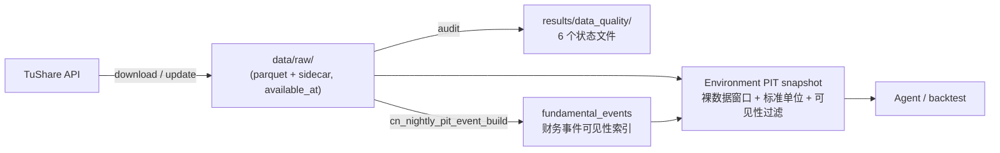

# 数据文档

本文档只记录数据层：从哪里下载、如何落盘、单位是什么、如何更新、如何审计、有哪些已知风险。

**相关边界**

- PIT snapshot、决策输入、回放和泄漏检查见 `docs/environment_design.md`。
- Agent 的证据包和大模型输入见 `docs/agent_design.md`。
- 完整实验编排见 `docs/pipeline_design.md`。
- QMT 实盘流程见 `docs/QMT_documentation.md`。
- 全部参数/超参数默认值速查见 `docs/parameters_reference.md`。

**术语说明**

| 中文名 | 代码/英文名 | 含义 |
|---|---|---|
| 原始落盘层 | `raw` | TuShare 或本地来源的原始文件，路径通常是 `data/raw/<dataset>/...` |
| 旁路元数据 | `sidecar` | 每个 parquet 旁边的 `.meta.json`，记录请求参数、抓取时间和 hash |
| 可见时间 | `available_at` | 数据在回测或决策中最早可以使用的时间 |
| 状态文件 | `status` | 当前数据质量审计结果 |
| 修正账本 | `revision ledger` | 源端回写或本地/远端不一致事件账本 |
| 触顶风险 | `source cap risk` | 接口命中返回行数上限，可能被截断 |
| 按时点可见 | PIT | 按决策时点过滤未来信息；数据层只保存支撑该规则的原始时间字段 |

**职责边界**

**数据层负责**

- 调用 TuShare 和本地脚本下载原始数据。
- 保存每个文件的请求参数、来源和 hash。
- 记录单位、分区、分页、触顶、空响应和源端修正。
- 输出 6 个当前数据质量状态文件。
- 说明原始数据是否足以支持后续按时间可见性构造。

数据层不负责：构造最终交易信号或策略字段、选择股票、做回测、生成大模型提示词、判断 Agent 决策是否合理。

**导航**

- [1. 数据域与原始口径](#1-数据域与原始口径)
  - [1.1 数据域总览](#11-数据域总览)
  - [1.2 全局单位](#12-全局单位)
  - [1.3 基础研究数据](#13-基础研究数据)
  - [1.4 宏观与全球上下文](#14-宏观与全球上下文)
  - [1.5 历史分钟线](#15-历史分钟线)
  - [1.6 事件、资金与打板专题数据](#16-事件资金与打板专题数据)
  - [1.7 文本数据](#17-文本数据)
- [2. 下载、更新与落库任务](#2-下载更新与落库任务)
  - [2.1 初始下载与日常更新](#21-初始下载与日常更新)
  - [2.2 定时任务、限频与代码入口](#22-定时任务限频与代码入口)
- [3. 状态文件、审计与可见时间](#3-状态文件审计与可见时间)
  - [3.1 状态文件与审计规则](#31-状态文件与审计规则)
  - [3.2 原始数据时间可见性合同](#32-原始数据时间可见性合同)
  - [3.3 Timeview 刷新节点与环境层交接](#33-timeview-刷新节点与环境层交接)
- [4. 数据风险、修正账本与官方索引](#4-数据风险修正账本与官方索引)

## 1. 数据域与原始口径

### 1.1 数据域总览

**数据流向**



**当前数据域**

| 数据域 | 覆盖内容 | 当前状态文件 |
|---|---|---|
| 基础研究数据 | 基础维表、日频行情、交易约束、财务基本面 | `base_research_status.json` |
| 宏观与全球上下文 | 国内宏观、政策、利率、全球事件、指数、外汇 | `macro_context_status.json` |
| 历史分钟线 | 全 A 1 分钟历史数据和按日整理层 | `intraday_minutes_status.json` |
| 事件与资金数据 | 两融、资金流、股东、回购、解禁、大宗交易 | `event_flow_status.json` |
| 打板专题数据 | 开盘啦、同花顺榜单、龙虎榜、热榜、连板概念 | `board_trading_status.json` |
| 文本数据 | 公告、新闻、研报、政策法规、盈利预测 | `text_evidence_status.json` |

### 1.2 全局单位

| 数据 | 单位规则 |
|---|---|
| `daily.vol` | 手 |
| `daily.amount` | 千元 |
| `stk_mins.vol` | 股 |
| `stk_mins.amount` | 元 |
| `daily_basic.total_share/float_share/free_share` | 万股 |
| `daily_basic.total_mv/circ_mv` | 万元 |
| `bak_daily.amount` | 万元；和 `daily.amount` 比较时乘以 10 |
| 财报主表金额字段 | 元 |
| `forecast_vip` 利润预测字段 | 万元 |
| 宏观金额字段 | 保持 TuShare 官方单位，常见为亿元 |
| `moneyflow` | 量为手，金额为万元 |
| `margin` / `margin_detail` | 金额为元 |
| `block_trade.vol` | 万股 |

`bak_basic` 不含 `vol` / `amount`，不能用于成交量或成交额口径对齐。

数据层只记录和审计原始单位，不改写原始字段。进入 Sandbox 可见数据、模型输入或回放输入前的单位统一规则见 `docs/environment_design.md` 的“单位合同”。

### 1.3 基础研究数据

基础研究数据包含三类：基础维表、日频行情与交易约束、财务与基本面。

**基础维表**

| 数据 | 接口 | 拉取方式 | 用途 |
|---|---|---|---|
| 股票列表 | `stock_basic` | `list_status=L/D/P` | 股票池基表 |
| 上市公司信息 | `stock_company` | 按交易所 | 公司属性补充 |
| 历史每日股票列表 | `bak_basic` | 按交易日，2016 起 | 每日行业、估值、股本快照补充 |
| 交易日历 | `trade_cal` | SSE/SZSE/BSE | WFO、调仓和交易日判断 |
| 曾用名/ST 历史 | `namechange` | 全量或按股票代码 | 名称/ST 变化，按公告可见性处理 |
| 行业分类 | `index_classify` | `src=SW2021` | 申万行业层级 |
| 行业成分 | `index_member_all` | 按一级行业 | 历史行业暴露 |

`stock_company.introduction` 是当前公司简介类字段，缺少可直接用于历史回测的发布时间。历史自然语言分析不得把它直接注入 Prompt；公司业务上下文应优先由历史名称、行业成分、`fina_mainbz_vip` 主营业务构成和 as-of 文本库生成。实盘或 forward run 如需使用当前简介，应按下载时间标记 `available_at`。

**日频行情与交易约束**

| 数据 | 接口 | 拉取方式 | 用途 |
|---|---|---|---|
| 日线行情 | `daily` | 按交易日 | OHLCV、成交额 |
| 复权因子 | `adj_factor` | 按交易日 | 复权价格构造和收益校验 |
| 每日指标 | `daily_basic` | 按交易日 | 估值、市值、换手率、股本 |
| 涨跌停价格 | `stk_limit` | 按交易日 | 交易约束 |
| 停复牌 | `suspend_d` | 按交易日或日期区间 | 停复牌约束 |
| 涨跌停/炸板列表 | `limit_list_d` | 按交易日 | 日终涨跌停和炸板标签 |

`daily`、`daily_basic`、`stk_limit` 覆盖口径不同，Environment snapshot 必须显式处理缺失或连接方式。`limit_list_d` 虽被打板研究复用，但主归属仍是日频交易约束。

**财务与基本面**

| 数据 | 接口 | 拉取方式 | 用途与边界 |
|---|---|---|---|
| 利润表 | `income_vip` | 按报告期 | 保留 `f_ann_date/report_type/comp_type` |
| 资产负债表 | `balancesheet_vip` | 按报告期 | 保留多版本记录 |
| 现金流量表 | `cashflow_vip` | 按报告期 | 保留多版本记录 |
| 财务指标 | `fina_indicator_vip` | 按报告期 | 无 `f_ann_date` 时用 `ann_date` |
| 业绩预告 | `forecast_vip` | 按公告月 | 预期修正事件 |
| 业绩快报 | `express_vip` | 按公告月 | 财报前置信息 |
| 分红送股 | `dividend` | 按股票代码 | 只用 `imp_ann_date/ann_date` 判断可见性 |
| 审计意见 | `fina_audit` | 按股票代码 | 审计风险 |
| 主营业务构成 | `fina_mainbz_vip` | 按股票代码 | 业务结构 |
| 披露计划 | `disclosure_date` | 按报告期 | 披露计划和实际披露日 |

财务原始层保留多版本、重复业务键和稀疏分区。环境层会把它们构造成 `fundamental_events` 后，再按当前视图的 Timeview cutoff 选择可见版本。

### 1.4 宏观与全球上下文

宏观/全球数据先作为市场背景和文本证据，不直接替代股票日频数据或策略信号。

| 数据 | 接口 | 拉取方式 | 用途 |
|---|---|---|---|
| 经济数据发布日程 | `cn_schedule` | 按月 | 修正宏观数据可见时间 |
| GDP | `cn_gdp` | 按季度 | 宏观 regime |
| CPI/PPI/PMI | `cn_cpi` / `cn_ppi` / `cn_pmi` | 按月 | 通胀和景气度 |
| 货币供应与社融 | `cn_m` / `sf_month` | 按月 | 流动性 |
| 利率与回购 | `shibor` / `shibor_quote` / `shibor_lpr` / `repo_daily` | 按年 | 资金价格 |
| 港/外币拆借利率 | `hibor` / `libor` | 按年或货币+年份 | 离岸/外币流动性 |
| 美国利率 | `us_tycr` / `us_trycr` / `us_tbr` / `us_tltr` | 按年 | 全球利率环境 |
| 全球财经日历 | `eco_cal` | 按月 | 全球事件 |
| 全球指数 | `index_global` | 按指数代码+年份 | 跨市场风险偏好 |
| 外汇日线 | `fx_daily` | 按外汇代码+年份 | 汇率上下文 |
| 央行货币政策执行报告 | `monetary_policy` | 按发布年份 | 政策文本 evidence |

只有日期或月份的数据不得用于同日开盘决策；进入环境层后应优先使用精确发布时间或保守延后时间。

### 1.5 历史分钟线

| 数据 | 接口/层 | 拉取方式 | 用途 |
|---|---|---|---|
| 历史 1 分钟源 | `stk_mins` | 全 A，按 `ts_code + year` | 可追溯源层 |
| 按日分钟最终层 | 本地整理 | 每交易日全市场文件 | 日内回放和增量更新 |
| 开/收盘竞价 | `stk_auction` / `stk_auction_c` | 不做历史全量 | 历史由 09:30/15:00 分钟条承载 |

源层路径：`data/raw/stk_mins_1min/ts_code=<TS_CODE>/year=<YYYY>.parquet`。
最终层路径：`data/raw/stk_mins_1min_by_date/trade_date=<YYYYMMDD>.parquet`。

最终层字段必须包含 `ts_code, trade_time, open, high, low, close, vol, amount, trade_date, available_at, available_at_rule`。分钟数据使用前要按有效股票池过滤。

决策输入 snapshot 的分钟样本窗口由 `SnapshotConfig.intraday_trade_days` 控制，默认取最近 21 个交易日（约一个交易月），让 Agent 在决策输入里看到一整月分钟结构；valid/test 回放区间的分钟窗口由各 Fold 周期决定，与该字段无关。

### 1.6 事件、资金与打板专题数据

| 数据 | 接口/文件 | 拉取方式 | 用途与边界 |
|---|---|---|---|
| 两融汇总 | `margin` | 按交易日 | 市场杠杆 |
| 两融明细 | `margin_detail` | 按交易日 | 个股融资融券压力 |
| 融资融券标的 | `margin_secs` | 按交易日 | 交易所标的资格；原始表不区分担保品/融资/融券标的，当前研究以同一集合近似门控信用账户担保品买入、融资买入和融券卖出 |
| 个股资金流 | `moneyflow` | 按交易日 | 资金行为 |
| 股东人数 | `stk_holdernumber` | 按公告月 | 筹码集中度 |
| 股东增减持 | `stk_holdertrade` | 按公告月 | 治理和事件 |
| 回购 | `repurchase` | 按公告月 | 资本配置 |
| 解禁 | `share_float_complete` | 专用补全 union | 供给压力 |
| 大宗交易 | `block_trade` | 按交易日 | 特殊交易行为 |

`share_float_complete` 是解禁最终保留边界。普通 `share_float` 过程文件可归档，但 union 不得静默缩水。触顶分区使用 candidate 级补充；如果最细粒度仍正好 6000 行，只能标记 `source_cap_risk`。

信用账户标的池模式（默认 `proxy_margin_secs`：成交日 `margin_secs` 表内股票临时视为可担保品买入、可融资、可融券标的）的执行语义由 `docs/environment_design.md` §3.2（信用账户模型）定义；数据层只负责 `margin_secs` 表本身的可见性与口径。券商真实担保品清单、券源、逐票折算率/保证金比例、利率费率和信用风控数据当前不可获得，相关数据合同待真实 broker 数据到位后再补充。

**打板专题数据**

打板专题数据用于日终标签、情绪和分钟回放。真实盘中打板不能提前使用日终汇总字段。

| 数据 | 接口 | 拉取方式 | 用途 |
|---|---|---|---|
| 涨跌停价格 | `stk_limit` | 按交易日 | 涨跌停交易约束；主归属为基础研究 |
| 日终涨跌停/炸板标签 | `limit_list_d` | 按交易日 | 涨停、炸板、回封标签；主归属为基础研究 |
| 开盘啦榜单 | `kpl_list` | 按交易日 + `tag` | 开盘啦涨停、炸板、跌停、竞价标签 |
| 连板高度 | `limit_step` | 按交易日 | 连板高度 |
| 连板概念 | `limit_cpt_list` | 按交易日 | 概念聚类和板块强度 |
| 同花顺榜单 | `limit_list_ths` | 按交易日 + `limit_type`，官方历史从 `20231101` 起 | 同花顺涨停池、炸板池、跌停池 |
| 龙虎榜 | `top_list` | 按交易日 | 龙虎榜资金性质和上榜原因 |
| 机构席位 | `top_inst` | 按交易日 | 机构席位买卖和净额 |
| 游资名单 | `hm_list` | 静态全量 | 游资席位参考表 |
| 游资明细 | `hm_detail` | 按交易日，官方历史从 `20220801` 起 | 游资席位映射和交易痕迹 |
| 同花顺热榜 | `ths_hot` | 按交易日 + `market` + `is_new` | 人气、概念和行业热度 |
| 东方财富热榜 | `dc_hot` | 按交易日 + `market` + `type` + `is_new` | 人气、概念和行业热度 |
| 分钟触板/开板 | `stk_mins_1min_by_date` + `stk_limit` | 按交易日分钟文件和涨跌停价格联动推导 | 用已走完分钟 bar 推导盘中触板/开板 |

**重要边界**

- `kpl_list` 按次日 08:30 可见处理。
- `top_list/top_inst` 按当日 20:00 可见处理。
- `limit_list_d` 与 `limit_list_ths` 口径不同，不能互相覆盖。
- `first_time/open_times/fd_amount/limit_amount` 等日终字段不能用于盘中决策。

### 1.7 文本数据

数据层只保存文本原始数据、发布时间、来源和 hash。进入 Agent 前，证据层再生成 `evidence_id`、截断正文、实体映射和来源质量。

| 数据 | 接口 | 拉取方式 | 可见性 |
|---|---|---|---|
| 上市公司公告 | `anns_d` | 按公告月 | `rec_time` 仅在与 `ann_date` 相差 -1~+3 天内可信；否则回退 `ann_date 23:59:59` |
| 长新闻 | `major_news` | 按月份 | `pub_time` |
| 新闻联播 | `cctv_news` | 按日期 | 只有日期时按晚间可见 |
| 政策法规库 | `npr` | 按月份 | `pubtime` |
| 券商研究报告 | `research_report` | 按月份 | 只有日期时不能用于同日开盘 |
| 盈利预测 | `report_rc` | 按月份 | `create_time` 仅在与 `report_date` 相差 -1~+3 天内可信；否则回退 `report_date 22:00`（官方当日 19:00-22:00 更新） |
| 新闻快讯 | `news` | 按来源+日期 | `datetime` |

带日期基准的文本时间字段只在接近源日期时才视为发布时间：回填历史里 `rec_time`/`create_time` 常是 TuShare 采集时间（如 2020 年公告带 2025 时间戳），超出 -1~+3 天窗口即按上表回退，规则标记 `conservative_from:<date>:implausible_<time>`。存量分区可用本地命令重写派生列（不调 API）：

```bash
~/miniconda3/bin/conda run -n quant python scripts/data/tushare_download.py repair-text-available-at --datasets anns_d report_rc
```

## 2. 下载、更新与落库任务

### 2.1 初始下载与日常更新

**初始建库顺序**

1. 基础研究数据：`reference`、`daily`、`fundamental`。
2. 宏观与全球上下文：`macro`、`global`。
3. 历史分钟线：下载 `intraday` 源层，再整理为按日最终层。
4. 事件与资金数据：`event_flow`，再生成 `share_float_complete`。
5. 打板专题数据：`board_trading`。
6. 文本数据：`text_evidence`。

**常用入口**

```bash
~/miniconda3/bin/conda run -n quant python scripts/data/tushare_download.py download --tier reference
~/miniconda3/bin/conda run -n quant python scripts/data/tushare_download.py download --tier daily --include-limit-list
~/miniconda3/bin/conda run -n quant python scripts/data/tushare_download.py download --tier fundamental --start-date 20100101 --end-date <YYYYMMDD>
~/miniconda3/bin/conda run -n quant python scripts/data/tushare_download.py download --tier macro --start-date 20200101 --end-date <YYYYMMDD>
~/miniconda3/bin/conda run -n quant python scripts/data/tushare_download.py download --tier global --start-date 20200101 --end-date <YYYYMMDD>
~/miniconda3/bin/conda run -n quant python scripts/data/tushare_download.py download --tier intraday --datasets stk_mins --start-date 20200101 --end-date <YYYYMMDD>
~/miniconda3/bin/conda run -n quant python scripts/data/tushare_download.py compact-intraday-by-date --start-date 20200101 --end-date <YYYYMMDD>
~/miniconda3/bin/conda run -n quant python scripts/data/tushare_download.py download --tier event_flow --start-date 20200101 --end-date <YYYYMMDD>
~/miniconda3/bin/conda run -n quant python scripts/data/tushare_download.py download-share-float-complete --ann-start-date 20100101 --ann-end-date <YYYYMMDD> --float-start-date 20200101 --float-end-date <YYYYMMDD> --rescue-ann-limit-hits --write-union
~/miniconda3/bin/conda run -n quant python scripts/data/tushare_download.py download --tier board_trading --start-date 20200101 --end-date <YYYYMMDD>
~/miniconda3/bin/conda run -n quant python scripts/data/tushare_download.py download --tier text_evidence --start-date 20200101 --end-date <YYYYMMDD>
```

**日常更新规则**

**日常更新入口**

```bash
~/miniconda3/bin/conda run -n quant python scripts/data/tushare_download.py update --start-date <YYYYMMDD> --end-date <YYYYMMDD>
```

**通用规则**

- `update` 从 `start_date` 扫到 `end_date`，不是只更新当天。
- cron 默认回看 30 天。
- 已存在且旁路元数据覆盖请求范围的分区跳过。
- 开放月份、开放年份和近期交易日会按配置强制刷新。
- 远端空响应不会覆盖本地非空分区，除非显式允许。
- 触发源端修正时写入修正账本。
- 交易日历会额外补到 `end_date+7`，供次日盘前判断。
- 宏观/全球 range 型数据仍从 `20200101` 保留窗口下界维护，不生成短窗口碎片。

| 数据域 | 日常刷新规则 | 风险控制 |
|---|---|---|
| 基础维表 | 股票列表、公司信息、行业、曾用名每日强刷；`trade_cal` 覆盖不足时补齐 | 空响应不覆盖非空本地 |
| 日频行情与约束 | 最近 30 天强刷 | 差异写修正账本；`limit_list_d` 不稳定字段不进入冻结交易输入 |
| 财务与基本面 | 最近 6 个报告期、最近 3 个公告月强刷；分红/审计/主营业务只定向刷新候选股票 | 避免全市场按日期误刷；保留多版本 |
| 宏观与全球 | 每晚刷新开放窗口 | 月度/季度数据使用保守可见时间 |
| 历史分钟线 | 每晚补最近窗口，只强刷最近 1 个自然日 | 新交易日按 `daily` 股票池尝试下载；已有按日文件按本地分钟覆盖口径校验，严格 `daily` 覆盖只做专项排查 |
| 事件/资金 | 晚间滚动强刷；两融和融资融券标的盘前回补 | 非交易日前一天自动跳过 |
| 解禁 union | 每晚重建 `share_float_complete` | union 缩水默认阻断覆盖 |
| 打板专题 | 晚间滚动强刷，08:50 回补关键榜单 | 官方历史起点前不视为缺失 |
| 文本数据 | 晚间滚动强刷，08:55 回补短新闻 | 重复推送保留原始数据，Agent 层再去重 |

### 2.2 定时任务、限频与代码入口

TuShare 接口更新时间和 cron 策略维护在 `configs/tushare_update_schedule.json`。

**当前北京时间任务**

| 任务 | 时间 | 目的 |
|---|---:|---|
| `cn_evening_full` | 23:35 | 滚动更新全域 raw 和近期开放窗口 |
| `cn_nightly_full_audit` | 02:30 | 刷新 6 个顶层状态文件 |
| `cn_nightly_pit_event_build` | 03:35 | 构造并审计财务事件 PIT 可见性索引 `fundamental_events`（状态文件为 `fundamental_events_status.json`，不属于 6 个 raw 状态文件） |
| `cn_daily_revision_sentinel` | 04:00 | 抽样检查历史分区是否被源端回写 |
| `cn_preopen_board_backfill_0850` | 08:50 | 回补前一日打板专题关键榜单 |
| `cn_preopen_text_backfill_0855` | 08:55 | 回补短新闻和新闻联播 |
| `cn_preopen_margin_secs_backfill_0903` / `cn_preopen_margin_secs_retry_0913` | 09:03 / 09:13 | 刷新当日融资融券标的资格 |
| `cn_preopen_margin_backfill_0905` / `cn_preopen_margin_retry_0915` | 09:05 / 09:15 | 回补上一交易日两融汇总和明细 |
| `cn_preopen_event_flow_audit_0920` | 09:20 | 盘前刷新事件/资金状态 |

回测的逐 tick 滚动数据视图（Timeview）按这些落库 job 的真实完成时间放行数据，建模为 `REFRESH_NODES` 刷新节点；纯审计 job 不落新数据、刻意不作为节点。节点定义、门禁语义与纯审计 job 清单见 §3.3。

runner 使用 `.runtime/tushare/locks/tushare_update.lock` 防止并发写 raw。日志写入 `logs/tushare_cron_<job>_<end_date>_<timestamp>.log`，运行状态写入 `.runtime/tushare/cron_state.json`。

当前 crontab 必须通过 `ops/cron/install_tushare_cron.py` 安装，使用 `/home/lzp/miniconda3/envs/quant/bin/python` 和 `scripts/data/tushare_cron_update.py`。

**安装或刷新 cron**

```bash
/home/lzp/miniconda3/envs/quant/bin/python ops/cron/install_tushare_cron.py
crontab -l
```

不要直接 `crontab ops/cron/tushare_update.cron`，否则会替换当前用户整份 crontab。

**限频和分页**

- 10000 积分基础频次：常规数据 500 次/分钟，特色数据 300 次/分钟。
- 独立文本权限：新闻 400 次/分钟，公告 500 次/分钟，政策法规 500 次/分钟。
- 脚本默认使用保守间隔，分钟线和混合文本建议 `0.22s` 或更慢。
- `namechange` 全市场循环使用 `0.50s`，降低接口压力。
- 命中官方行数上限时，必须缩小日期、按股票代码、按来源或按 offset 分页。
- 文本接口会 clamp 单页上限：`anns_d=2000`、`major_news=400`、`npr=500`、`research_report=1000`、`report_rc=3000`、`news=1500`。
- `stk_mins` 单页上限按 `8000` 处理。
- `TUSHARE_TOKEN` 只允许存在于环境变量或 ignored `.env`。
- 长任务必须有断点续跑、限频、重试和本地日志。

**代码入口**

**业务实现位置**

TuShare 下载、更新和审计保留少量外层入口，业务实现集中在 `src/autotrade/data_sources/tushare/`。

| 文件 | 责任 |
|---|---|
| `scripts/data/tushare_download.py` | 下载和更新命令入口 |
| `scripts/data/tushare_audit.py` | 审计命令入口 |
| `scripts/data/tushare_cron_update.py` | cron job 调度入口 |
| `common.py` | 数据集定义、接口策略、可见时间、限频和共享业务逻辑 |
| `download.py` | 下载、更新、修正监控和数据重组实现 |
| `audit.py` | 顶层状态文件和专项审计实现 |
| `cron_update.py` | cron job 调度业务实现（读 `configs/tushare_update_schedule.json`，被 `scripts/data/tushare_cron_update.py` 包装） |
| `io.py` | Parquet、sidecar、JSONL 和分页探测等底层读写工具 |

## 3. 状态文件、审计与可见时间

### 3.1 状态文件与审计规则

`results/data_quality/` 顶层只维护 6 个当前状态文件：

| 文件 | 覆盖范围 |
|---|---|
| `base_research_status.json` | 基础维表、日频行情与约束、财务基本面 |
| `macro_context_status.json` | 宏观、政策、全球事件和跨市场上下文 |
| `intraday_minutes_status.json` | 历史分钟线最终按日层 |
| `event_flow_status.json` | 事件/资金数据和 `share_float_complete` |
| `board_trading_status.json` | 打板专题数据 |
| `text_evidence_status.json` | 文本原始层 |

临时排查产物写入 `results/data_quality/process/`；处理后移到根目录 `archive/` 或删除。

**补充状态文件**

- 修正账本 `revision_events.jsonl` / `revision_summary.json`，见第 4 章。
- PIT 事件索引状态 `fundamental_events_status.json`，由 `cn_nightly_pit_event_build` 生成，供 Environment snapshot 做财报版本可见性过滤；启用 fundamentals 时该文件缺失或为 error 会阻断 snapshot 构造。Snapshot 读取财务事件时按决策窗口选择 `available_month` 分区，再用 `available_at` 二次过滤，避免短窗口扫描全历史分区。

正式状态文件应由 cron 编排层生成并保持最新。数据门禁以文件内容为准：`status=ok` 或 `warning` 且没有 error finding 时可继续下游流程；`status=error`、文件缺失、无法解析或审计时间明显滞后时应阻断使用并重新下载/审计。

| 状态文件 | 合格条件 | 常见 warning |
|---|---|---|
| `base_research_status.json` | 无 error finding，基础维表、日频行情、约束和财务分区可读 | 单位口径、覆盖差异、重复业务键 |
| `macro_context_status.json` | 无 error finding，宏观、政策和跨市场上下文分区可读 | 发布时间保守假设、异构事件值 |
| `intraday_minutes_status.json` | `status=ok`，交易日分钟按日层覆盖可用 | 不应有常态 warning |
| `event_flow_status.json` | 无 error finding，交易日事件/资金分区覆盖到最近应可见交易日 | 稀疏事件、重复事件键、PIT 语义提示 |
| `board_trading_status.json` | 无 error finding，打板专题分区覆盖到最近应可见交易日 | 龙虎榜/榜单口径差异 |
| `text_evidence_status.json` | 无 error finding，文本源覆盖到自然日窗口 | 新闻重复、文本时间语义提示 |

**通用审计规则**

**正式状态文件检查项**

- 文件是否存在、Parquet 是否可读。
- 旁路元数据是否存在，是否和 parquet 对齐。
- 是否有空文件、半成品、孤儿旁路元数据。
- 预期分区是否齐全。
- 关键字段、业务键、日期字段是否可用。
- 是否命中分页行数上限。
- 单位和可见时间规则是否写入报告。

**状态文件结构**

| 字段 | 含义 |
|---|---|
| `created_at` | 审计生成时间 |
| `raw_dir` | 审计读取的数据根目录 |
| `scope` | 审计参数和数据范围 |
| `status` | `error`、`warning` 或 `ok` |
| `finding_counts` | 各严重级别计数 |
| `datasets` | 按数据项聚合的结果 |
| `findings` | 逐条发现 |
| `unit_rules` / `pit_rules` | 单位和可见时间规则 |
| `doc_refs` | 官方文档链接 |
| `conclusions` | 当前可操作结论 |

存在 `error` 时脚本返回非 0；只有 `warning` 时返回 0，但下游必须显式处理 warning 指向的语义风险。

**各数据域审计**

| 数据域 | 入口 | 输出 | 核心检查 | 特殊风险 |
|---|---|---|---|---|
| 基础研究 | `scripts/data/tushare_audit.py base --include-limit-list` | `base_research_status.json` | 基础维表、交易日、日频分区、财务多版本、跨表股票覆盖、单位 | `bak_basic` 起始较晚；日频表覆盖口径不同；财务重复键是原始语义 |
| 宏观与全球 | `scripts/data/tushare_audit.py macro` | `macro_context_status.json` | 月/季/年/代码/货币分区、字段、重复事件键、单位和可见时间 | 月度/季度发布时间滞后；`eco_cal` 异构事件不能直接数值化 |
| 历史分钟线 | `scripts/data/tushare_audit.py intraday-by-date` | `intraday_minutes_status.json` | 按日文件、必需字段、重复 `(ts_code, trade_time)`、时间解析、09:30/15:00 条 | 正式状态文件用本地分钟覆盖口径；严格 daily 覆盖只做专项排查 |
| 事件/资金 | `scripts/data/tushare_audit.py event-flow` | `event_flow_status.json` | 日频/公告分区、资金和事件单位、重复业务键、`share_float_complete` 合并结果 | 解禁触顶风险；融资融券标的资格不等于券商券源 |
| 打板专题 | `scripts/data/tushare_audit.py board-trading` | `board_trading_status.json` | tag/type/market 分区、榜单字段、可见时间、重复键 | 日终标签不能用于盘中；同花顺和 TuShare 涨跌停口径不同 |
| 文本数据 | `scripts/data/tushare_audit.py base --include-text` | `text_evidence_status.json` | 月/日期/source 分区、时间字段、重复文本键、触顶风险 | 重复推送和转载是 warning；证据层再生成 `evidence_id` |

**分钟线竞价口径专项检查**

```bash
~/miniconda3/bin/conda run -n quant python scripts/data/tushare_audit.py auction-alignment --start-date <YYYYMMDD> --end-date <YYYYMMDD>
```

专项报告只用于过程排查，不写入顶层状态文件。

### 3.2 原始数据时间可见性合同

**原始层原则**

- 原始层尽量保留 TuShare 原始字段，不派生 alpha 列。
- 原始层不静默删除多版本财报、重复公告、稀疏事件和源端重复推送。
- 每个 parquet 必须有旁路元数据，记录接口、请求参数、抓取时间和源数据 hash。
- 原始审计只说明数据是否足以支持按时点可见，不声明某个策略无泄漏。

**可见时间速查**

下表是行级 `available_at` 规则；回测的 Timeview 在此之上再叠加落库 job 延迟：一行要同时满足行级 `available_at` 门禁与落库节点 `ready_at` 才进入滚动视图（节点模型见 §3.3）。

| 数据 | 可见时间规则 |
|---|---|
| `daily` / `daily_basic` | 行级 `available_at` 为当日收盘后（次一交易日生效）；Timeview 另由 `cn_evening_full`（约次日 02:05 完成）门禁，故交易日内横截面日频只到 D-1，当日数据要到次日约 02:05 才落库可见，09:25 信号不得使用当日数据 |
| 分钟线 | `available_at=trade_time`，视为该分钟 bar close 后可见；历史分钟随 `cn_evening_full` 晚间滚动落库，当日实时 bar 由引擎 `ctx.bars` 提供、不走持久化视图 |
| 财务 | 优先 `f_ann_date`，否则 `ann_date`；多版本按决策时点选择；`fundamental_events` 由 `cn_nightly_pit_event_build`（约 03:50）落库后可查 |
| 分红 | 只用 `imp_ann_date/ann_date` 判断可见性，`ex_date/record_date/pay_date` 是未来事件属性 |
| 宏观 | 优先发布时间或 `cn_schedule.publish_date`，否则保守延后；Timeview 随 `cn_evening_full` 落库 |
| 全球事件 | 有具体 `time` 时使用 `date+time`，否则当日收盘后可见；Timeview 随 `cn_evening_full` 落库 |
| 文本 | 优先 `rec_time/pub_time/pubtime/datetime/create_time`；有日期基准的字段须通过 -1~+3 天合理性检查，否则按日期保守回退（见 §1.7）；`cctv_news/news` 盘前另由 `cn_preopen_text_backfill_0855` 回补 |
| 两融 | `margin/margin_detail` 行级 `available_at` 为下一日 09:00，Timeview 经盘前 `cn_preopen_margin_backfill_0905`/`_retry_0915` 落库；`margin_secs` 为当日盘前 09:00，经 `cn_preopen_margin_secs_backfill_0903`/`_retry_0913` 落库 |
| 资金/大宗 | `moneyflow` 当日 19:00、`block_trade` 当日 21:00 为行级 `available_at`；Timeview 实际随 `cn_evening_full`（约次日 02:05）落库，故当日盘中不可见 |

### 3.3 Timeview 刷新节点与环境层交接

回测的逐 tick 滚动数据视图（Timeview）复刻本地库的真实刷新节奏：一行数据只有在落库它的 cron job 写完之后才可见，建模为 `ready_at = job 启动时间 + 实测刷新时长`。共享节点表是 `src/autotrade/environment/data/contracts.py` 的 `REFRESH_NODES`，与 `configs/tushare_update_schedule.json` 一一对应（漂移守护测试断言每个节点都是真实 cron job、纯审计 job 不得成为节点）。该节点模型在已写入的 `available_at` 之上叠加落库延迟：`available_at` 仍是行级门禁，节点只把落库 job 的延迟加在其上，二者都满足才进入滚动视图。完整执行/回放语义见 `docs/environment_design.md`。

**默认刷新节点**

| 节点 | 启动 → 就绪 | 让什么变可见 |
|---|---|---|
| `cn_evening_full` | 23:35 → 次日约 02:05（约 150 分钟） | A 股日频核心（`daily` / `daily_basic` / `adj_factor` / `stk_limit` / `suspend_d`）、分钟历史、`moneyflow`、`block_trade`、股东/回购/解禁/龙虎榜、全部宏观、文本主语料 |
| `cn_nightly_pit_event_build` | 03:35 → 约 03:50（约 15 分钟） | 财务 PIT 事件（`fundamental_events`）变为可查询 |
| `cn_preopen_board_backfill_0850` | 08:50 → 约 08:55 | 前一日打板关键榜单（`kpl_list` 等） |
| `cn_preopen_text_backfill_0855` | 08:55 → 约 09:00 | 短新闻 `cctv_news` / `news` 盘前回补 |
| `cn_preopen_margin_secs_backfill_0903` / `_retry_0913` | 09:03 / 09:13 → 约 09:05 / 09:15 | 当日 `margin_secs` 近似标的池（同一集合临时门控担保品买入、融资买入和融券卖出） |
| `cn_preopen_margin_backfill_0905` / `_retry_0915` | 09:05 / 09:15 → 约 09:07 / 09:17 | 前一交易日 `margin` / `margin_detail` |

关键后果：因 `cn_evening_full` 约次日 02:05 才写完，交易日内横截面日频视图只到上一交易日（D-1），当日 `daily` 等次日约 02:05 才落库可见；分钟历史同样在晚间节点滚动落库，当日实时分钟 bar 不走持久化视图、由引擎单独提供（`ctx.bars`）。

纯审计 job（`cn_nightly_full_audit`、`cn_daily_revision_sentinel`、09:20 的 `cn_preopen_event_flow_audit_0920`）不落新数据，刻意不作为节点。

**交给环境层的最小信息**

**环境层交接信息**

- 来源：接口名、请求参数、分区路径、旁路元数据。
- 业务键：例如 `(trade_date, ts_code)` 或财报多版本键。
- 时间键：交易日、公告日、发布时间、生效日和 `available_at` 候选。
- 单位：价格、成交量、成交额、股本、市值、财报金额、宏观口径。
- 风险标记：分页触顶、空分区、源端缺失、重复推送和 revision 事件。

## 4. 数据风险、修正账本与官方索引

| 风险项 | 影响 | 当前处理 |
|---|---|---|
| 深圳 09:30 分钟条与开盘竞价接口口径不一致 | 历史竞价近似列 | 原始数据不改写；环境层负责生成口径校正列并记录规则版本 |
| 日线和分钟线单位不同 | 横向校验和 snapshot 拼接 | `daily.vol=手`、`daily.amount=千元`；分钟 `vol=股`、`amount=元` |
| `share_float_complete` 可能仍有触顶风险 | 解禁供给压力 | 专用入口补全并生成 union；exact-6000 标记 `source_cap_risk` |
| 历史分钟线与日线股票池不完全一致 | 早期 NEEQ/BSE 迁移、停牌退市 | 正式分钟审计用本地分钟覆盖口径；daily 覆盖对比只做专项 |
| 日频表覆盖口径不同 | `daily`、`daily_basic`、`stk_limit` 等 join | Environment snapshot 显式处理缺失，不默认全集一致 |
| 当前公司简介缺少历史可见时间 | 历史文本 Prompt 可能泄露未来业务描述 | 历史回测不直接使用 `stock_company.introduction`；公司上下文由历史名称、行业、主营业务构成和 as-of 文本生成 |
| TuShare 可能回写历史数据 | 近期和部分历史分区 | 定时任务强刷滚动窗口并写修正账本；旧非空、新空默认不覆盖 |
| `limit_list_d.limit_amount` 历史不稳定 | 打板和涨停强度字段 | raw 保留，默认不进入冻结交易输入；sentinel 发现源端会把历史数值回写为空 |
| 结构性重复业务键 | `block_trade`、`top_list` 等 | raw 保留，审计 warning；进入 snapshot 前必须扩展键、聚合或去重 |
| `proxy_margin_secs` 只是信用账户标的池近似 | 信用账户担保品/融资/融券可执行性与成本 | 当前研究把 `margin_secs` 表内股票全部临时视为可担保品买入、可融资、可融券，费率用 profile 假设值；真实担保品池、券源、费率和风控数据到位后再拆分 |
| 财务多版本和公告日缺失 | 财务按时点可见 | 原始数据保留多版本；环境层构造 `fundamental_events` 后选择可见版本 |
| 宏观发布时间不精确 | 月度/季度数据 | 原始数据使用保守可见时间，环境层优先使用发布日程修正 |
| 文本重复推送和转载 | 大模型证据 | 原始数据保留，证据层按 hash 和时间过滤 |
| `anns_d.rec_time` / `report_rc.create_time` 对回填历史是 TuShare 采集时间（如 2025），不是发布时间 | 若直接使用会让历史公告/盈利预测在时间墙下不可见 | 入库按 -1~+3 天合理性检查回退（见 §1.7）；存量分区必须满足该规则 |
| 打板日终字段有盘中前视风险 | 打板策略 | 日终汇总字段不得用于盘中决策；真实盘中策略需分钟或盘口数据 |

**Revision ledger 路径**

```text
results/data_quality/revision_events.jsonl
results/data_quality/revision_summary.json
```

它记录源端修正，不等于顶层状态文件。默认 `downstream_status=pending_review`，表示下游 snapshot、缓存或实验结果是否需要重建尚未确认。

**当前账本规则**

- 正式 raw 根目录 `data/raw` 的源端修正写入 `results/data_quality/revision_events.jsonl`。
- 单元测试、临时 raw 目录和过程排查目录只写本地 `revision_events.jsonl`，不得污染正式账本。
- 正式账本不得出现 `/tmp` 路径；测试污染记录属于无效账本输入。
- 分页接口若连续返回重复的非空满页，会 fail fast，避免死循环或重复写入。
- `stock_basic` 代码加载只接受合法 A 股代码模式 `\d{6}.(SH|SZ|BJ)`。
- `bak_basic` 审计的预期交易日上限必须截到审计 `end_date`，不能把 `trade_cal` 的未来 lookahead 误报为缺失。

Revision sentinel 监控 `daily`、`adj_factor`、`daily_basic`、`stk_limit`、`suspend_d`、`limit_list_d` 的全字段源端差异；监控数据集与抽样规模的单一配置来源是 `tushare_update_schedule.json` 的 `revision_monitor.sentinel_datasets` / `sentinel_sample_size`（job `extra_args` 不再重复）。抽样发现的字段级回写、空值回写或行键变化必须进入修正账本；其中 `limit_list_d.limit_amount` 属于易回写字段，在进入 snapshot 和冻结回测输入前必须排除、置为仅审计字段，或在未来引入字段级版本化后再使用。

**官方文档索引**

- 权限说明：https://tushare.pro/document/1?doc_id=290
- 权限表：https://tushare.pro/document/2?doc_id=108
- 日线行情：https://tushare.pro/document/2?doc_id=27
- 复权因子：https://tushare.pro/document/2?doc_id=28
- 每日指标：https://tushare.pro/document/2?doc_id=32
- 历史分钟：https://tushare.pro/document/2?doc_id=370
- 开盘集合竞价：https://tushare.pro/document/2?doc_id=369
- 开盘啦榜单：https://tushare.pro/document/2?doc_id=347
- 连板天梯/最强板块：https://tushare.pro/document/1?doc_id=356 / https://tushare.pro/document/2?doc_id=357
- 龙虎榜/游资/热榜：https://tushare.pro/document/2?doc_id=106 / https://tushare.pro/document/2?doc_id=107 / https://tushare.pro/document/2?doc_id=311 / https://tushare.pro/document/2?doc_id=312 / https://tushare.pro/document/2?doc_id=320 / https://tushare.pro/document/2?doc_id=321
- 两融：https://tushare.pro/document/2?doc_id=58 / https://tushare.pro/document/2?doc_id=59 / https://tushare.pro/document/2?doc_id=326
- 上市公司公告：https://tushare.pro/document/2?doc_id=176
- 中国经济数据发布日程：https://tushare.pro/document/2?doc_id=461
- GDP：https://tushare.pro/document/2?doc_id=227
- 上交所融资融券交易实施细则解读（维保比例/保证金可用余额公式）：https://www.sse.com.cn/services/tradingservice/margin/edu/c/10074042/files/a1f1c4833302451fb9130dbb94116c56.pdf
- 国金证券融资融券业务页（利率、担保证券、维保比例公示）：https://www.gjzq.com.cn/main/a/rzrq/index.html
- CPI/PPI/PMI/货币供应/社融：https://tushare.pro/document/2?doc_id=228 / https://tushare.pro/document/2?doc_id=229 / https://tushare.pro/document/2?doc_id=325 / https://tushare.pro/document/2?doc_id=242 / https://tushare.pro/document/2?doc_id=310
- 利率与全球事件：https://tushare.pro/document/2?doc_id=202 / https://tushare.pro/document/2?doc_id=204 / https://tushare.pro/document/2?doc_id=205 / https://tushare.pro/document/2?doc_id=206 / https://tushare.pro/document/2?doc_id=233
- 全球指数/外汇/美国利率：https://tushare.pro/document/2?doc_id=211 / https://tushare.pro/document/2?doc_id=179 / https://tushare.pro/document/2?doc_id=218
- 央行货币政策执行报告：https://tushare.pro/document/2?doc_id=465
