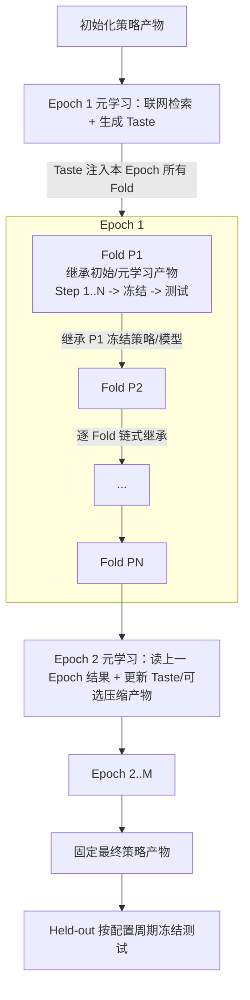

# Pipeline 设计

本文档记录训练、测试和 Held-out 的运行顺序。Pipeline 是 Step / Fold / Epoch 编排、策略产物冻结、测试执行和实验账本的权威文档。

**相关边界**

- raw 数据下载、源口径和审计见 [数据文档](data_documentation.md)。
- PIT 窗口、Sandbox、工具和回测合同见 [Environment 设计](environment_design.md)。
- Agent 工作合同、可见输入和可写产物见 [Agent 设计](agent_design.md)。
- 控制台和 QMT 部署见 [部署文档](deployment_documentation.md)。
- 参数默认值速查见 [参数参考](parameters_reference.md)。

**术语说明**

| 术语 | 含义 |
|---|---|
| Pipeline | 消费 Data 产物并调度 Environment 和 Agent 的外层程序，不实现投资逻辑 |
| Step | 一个 Fold 内的一次策略修改和验证尝试 |
| Fold | 一个验证区间加后续测试区间 |
| Epoch | 从起始 Fold 到结束 Fold 跑完一遍 |
| Development | 用于滚动验证和测试的研究区间，不等于最终 held-out |
| Held-out | 所有训练完成后才运行的冻结测试区间 |
| `strategy_artifact` | Agent 写出的 `output/` 正式策略产物目录，根目录入口为 `main.py` |
| `model_artifact` | Agent 写出的 `models/` 可继承模型参数目录 |
| Taste | Epoch 开始前由元学习会话生成的探索偏好，作为 Prompt 注入本 Epoch 的 Fold Agent |
| `snapshot_manifest` | 记录本次可见数据窗口、hash、单位和时间覆盖的说明文件 |
| ledger | 记录 Fold、Epoch、Held-out 结果和审计信息的文件 |

**职责边界**

Pipeline 负责消费已准备的数据，按时间顺序调度 Environment 和 Agent，冻结每个阶段的输入输出，并写实验账本。Pipeline 不下载或更新 raw 数据，不实现投资逻辑，也不改写 Agent 策略代码。

**导航**

- [1. 实验循环与时间排程](#1-实验循环与时间排程)
  - [1.1 循环层级与主路径](#11-循环层级与主路径)
  - [1.2 Fold 时间、泄漏边界与运行约束](#12-fold-时间泄漏边界与运行约束)
- [2. Step、Fold 验收与产物冻结](#2-stepfold-验收与产物冻结)
  - [2.1 Step 输入与执行](#21-step-输入与执行)
  - [2.2 冻结条件、完整验证与测试](#22-冻结条件完整验证与测试)
  - [2.3 策略产物、Manifest 与 Hash](#23-策略产物manifest-与-hash)
- [3. Epoch、元学习与最终评估](#3-epoch元学习与最终评估)
  - [3.1 元学习输入输出与边界](#31-元学习输入输出与边界)
  - [3.2 多 Epoch、Development 与 Held-out](#32-多-epochdevelopment-与-held-out)
- [4. 账本、路径、报告与失败处理](#4-账本路径报告与失败处理)
  - [4.1 实验目录、路径角色与主账本](#41-实验目录路径角色与主账本)
  - [4.2 报告、失败条件与验收清单](#42-报告失败条件与验收清单)
- [5. 交互式运行与 HITL 控制台](#5-交互式运行与-hitl-控制台)
  - [5.1 交互式 Worker 与会话门控](#51-交互式-worker-与会话门控)
  - [5.2 续跑与状态恢复](#52-续跑与状态恢复)
  - [5.3 Web 控制台与防泄漏](#53-web-控制台与防泄漏)

## 1. 实验循环与时间排程

### 1.1 循环层级与主路径

**三层循环**

| 层级 | 含义 | 是否允许修改策略产物 |
|---|---|---|
| Step | 一个 Fold 内的一次尝试 | 允许，在修改约束内 |
| Fold | 一个滚动验证区间和下一测试区间 | 验证期允许；测试期禁止 |
| Epoch | 从起始周期到结束周期跑完所有 Fold | 每个 Epoch 开始前可运行元学习和可选正则化 |

**主路径**



Pipeline 不实现投资逻辑，也不改写 Agent 代码；它只做调度、冻结、校验和记录。

完整流程：

- 每个 Epoch 先运行一次元学习会话，基于 development 历史、父产物、可见数据和联网检索生成非空 Taste，并可选产出小幅正则化后的父产物。
- Pipeline 随后按配置周期依次启动普通 Fold Agent，把同一份 Taste 注入本 Epoch 所有 Fold Prompt，作为策略实现、NL 使用、交易取舍和正则化偏好的关键指导。
- 策略产物和模型参数按 Fold 链式继承：第一个 Fold 继承初始模板或元学习正则化后的父产物；之后每个 Fold 继承上一个 Fold 在测试前冻结的策略和模型产物；若没有可接受更新，则继承 fallback 父产物。
- 所有 development Fold 完成后固定最终策略产物，再执行 held-out 冻结测试。
- Taste 在同一 Epoch 内保持一致；下一 Epoch 可基于 development 结果生成新的 Taste。

运行入口：

- 完整实验运行不可原地续跑：`ExperimentPipeline.run()` 在目标 experiment 已存在冻结产物或 Fold 账本记录时直接 fail-fast，要求换用新的 experiment id，避免冻结写入落到已填充的实验目录。
- 需要人工介入（逐 Fold 批准、注入指令、暂停/停止）或会话级续跑时使用交互式入口，见第 5 章。

### 1.2 Fold 时间、泄漏边界与运行约束

**可配置周期滚动**

Fold 周期支持周、月、季度和年，默认季度。每个测试周期使用前一个同频周期作为验证区间；上一 Fold 的测试区间会成为下一 Fold 的验证区间。以下以季度为例：

| 项目 | 示例 |
|---|---|
| 输入窗口 | 2020-01 到 2021-09 |
| 验证区间 | 2021-10 到 2021-12 |
| 测试区间 | 2022-01 到 2022-03 |
| 验证决策时点 | 验证区间前最后一个交易日 23:59:59 北京时间（2021-10 首个交易日的前一交易日收盘） |
| 验证可见数据 | Environment 配置窗口内、截至验证决策时点已可见的数据 |
| 测试决策时点 | 测试区间前最后一个交易日 23:59:59 北京时间（2022Q1 首个交易日的前一交易日收盘） |
| 测试可见数据 | Environment 配置窗口内、截至测试决策时点已可见的数据 |

验证、测试和 held-out 使用同一锚点合同：

- 决策输入截止在区间开始前最后一个交易日 23:59:59。
- 冻结快照不含区间首日数据，包括首日盘前刷新。
- 区间内数据只在回放时钟跨过行级可见时间和刷新节点后滚动进入。

**Fold 滚动示例**

| Fold | 输入窗口 | 验证区间 | 测试区间 |
|---|---|---|---|
| `fold_2022Q1` | 2020-01 到 2021-09 | 2021-10 到 2021-12 | 2022Q1 |
| `fold_2022Q2` | 2020-04 到 2021-12 | 2022Q1 | 2022Q2 |
| `fold_2022Q3` | 2020-07 到 2022-03 | 2022Q2 | 2022Q3 |

每个验证、测试和 held-out 区间至少有 2 个交易日，因为最后一个交易日保留给期末清仓处理；清仓仍可能因市场约束失败。排程构建阶段直接拒绝不足区间，避免启动无效 Sandbox 和模型会话。

**时间和泄漏边界**

- Agent 在验证决策时点（验证区间前一交易日收盘 23:59:59）只能看到该时点前已可见的数据；验证区间首日数据只在回放中按逐 tick Timeview 滚动进入。
- 验证期可以修改 `output/` 并重复 Step。
- 验证结束后冻结本 Fold 策略产物。
- 测试时使用冻结产物回放测试区间，不允许再改策略。
- 下一 Fold 只继承上一 Fold 在测试前已经冻结的策略和模型产物；如果上一 Fold 没有可接受更新，则继承 Pipeline 选择的 fallback 父产物。
- 本 Epoch 的 Taste 会直接注入每个 Fold Prompt，作为实现策略的高层指导；它可以影响普通 Fold 的探索方向、NL 使用方式、交易策略取舍和正则化偏好，但不能携带测试或 held-out 明细。
- 上一 Fold 的 Agent 对话历史、工具调用（含 shell）、LLM 调用日志、`results/test_*`、测试收益和测试 conversation log 不能进入下一 Fold prompt 或策略产物。
- 如果某个历史区间在后续 Fold 中成为验证区间，当前 Fold 必须重新调用 `backtest` 生成自己的 `results/valid_*`。
- 每个 Fold 必须创建新的 `conversation_id` 和 Agent session。

**运行约束**

Environment 为每个决策时点准备实验配置冻结的数据窗口。Agent 可以少用窗口内数据，但不能请求超出窗口的数据。Pipeline 记录以下语义事实：

- `decision_time`
- `input_window`
- `validation_period`
- `test_period`
- `snapshot_config`
- `snapshot_id`
- `snapshot_manifest_hash`
- `strategy_artifact_id`

Fold 内所有 Step 共享同一截止时间：

- 进入收尾窗口时，Runner 最多发送一次固定收尾提示。
- 主对话轮次和上下文压缩分别计数，但都受同一 Fold 截止时间约束。
- 截止时间到达后，不再启动 Shell、受控服务或模型调用。
- 正式回测独立计时并回补推理时间，但仍受回测次数和真实墙钟硬上限约束；具体限制见 Environment 的回测合同。

## 2. Step、Fold 验收与产物冻结

Step 是验证期的一次策略修改和验证。每个 Fold 的 Step 数有配置上限，实际执行仍受 Fold deadline 和 `finish_fold` 约束。

### 2.1 Step 输入与执行

**Step 输入**

| 输入 | 说明 |
|---|---|
| `parent_strategy_artifact` | 本 Fold 起点产物：上一 Fold 冻结产物或初始模板，复制到只读 `parent_output`；Step 之间不替换该基准 |
| `output` | 当前可写策略工作副本，根目录固定 `main.py`，可含受控子目录 |
| `models` | 当前可写模型参数工作副本，可含受控子目录 |
| `train_snapshot` | Agent 可读的训练/探索数据槽 `/mnt/snapshots/train` |
| `validation_replay_snapshot` | Agent 可读的验证回放数据槽 `/mnt/snapshots/valid` |
| `test_replay_snapshot` | Agent 不可读的冻结测试回放槽 `/mnt/snapshots/test` |
| `valid_decision_input` | `backtest` 验证模式绑定到 `/mnt/snapshot` 的决策输入视图；`train_snapshot` 是它的 Agent-visible alias，manifest 记录相同 snapshot hash |
| `test_decision_input` | `frozen_eval` 绑定到 `/mnt/snapshot` 的测试决策输入视图 |
| `snapshot_config` | 实验启动前冻结的数据窗口配置，控制各数据域的 PIT 准备窗口 |
| `modification_constraints` | 当前 Step / Epoch 的文件数、diff 行数、代码 diff 行数、字节数和非法文件约束 |
| 验收规则 | 验证收益、Sharpe、回撤和完整验证要求 |
| `deadline` | Fold 运行时长约束和收尾窗口 |
| `execution_policy` | 允许调用的工具、主对话上限、compact 上限和超时 |
| `anti_overfit_prompt` | 防止记忆特定月份、题材或股票 |
| `convergence_prompt` | 收敛阶段优先保留更小、更稳定的策略 |
| `Taste` | Epoch 前元学习输出的探索偏好；同一 Epoch 内直接注入所有普通 Fold Prompt |
| `phase` | `exploration` 或 `convergence` |
| `step_tree` | 跨 Fold 的 Step 产物谱系树，供 Agent 只读参考 |

**执行流程**

1. Fold 开始时，Pipeline 启动一个 Sandbox 和一个 Agent 会话。
2. Runner 挂载 `train`、`valid`、`test` 三类数据槽；`test` 对 Agent 用户不可读。
3. Pipeline 把父策略产物复制到 `/mnt/artifacts/parent_output/` 和 `/mnt/agent/output/`，把父模型参数复制到 `/mnt/artifacts/parent_models/` 和 `/mnt/agent/models/`。
4. Runner 把本 Epoch 的 Taste 注入 Fold Agent Prompt；该 Taste 不写入正式策略产物 hash，但会指导 Agent 如何实现和取舍策略。
5. Agent 在 `workspace/` 探索、读数据、复盘验证结果和调试。
6. Agent 把当前正式代码写入 `output/`，把需要继承的模型参数写入 `models/`。
7. Agent 主动调用 `modification_check`；`backtest` 在正式执行前也会复核最近检查结果和当前策略/model hash。
8. 修改检查通过后，Agent 调用 `backtest`；可选参数只有 `replay_window`，Runner 固定以 valid 模式执行。若检查缺失或过期，`backtest` 自动补跑。
9. `backtest` 执行 `output/main.py`，写入 `results/valid_<idx>/`。
10. Pipeline 把完成验证回测的 Step 轻量摘要追加到当前 Fold 记录的 `steps[]`。
11. Agent 根据结果继续下一 Step，或调用无参数 `finish_fold`。

**Step 摘要**

`steps[]` 只记录完成验证回测的 Step；失败尝试、超时和无更新 fallback 由 run manifest、agent trace、Step tree 的 failed 节点和 Fold ledger 顶层状态记录。Step 摘要至少记录：

| 字段 | 内容 |
|---|---|
| `step_id` | Fold 内唯一 Step ID |
| `status` | `accepted` 或 `completed`；这里只表示完整验证候选在本轮冻结评估中的位置，不等于 Fold 最终采纳 |
| `strategy_artifact_ref` | 当前 `output` hash |
| `model_artifact_ref` | 当前 `models` hash |
| `combined_artifact_ref` | 策略 hash 与模型 hash 的组合身份 |
| `modification_check_ref` | 修改检查摘要位置或嵌入摘要 |
| `validation_result_ref` | `results/valid_<idx>/` 引用 |
| `modification_delta_summary` | 本次正式产物相对父产物的修改摘要 |
| `summary` | 收益、Sharpe、回撤、订单数量和 long/short 拆分摘要 |
| `timing` | 完成时间等轻量时间信息 |
| `decision_reason` | 回测完成说明；Fold 的最终采纳或拒绝原因见顶层状态与原因列表 |

Pipeline 不为 Step 单独维护账本文件。Shell、LLM、Broker、NL 和回测明细由 Environment 写入，并通过 result path 或 run manifest 引用。

### 2.2 冻结条件、完整验证与测试

**冻结必要条件**

- 最近一次 `modification_check` 通过。
- 当前 `output` hash 与 modification check hash 一致。
- 当前 `models` hash 与 modification check hash 一致。
- 最近一次完整 `backtest` 验证成功。
- 当前 `output` hash 与该 backtest 的 artifact hash 一致。
- 当前 `models` hash 与该 backtest 的 artifact hash 一致。
- 验证结果满足 `AcceptanceRules`。

收益和风险阈值可配置，但完整验证要求始终开启；当前默认值见 [参数参考](parameters_reference.md#2-实验编排与验收experimentconfig--acceptancerules--modificationconstraints)。数值边界如下：

- 非有限验收指标直接拒绝，不能利用 NaN 绕过阈值比较。
- 阈值必须是范围合法的有限数；预算和上限必须是正有限数。
- 验收指标与明确声明的严格 JSON 产物不得写入 NaN；其他审计文件不在此处作超出实现的统一保证。

**完整验证**

- `output/main.py` 的 `main(ctx)` 在整个回放区间逐 tick 成功执行。
- `main` 发出的 Broker 动作均由 Broker 处理；成交、拒单和撤单结果完整记录。合法拒单不影响回放完整性。
- Broker 完成日线或分钟线回放。
- 固定结果摘要和必要清单已写入；订单或日终持仓记录仅在存在对应记录时生成。
- Broker 可执行性、拒单和费用摘要可追溯。

**收敛和早停**

- 只看验证结果、修改量、策略复杂度和剩余 Fold 时间。
- 不看测试或 held-out 结果。
- 收敛阶段优先保护收益和风险指标，其次压缩 `output` 代码、helper、参数、prompt 和模型参数。
- 当验证效果接近或边际收益很小时，优先保留更小、更简单、更可解释的版本。

结束 Fold 时按以下顺序处理：

1. 只读锁定策略与模型，并清理 Agent 后台进程。
2. 选择最近一次完整验证成功且内容未变的候选。
3. 若历史候选更优，Agent 必须先恢复它并重新完成修改检查和完整验证。
4. 没有可接受候选时进入下列 fallback。

Fallback 规则：

1. 有父产物时沿用父产物：从未有成功完整验证记 `no_valid_backtest`；已有完整验证但未达阈值或内容已变记 `no_update`。两种状态都附拒绝原因。
2. 首个 Fold 没有父产物且无法产生可接受基线时，实验失败。

**冻结测试**

- Agent 停止，`shell` 不再可用。
- Runner/root 绑定测试决策输入视图到 `/mnt/snapshot`。
- 使用冻结产物自动执行 `frozen_eval`。
- 测试前后校验 `output` hash 和 `models` hash 不变。
- 测试结果只写宿主审计面，包括运行结果、development 账本、host manifest 和报告；不进入后续 Epoch 元学习输入，也不反馈给当前或下一 Fold Agent Prompt。
- 冻结测试只作样本外诊断，不参与本 Fold 的策略接受。测试失败会记录原因，但不会撤销已通过验证并冻结的策略，也不会抹去 Fold 记录。

### 2.3 策略产物、Manifest 与 Hash

**冻结目录**

```text
experiments/<experiment_id>/strategy_artifacts/<epoch_id>/<strategy_artifact_id>/
  README.md
  main.py
  candidate.py
  trading.py
  nl_prompt.md
  ...
  manifest.json

experiments/<experiment_id>/strategy_artifacts/<epoch_id>/<strategy_artifact_id>.models/
  model.joblib
  scaler.json
  weights.pt
```

`manifest.json` 是冻结元数据，不参与策略 artifact hash，也不会复制回 `output`。下一 Fold 继承策略文件和对应模型参数；空 `models` 是合法状态并有稳定 hash。

**Manifest 字段**

策略产物 `manifest.json` 只记录冻结产物自身的身份、血缘和来源运行。它不保存验证结果、修改检查详情或运行账本引用；这些属于 Fold ledger 的 Step 记录。

| 字段 | 内容 |
|---|---|
| `experiment_id` | 所属实验 ID |
| `epoch_id` | 所属 Epoch |
| `strategy_artifact_id` | 冻结产物 ID |
| `parent_strategy_artifact_id` | 父产物 ID，首个产物为空 |
| `strategy_artifact_hash` | 策略文件 hash，不含冻结 manifest |
| `model_artifact_hash` | 模型参数 hash，可为空目录 hash |
| `combined_artifact_hash` | 策略 hash 与模型 hash 的组合身份 |
| `source_run_id` | 产物来源 run |
| `source_fold_id` / `source_step_id` | 来源 Fold 和 Step |
| `created_at` | 冻结时间 |

触发冻结的验证结果、`run_manifest_ref`、`modification_check_ref` 和修改摘要写入 Fold ledger 的 Step 记录；文件清单和文件 hash 可由冻结目录重新计算，不作为最小 manifest 字段。

**完整性边界**

- **内容身份**：策略代码、模型参数和数据快照使用稳定哈希；冻结、继承和评估前后据此校验内容未变。
- **审计证据**：运行配置、提示词、期限、资源限制、执行轨迹和结果目录持久保存，并通过运行身份互相引用。
- 除明确记录哈希的文件外，不宣称整个结果目录、运行清单或轨迹都经过内容寻址。

## 3. Epoch、元学习与最终评估

每个 Epoch 覆盖从起始 Fold 到结束 Fold 的完整滚动序列。Epoch 开始前运行独立元学习会话，生成本 Epoch 的 Taste；随后每个普通 Fold 直接继承这份 Taste，同时在策略和模型文件层面依次继承上一个 Fold 的冻结产物。

### 3.1 元学习输入输出与边界

**元学习输入**

以下输入均写入 `workspace/`，由 Runner 注入。

- compact `development_history.json`：紧凑的逐 Fold 验证摘要、接受/拒绝原因和验证回测明细。
- `experiment_ledger_full.jsonl`：Agent 可见 development 账本（逐条 `fold` / `meta_learning` 记录，排除 held-out、测试期调度和测试结果）。
- 元学习记忆：按 Epoch 顺序拼接配置数量的最近会话完整对话和工具日志；设为 0 时关闭。更早的原始记忆不再注入，只通过 Taste 链和紧凑 Fold 历史保留。
- 上一次 Taste。
- 当前父策略产物和父模型参数产物。
- 实验级 `meta_learning_directive`：研究者在实验启动前可选注入的探索方向，写入 run manifest 和 meta-learning 账本。
- `run_manifest.json` 的 `experiment_parameters`：Fold 周期、数据窗口、验收规则、Broker profile、deadline、Step tree 和 Sandbox 资源等实验级参数；未来测试和 held-out 调度只保存在宿主审计账本。
- 元学习会话使用与第一个 Fold Agent 相同的可见数据：`/mnt/snapshot` 与 `/mnt/snapshots/{train,valid}`；test/held-out 不进入元学习可见输入（绑定与可见性规则见 `environment_design.md` §1.2）。
- `/mnt/artifacts/runtime_env.json`：Sandbox Python 包、CLI 工具、网络/安装策略和资源摘要。
- `/mnt/artifacts/data_summary.json`：第一个 Fold 可见数据的预生成轻量索引，含文件规模、行数、列数、关键列、日期覆盖和大表访问提示。
- meta-learning run manifest 中记录本次可用的 `web_search_engines`；当前默认引擎见 [参数参考](parameters_reference.md#9-hitl模型联网与控制台)。
- `meta_learning_sandbox_spec`：仅用于元学习 run 的 Docker 网络、资源和环境变量名透传配置；普通 Fold 仍使用基础 `sandbox_spec`。
- `workspace/sandbox_environment.example.json`：依赖声明模板，仅供 Agent 参考，不触发镜像构建。

**元学习输出**

- 非空 `workspace/taste.md`。
- 可选的小幅正则化策略产物和模型参数产物。
- 可选依赖声明只接受 Python、apt 和 npm 包列表，以及说明文本；不接受 Shell 命令、URL、Token 或缓存路径。
- 有效声明以当前 Fold 镜像为基础构建派生镜像，并在末尾执行 import 烟测。成功后，后续 Fold 与 held-out 使用派生镜像。
- 构建失败显式终止，不回退旧环境。生效镜像身份写入账本，恢复进程据此继续继承；旧派生镜像只做不影响活跃运行的尽力清理。
- meta-learning run manifest 和 canonical `artifacts/run_<id>/agent_trace.jsonl`。

元学习只额外保存便于人工查看的 Taste，执行轨迹仍由规范运行目录单点保存。最终化顺序为：

1. 采集可用产物。
2. 总是写元学习账本，包括最终化错误。
3. 再对构建或采集失败 fail-fast。

同一 Epoch 的 Fold 都注入同一 Taste，不重复生成。

**边界**

- 元学习使用独立 run/session，不复用普通 Fold Agent 会话。
- 实验级 `meta_learning_directive` 只进入元学习 Prompt，不直接进入普通 Fold Agent；元学习必须把它当作待检验假设，可采纳、细化、降级或拒绝，并在 Taste 中给出可执行方向。
- 网页搜索和抓取只在元学习开放，普通 Fold 断网。抓取只读取公开网页，不替代三个规定研究视角的搜索完成要求；默认直连，显式请求才使用代理。
- 元学习 Sandbox 默认通过桥接网络访问公网，以支持源码、包和模型资源探索。
- 宿主中存在代码仓库或模型仓库凭据时，它们是默认透传候选；研究者还可显式追加允许的环境变量名。运行记录只保存实际注入的变量名，不保存值。
- 托管代理只在配置存在时按会话启动，默认不接管 Shell 命令；代理凭据和正文不得进入 Prompt、清单或账本。完整网络边界见 Environment。
- 元学习先读数据摘要，再只读检查可见快照的 schema、覆盖、行数、关键空值和单位。大表先查 metadata，之后按列和日期抽样或聚合。
- 启用联网搜索时，元学习结束前必须完成金融/量化/经济、自然科学/工程、哲学/方法论三类视角的非空检索，并收敛为可执行的简洁 Taste。引擎限流、失败或返回空结果时，应换引擎或重试同一视角。
- Pipeline 只在真实 Runner summary 显示 `meta_learning_done` 且 `taste.md` 非空时采纳 Taste 或正则化改动；否则 fail-fast，不沿用旧 Taste 伪装本轮完成。
- Taste 是后续 Fold Agent 实现策略的重要指导输入。注入 Fold Prompt 前只保留方向性约束，不保存细粒度实现方案；它应提示 NL 证据的前视、召回和解析风险，以及是否把 NL 作为主信号、辅助过滤或风险降权。
- 元学习可以读取 development 摘要和当前父产物。
- 元学习不能读取 held-out。
- 元学习不能运行正式 backtest 来反复调参。
- Taste 注入本 Epoch 的 Fold Prompt，但不能包含测试或 held-out 明细。

正则化只压缩正式策略、辅助模块、参数、Prompt 和模型产物，减少冗余。修改通过约束且存在父产物时可冻结为新的元学习产物；否则只保存 Taste 或沿用父产物。

### 3.2 多 Epoch、Development 与 Held-out

**多 Epoch 之间**

- 每个 Epoch 都从首个 Fold 跑到末个 Fold。
- 后一 Epoch 可读取前一 Epoch 的 development 摘要和 Taste，并生成新的 Taste；新 Taste 只影响该 Epoch 后续 Fold，不改写上一 Epoch 已冻结产物。
- 同一 Epoch 内，普通 Fold 共享同一份 Taste；策略产物和模型参数则按 Fold 顺序从上一个冻结结果继承。
- Held-out 始终保留到全部 development 结束后。

**Development**

Development 保存滚动 Fold 的验证结果和冻结测试结果，但两者用途不同：

- 验证摘要、接受或拒绝原因及既往 Taste 可以进入下一 Epoch 的元学习。
- 冻结测试只供宿主事后诊断；测试区间、指标、日志、快照引用和对话在投影层移除。

**Held-out 配置**

- 起止周期必须在实验开始前配置并冻结。
- 不能根据 development 结果选择 held-out 区间。
- 不能与 development 区间重叠。
- 使用最终冻结策略产物。
- 按配置周期生成 `heldout_<label>` run。
- 不启动 Agent。
- 不允许修改 `output`。
- 不允许修改 `models`。
- 测试前后校验策略和模型 artifact hash 不变。
- 账本只新增 held-out 类型记录；同时保存对应运行清单、Trace、回测结果和收集产物，不启动 Agent。

Held-out 结果只用于最终评估，不反馈给任何训练、元学习或 Fold Prompt。

## 4. 账本、路径、报告与失败处理

### 4.1 实验目录、路径角色与主账本

**实验目录树**

```text
experiments/<experiment_id>/
  ledgers/
    experiment_ledger.jsonl
  strategy_artifacts/
    <epoch_id>/<strategy_artifact_id>/
    <epoch_id>/<strategy_artifact_id>.models/
  meta_learning/
    <epoch_id>/
  artifacts/
    <run_id>/
  snapshot_cache/
  reports/
  hitl/
```

**路径角色**

| 路径 | 写入方 | 用途 |
|---|---|---|
| `ledgers/experiment_ledger.jsonl` | Pipeline | Fold、meta-learning、held-out 主账本 |
| `strategy_artifacts/` | Pipeline | 冻结策略产物和对应模型参数产物 |
| `meta_learning/` | Pipeline | 元学习 Taste；trace 由账本 `agent_trace_ref` 指向 canonical run 目录 |
| `artifacts/<run_id>/` | Environment | Sandbox run manifest、trace、results、logs |
| `snapshot_cache/` | Pipeline | 实验内决策快照/回放槽构建缓存（见下） |
| `reports/` | reporting 脚本 | 实验图表和汇总 |
| `hitl/` | 交互式 worker / Web 后端 | HITL 控制面文件与 Fold 分析（见第 5 章） |

快照缓存按内容身份复用同一实验内字节相同的构建结果：

- 相邻 Fold 可以共享相同决策锚点，多 Epoch 的同一视图也可复用。
- 回放槽按阶段标签分别构建，不跨 valid/test 标签复用。
- 缓存键包含 raw 数据湖世代戳：夜间落库后旧缓存自动失效重建，不会复用上一世代的视图。
- 缓存只写一次，再以硬链接挂入运行目录；共享文件保持只读。

**主账本**

| record_type | 内容 |
|---|---|
| `fold` | Fold 时间、父产物、冻结产物、验证/测试摘要、Step 摘要、snapshot id |
| `meta_learning` | Taste、正则化状态、修改检查摘要、`agent_trace_ref` |
| `heldout` | held-out 区间和冻结测试结果 |

**Fold 记录示例**

```json
{
  "record_type": "fold",
  "fold_id": "fold_2022Q1",
  "input_window": "20200101..20210930",
  "validation_period": "20211001..20211231",
  "test_period": "20220101..20220331",
  "parent_strategy_artifact_id": "strategy_epoch1_fold0",
  "finish_reason": "fold_finished",
  "fold_status": "frozen",
  "accept_reasons": [],
  "selected_step_id": "step_003",
  "steps": [],
  "frozen_strategy_artifact_id": "strategy_epoch1_fold_2022Q1",
  "frozen_strategy_artifact_hash": "sha256:...",
  "frozen_model_artifact_hash": "sha256:...",
  "frozen_combined_artifact_hash": "sha256:...",
  "frozen_strategy_artifact_path": "experiments/.../strategy_artifacts/...",
  "frozen_model_artifact_path": "experiments/.../strategy_artifacts/...models",
  "validation_result": {"total_return": 0.04, "sharpe": 0.8, "max_drawdown": 0.12},
  "test_result": {"total_return": 0.02, "sharpe": 0.4, "max_drawdown": 0.10},
  "run_manifest_ref": "artifacts/run_x/run_manifest.json",
  "snapshot_ids": {"train_snapshot": "...", "valid_decision_input": "...", "test_decision_input": "...", "valid_replay": "...", "test_replay": "..."},
  "state_changed_during_test": false
}
```

`fold_status` 取 `frozen`（本 Fold 冻结了新产物）、`no_update`（有完整验证但未接受，沿用父产物）或 `no_valid_backtest`（无成功完整验证，沿用父产物）；后两者的 `accept_reasons` 记录拒绝原因。

实验启动时冻结各数据域的决策窗口：

- 日频、财务、事件、宏观和文本按月配置，分钟样本按交易日数配置。
- 未单独覆盖的域回退到基础窗口。
- Fold 的输入窗口只是调度摘要；实际可见历史以生效配置和快照清单记录的各域覆盖为准。

普通 Fold run manifest 直接记录 Fold、snapshot、Broker、验收、修改约束和 deadline。

**run manifest 约定**

- 初始模板只记录稳定 `template_ref` 和 `initial_template_hash`，不记录宿主 `configs/agent_output_template` 绝对路径；修改检查使用 sandbox 内只读 `parent_output` 作为基线。
- 元学习 run manifest 通过 `experiment_parameters` 汇总同一组实验级参数，并记录第一个 Fold 的可见决策输入和验证回放 snapshot id/hash；不记录 test 或 held-out。
- CLI 装配的真实 Agent 运行还会写入 `agent_session_config` 和 `llm_config_summary`，用于审计上下文压缩阈值、最大调用数和模型配置；这些字段不包含 API key。

实验级元学习方向可直接传文本或从 UTF-8 文件读取，两种方式互斥。实际文本写入元学习运行清单和账本记录。

单会话审计入口只启动一次元学习会话或一个普通 Fold，用于人工检查 Prompt、Trace、Sandbox 和产物交接，不替代完整实验：

- 元学习模式只生成 Taste 和可选正则化产物。
- Fold 模式执行 Agent、验证和冻结测试。
- 审计入口不构建基础 Sandbox 镜像；正式 Docker 审计前必须确保基础镜像存在。
- 元学习若提交有效依赖声明，仍按配置构建派生镜像；构建失败会显式终止。

### 4.2 报告、失败条件与验收清单

**报告**

- 默认命令：`scripts/experiments/report_experiment.py`。
- benchmark（沪深300 `000300.SH`）取自账本各记录中回放时冻结的 `benchmark` 块（回放槽数据计算），报告不读可变 raw 数据湖，与 Agent/控制台所见完全一致。
- 有成绩的周期缺冻结 benchmark 块时，summary status 必须标记 warning。
- 输出 `reports/epoch_comparison_returns.png`。
- 输出 `reports/epoch_returns/<epoch_id>_returns.png`。
- 逐 Fold `active_return` 是该 Fold 策略收益减 benchmark 收益。
- 累计/复利 active return 统一用权益比口径 ∏(1+r)/∏(1+b)−1；汇总 `compound_active_return`、报告表 “Cum active” 列和 “Relative equity vs benchmark” 图三者口径一致。
- development 汇总另含样本标准差 `std_test_return`、`std_active_return`（样本数 < 2 时为 null），以及逐 Fold active return 对零的单样本 t 统计量 `active_return_tstat`（样本数 < 2 或离散度为 0 时为 null）。
- 相对权益曲线以策略权益除以 benchmark 权益表示，与上面的复利 active return 口径一致。

**立即终止当前运行**

- snapshot hash 与 run manifest 不一致。
- parent artifact hash 与 run manifest 不一致。
- parent model artifact hash 与 run manifest 不一致。
- frozen eval 前后策略或模型 artifact hash 变化。
- 首个 Fold 没有可接受基线。
- held-out 与 development 区间重叠。
- Python 失败却返回成功状态。
- 回测输入 schema 非法。
- 测试或 held-out 期间策略或模型产物被修改。
- 完整实验在已有冻结产物或 Fold 账本记录的 experiment 上重复运行（不支持原地续跑，须换新 experiment id）。

**拒绝当前操作或候选**

- 访问 Sandbox 禁止路径时返回工具错误，Agent 可在会话内修正。
- 修改次数、文件数、diff 行数或字节数超限时，修改检查拒绝当前产物。
- 单次 backtest、Broker 或产物校验失败时记录错误；预算和截止时间允许时可以重试，但失败结果不能用于冻结。
- 元学习中的 held-out 读取或正式回测请求被阶段策略拒绝。

**运行后审计要求**

- 未发现 Agent 读取未来、测试或 held-out 数据。
- 工具、LLM 和 Broker 调用具有与实际发生范围一致的审计记录。
- 文本和 NL 结果存在可追溯证据；缺证据的结论不能进入可信研究链。

所有失败和拒绝都必须记录明确状态与原因；不得静默吞掉。

**验收清单**

**实验配置**

- Fold 时间、输入窗口、验证区间、测试区间和 held-out 区间已冻结。
- Held-out 与 development 不重叠。
- 每个 Fold 有新的 `conversation_id`。
- 每个决策输入视图都有 snapshot manifest 和 hash。

**数据和可见性**

- 所有正式输入满足 Timeview 可见性口径：取当前仿真时钟下已完成的最新刷新节点作为 cutoff，仅暴露行级 `available_at <= cutoff` 的数据。
- 测试/held-out 数据、结果和日志不反馈给 Agent。
- `universe.parquet` 使用决策日在市口径。

**策略和工具**

- Agent 只在验证期修改 `output/` 和 `models/`。
- `workspace/` 不冻结、不复制到下一 Fold。
- `models/` 只保存需要继承的模型参数、权重和轻量元数据，不保存包目录、数据 dump、日志、notebook 或密钥。
- 每次正式回测前有通过的 modification check。
- `backtest` 结果目录完整。
- Broker 拒单、成交、费用、做空和强平事件可追溯。

**冻结和账本**

- 冻结策略产物 manifest 完整。
- 测试和 held-out 前后策略/model artifact hash 不变。
- 主账本写入 Fold、元学习和 held-out 成功类型记录；运行异常时另写失败尝试记录。
- 同一次运行可能先完成业务记录、再在收集或最终化阶段失败，因此成功类型记录和失败尝试记录可以同时存在。读取与恢复逻辑按业务成功类型选择有效记录，失败尝试本身不阻止重跑。
- run manifest、agent trace、LLM/compact conversation log 和结果目录可互相追溯。

**报告**

- development 和 held-out 汇总生成。
- benchmark 缺失时显式 warning。
- active return 和相对权益口径一致。

## 5. 交互式运行与 HITL 控制台

### 5.1 交互式 Worker 与会话门控

交互式入口沿用正式 Pipeline 的元学习、Fold 和 held-out 顺序，但在会话边界增加研究者控制。控制面采用单写者、原子替换的本地状态文件：

| 文件 | 写入方 | 内容 |
|---|---|---|
| `params.json` | 创建方 | 实验参数和交互式专有设置；每次启动据此确定性重建运行配置 |
| `control.json` | 控制方 | 模式、暂停或停止请求、会话批准、研究者输入、重跑、回滚、提前收官和资源分配 |
| `status.json` | 仅 worker | pid、心跳、当前会话、run_id 与实时 trace 路径、进度、错误 |
| `schedule.json` | 仅 worker | 启动时写出的会话计划（元学习/Fold/held-out） |
| `analysis/` | worker / Web 后端 | Fold 完成后的 LLM 策略分析（markdown + provenance sidecar） |

**会话门控**

- 自动模式连续执行；逐步模式要求每个会话在启动前获得批准。
- 暂停和停止在会话边界生效，不中断正在运行的 Fold。
- 强制终止只用于中途停止进程；被中断的 Fold 需要整体重跑，并可能留下待人工处理的未记账运行目录。

**研究者输入**

- 每个会话可附加待检验的研究方向；它会进入运行清单和账本，但不参与策略内容哈希。
- 研究者输入不能放宽 PIT、写入、修改量、验证或冻结边界，也不得携带测试或 held-out 证据。
- Fold 允许整体覆盖系统 Prompt。覆盖会替代自动装配的 Prompt，并留下可审计标记；数据权限和工具硬边界不因此改变。

**恢复性操作**

- **重跑**：只允许在 worker 停止时重跑最新 Fold。旧记录保留，新产物使用独立身份；完成后重新执行 held-out。
- **回滚**：先备份账本并归档目标 Fold 之后的冻结产物，再从目标 Fold 恢复父产物链。回滚后可继续运行或重跑该 Fold。
- **提前收官**：至少有一个冻结 Fold 后，可跳过剩余 development，以最新冻结产物进入 held-out；逐步模式仍需批准 held-out。
- **资源分配**：批准 Fold 前可以查看资源状态并设置 GPU 数，自动选择仍按空闲显存分配具体设备。
- **继承创建**：新实验可以复制另一实验最新冻结产物作为起点。复制时校验内容身份，之后不依赖源实验继续存在。
- **Agent 主动提问（`ask_user` 工具）**：Agent 在关键分叉点可暂停并提交一个方向性问题 + 现状总结（status `waiting_user_reply` + 问题原文），研究者在详情页答复（`reply_question`，空答复=放行由 Agent 自行决策），答复作为研究者方向指引注入工具观察（不放宽硬约束）；等待时间回补推理预算，stop 请求在等待处立即生效。auto 模式或 CLI 无人值守运行立即返回 unattended，由 Agent 自主决策。控制字段 `user_replies["<session>#q<n>"]`；重跑/回滚会清除对应会话的历史答复。
- **过期代码提示**：worker 启动时把当时的仓库 HEAD 写入 status（`code_version`）；长驻进程在代码更新后仍运行旧实现，控制台在 worker 存活且与当前 HEAD 不一致时显示「代码过期」徽标（重启 worker 生效；提交粒度，不感知未提交改动）。

### 5.2 续跑与状态恢复

批量入口不支持在已有实验上原地续跑；交互式 worker 以账本为事实源进行会话级恢复：

- 已成功记录的元学习和 Fold 会话跳过，父产物链按账本重建并重新校验哈希。
- Taste 与最近生效的派生 Sandbox 环境从持久记录恢复。
- held-out 只补跑缺失周期。
- 冻结完成但账本尚未追加时被强制终止，会留下孤立产物；恢复流程拒绝猜测其归属，要求人工处理。
- 在受支持的单控制面运行方式下，进程身份和心跳用于拒绝重复启动；它们不是跨多个控制台进程或手工启动的全局互斥锁。

### 5.3 Web 控制台与防泄漏

Web 控制台是纯控制面，实验在独立 worker 进程中执行；控制台或隧道重启不影响正在运行的实验。生产网络、Unix socket、反向代理和访问控制由 Deployment 文档统一定义。

- 首页展示实验状态、Fold 进度和冻结结果摘要，并支持按统一参数定义创建、继承和删除实验；运行中的实验不得删除。
- 详情页提供会话导航、门控操作、指令和 Prompt 预览、资源分配、实时轨迹摘要、验证结果、Step 历史和整包冻结产物下载。
- 回放落盘权益曲线、基准日收益和风格归因。Web 后端只基于这些冻结产物派生展示曲线与跨 Fold 汇总，不读取 raw；浏览器只负责渲染。
- 风格暴露使用 Broker 按账户和方向记录的权威日终持仓，不从成交记录重建。短窗口回归只作诊断，不作为优化目标。
- 周期选择：创建表单的周期下拉由交易日历∩关键数据集分区覆盖（daily 与分钟线）共同约束，不提供无本地数据支撑、会在运行期报错的区间。
- Fold 完成后，worker 可用固定模板生成中文策略分析；分析只读验证证据，失败仅记录状态、不阻断实验，并可按需重新生成。
- Fold 分析只接收验证证据。Fold 详情中的测试明细默认折叠并带警示，但首页仍直接展示累计测试收益、测试 Sharpe 和逐 Fold 测试摘要。
- 控制台提醒研究者不得把任何测试证据编码进后续指令。
- 该 UI 防护不能阻止研究者主动展开并记住测试结果，因此 HITL 样本外隔离仍包含无法机器强制的人为环节。

控制台的实际部署拓扑、服务保活和故障排查见 Deployment 文档。
