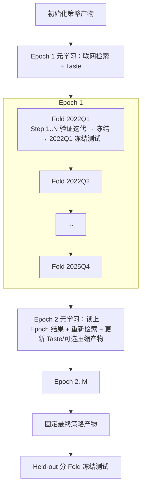

# Pipeline 设计

本文档记录训练、测试和 Held-out 的运行顺序。Pipeline 是 Step / Fold / Epoch 编排、策略产物冻结、测试执行和实验账本的权威文档。Pipeline 负责按时间顺序调度 Data、Environment 和 Agent，冻结每个阶段的输入输出，并写账本；它不实现投资逻辑。

相关边界：

- Agent 自身工作合同、可见数据、可写产物和输出格式见 `docs/agent_design.md`。
- PIT 窗口、Sandbox、Shell 和 Tool 见 `docs/environment_design.md`。
- raw 数据下载和审计见 `docs/data_documentation.md`。
- QMT 实盘流程见 `docs/QMT_documentation.md`。

## 术语说明

| 术语 | 含义 |
|---|---|
| Pipeline | 调度 Data、Environment 和 Agent 的外层程序，不实现投资逻辑 |
| Step | 一个 Fold 内的一次策略修改和验证尝试 |
| Fold | 一个验证区间加后续测试季度 |
| Epoch | 从起始 Fold 到结束 Fold 跑完一遍 |
| Held-out | 所有训练完成后才运行的冻结测试区间 |
| Development | 用于滚动验证和测试的研究区间，不等于最终测试 |
| `strategy_artifact` | Agent 写出的 `agent_output/factor/` 因子逻辑和 `agent_output/nl_prior/` 投资先验 |
| Taste | Epoch 开始前由元学习 Fold 生成的探索品味，作为 Prompt 注入本 Epoch 的 Fold Agent |
| `snapshot_manifest` | 记录本次可见数据窗口、hash、单位和时间覆盖的说明文件 |
| ledger | 记录 Step、Fold、Epoch、Held-out 结果和审计信息的文件 |

## 导航

- [1. 核心循环](#1-核心循环)
- [2. Fold 时间定义](#2-fold-时间定义)
  - [2.1 滚动 Fold](#21-滚动-fold)
  - [2.2 滚动方式](#22-滚动方式)
  - [2.3 数据窗口](#23-数据窗口)
- [3. Step 流程](#3-step-流程)
  - [3.1 Step 输入](#31-step-输入)
  - [3.2 Step 执行](#32-step-执行)
  - [3.3 Step 摘要](#33-step-摘要)
- [4. Fold 流程](#4-fold-流程)
  - [4.1 验证期](#41-验证期)
  - [4.2 Fold 内收敛和早停](#42-fold-内收敛和早停)
  - [4.3 测试期](#43-测试期)
  - [4.4 Fold 输出](#44-fold-输出)
- [5. Epoch 流程](#5-epoch-流程)
  - [5.1 Epoch 范围](#51-epoch-范围)
  - [5.2 Epoch 前元学习和正则化](#52-epoch-前元学习和正则化)
  - [5.3 多 Epoch](#53-多-epoch)
- [6. 测试和 Held-out](#6-测试和-held-out)
  - [6.1 Development 表现](#61-development-表现)
  - [6.2 Held-out](#62-held-out)
- [7. 账本和日志](#7-账本和日志)
  - [7.1 宿主机路径](#71-宿主机路径)
  - [7.2 账本文件](#72-账本文件)
  - [7.3 Docker 结束产物](#73-docker-结束产物)
  - [7.4 策略产物和版本记录](#74-策略产物和版本记录)
  - [7.5 实验报告图](#75-实验报告图)
- [8. 失败条件](#8-失败条件)
- [9. 验收清单](#9-验收清单)

## 1. 核心循环

Pipeline 使用三层循环：

| 层级 | 含义 | 是否允许修改策略产物 |
|---|---|---|
| Step | 一个 Fold 内的一次尝试 | 允许，在修改约束内 |
| Fold | 一个滚动验证区间和下一测试季度 | 验证期允许；测试期禁止 |
| Epoch | 从起始季度到结束季度跑完所有 Fold | 每个 Epoch 开始前可运行元学习 + 正则化 Fold |

主路径：



Pipeline 不实现投资逻辑，也不改写 Agent 代码。它只做调度、冻结、校验和记录。

## 2. Fold 时间定义

### 2.1 滚动 Fold

首个 Fold 使用 2021-10 到 2021-12 作为启动验证区间，随后按自然季度滚动。以 `fold_2022Q1` 为例：

| 项目 | 示例 |
|---|---|
| 输入窗口 | 2020-01 到 2021-09 |
| 验证区间 | 2021-10 到 2021-12 |
| 测试季度 | 2022-01 到 2022-03 |
| 验证决策时点 | 2021 年 10 月第一个交易日开盘前 |
| 验证可见数据 | Environment 默认窗口内、截至验证决策时点已可见的数据 |
| 测试决策时点 | 2022Q1 第一个交易日开盘前 |
| 测试可见数据 | Environment 默认窗口内、截至测试决策时点已可见的数据 |

含义：

- Agent 在验证决策时点只能看到验证季度开始前的数据。
- Agent 在验证期回测 2021-10 到 2021-12，并可在 Step 内修改代码和经验。
- 验证结束后冻结本 Fold 策略产物。
- 测试时用冻结策略产物回测 2022Q1，不允许再改代码或经验。

### 2.2 滚动方式

下一个 Fold 向后移动一个季度；上一 Fold 的测试季度会成为下一 Fold 的验证区间：

| Fold | 输入窗口 | 验证区间 | 测试季度 |
|---|---|---|---|
| `fold_2022Q1` | 2020-01 到 2021-09 | 2021-10 到 2021-12 | 2022Q1 |
| `fold_2022Q2` | 2020-04 到 2021-12 | 2022Q1 | 2022Q2 |
| `fold_2022Q3` | 2020-07 到 2022-03 | 2022Q2 | 2022Q3 |

下一个 Fold 只继承上一个 Fold 在测试前已经冻结的策略产物，也就是 `agent_output/factor/` 和 `agent_output/nl_prior/`。上一 Fold 的 Agent 对话历史、Shell/LLM/服务调用记录、`results/test_*` 目录和 Environment 运行日志不能进入下一 Fold prompt 或策略产物。

传递步骤必须显式记录：

1. 上一个 Fold 在验证期结束时向 `experiment_ledger.jsonl` 写入冻结策略产物 ID。
2. Pipeline 用 `experiment_id`、`epoch_id` 和该 ID 读取 `experiments/<experiment_id>/strategy_artifacts/<epoch_id>/<frozen_strategy_artifact_id>/manifest.json`。
3. Pipeline 校验策略产物聚合版本、父产物 ID 和冻结标记。
4. 新 Fold 启动时，Pipeline 把冻结产物复制到新 Sandbox 的 `/mnt/artifacts/parent_output/` 作为只读父产物基准，同时复制到 `/mnt/agent/agent_output/` 作为可写工作副本；并创建新的 `conversation_id`。
5. 新 Fold 的 Agent 只能看到父产物和当前工作副本中的因子逻辑、投资先验，不能看到上一 Fold 的对话、调用日志、`results/test_*` 或测试收益。

如果某个自然季度在后续 Fold 中成为验证季度，Pipeline 可以把该季度重新作为 raw/PIT 回放区间使用；但不能把它在上一 Fold 中作为测试季度时保存的 `results/test_*` 目录、Environment 运行日志或 Agent 对话直接喂给 Agent。当前 Fold 必须重新调用 `backtest_tool` 生成自己的 `results/valid_*`。

每个 Fold 必须创建新的 `conversation_id` 和 Agent session。Pipeline 不得复用上一 Fold 的对话上下文。

### 2.3 数据窗口

Environment 为每个决策时点准备固定最大长度窗口。具体数据域、默认窗口长度和单位合同以 `docs/environment_design.md` 的“可见数据窗口”为准；Pipeline 只记录每个 Fold 使用了哪个窗口配置。Agent 可以少用窗口内数据，但不能请求超出窗口的数据。

Pipeline 必须记录：

- `decision_time`
- `input_window`
- `validation_period`
- `test_period`
- `snapshot_id`
- `snapshot_manifest_hash`
- `strategy_artifact_id`

## 3. Step 流程

Step 是验证期的一次策略修改和验证。每个 Fold 的 Step 数固定上限，默认最多 10 次；实际执行仍受 Fold deadline 和 `finish_fold_tool` 约束。

### 3.1 Step 输入

| 输入 | 说明 |
|---|---|
| `strategy_artifact` | 上一 Step 或上一 Fold 冻结的 `agent_output/factor/` 和 `agent_output/nl_prior/` |
| `train_snapshot` | Agent 可读的训练/探索数据槽，对应 `/mnt/snapshots/train` |
| `validation_replay_snapshot` | Agent 可读的验证回放数据槽，对应 `/mnt/snapshots/valid`；验证结果另由 `backtest_tool` 写入 `/mnt/artifacts/results/valid_<idx>/` |
| `decision_input_view` | `backtest_tool` 正式调用前绑定到 `/mnt/snapshot` 的当前决策前 PIT 输入视图 |
| `modification_constraints` | 本 Step / Fold 对 `agent_output/factor/` 和 `agent_output/nl_prior/` 的修改约束 |
| `fold_time_limit` | Fold 运行时长约束，例如 `max_fold_minutes=30`；Step 不设单独时长 |
| `execution_policy` | 允许调用的 Shell/Tool 和调用上限；训练/验证期可启用受控 `sandbox_shell_tool`，测试和 held-out 默认关闭 |
| `anti_overfit_prompt` | 防止记忆特定月份、题材或股票 |
| `convergence_prompt` | 提示 Agent 优先保障验证收益和风险指标，其次在效果接近时选择更小、更简单的 `factor/` 和 `nl_prior/` 修改 |
| `step_tree` | 跨 Fold 的 Step 产物谱系树（开关 `step_tree_enabled`，供消融实验关闭）：实验级 `steps/` 复制进 Sandbox，`current_node_id` 定位到父产物节点；Fold 结束后同步回 `experiments/<experiment_id>/steps/` |
| `phase` | 阶段指引：`exploration` 鼓励有假设的自由探索（允许短期收益下降）；从 `convergence_start_epoch` 起为 `convergence`，要求在保持收益下尽量少改直至不改 |

`scripts/experiments/run_experiment.py` 暴露 `--convergence-start-epoch` 和 `--disable-step-tree`，分别用于调整收敛期起点和关闭 Step 产物树消融；默认从第 3 个 Epoch 进入收敛期，并启用 Step 产物树。模型默认值为：主 Agent `--model deepseek-v4-pro`，自然语言评分 `--nl-model deepseek-v4-flash`；二者可独立覆盖。Epoch 前元学习默认使用 Tavily Search API（`TAVILY_API_KEY`），也可用 `--web-search-provider semantic_scholar` 切换到 Semantic Scholar（`SEMANTIC_SCHOLAR_API_KEY`），或通过 `--web-search-provider disabled` 关闭。

`decision_input_view` 不是一个独立可探索目录，而是 Runner/root 在正式回测前绑定给 `backtest_tool` 的当前决策输入视图。运行时目录、可读/可写路径和正式候选生成隔离由 `docs/environment_design.md` 第 3-4 章定义；Pipeline 只决定“本次绑定哪个决策输入视图、使用哪个回放区间、冻结哪个策略产物”。

训练/验证 Step 中，Agent 可以对照父策略产物、在工作区写临时代码并更新正式 `factor/` 与 `nl_prior/`。接受该 Step 时，Pipeline 只冻结 `agent_output/factor/` 和 `agent_output/nl_prior/` 为新的 `strategy_artifact`，不冻结父产物副本、临时工作区或验证结果。测试和 held-out 只运行冻结产物，运行后必须校验因子和投资先验 hash 未变化。

首次没有父策略产物时，Pipeline 要求 Environment 使用 `configs/agent_output_template/` 初始化 `agent_output/factor/README.md`、`main.py`、`factors.json`、`agent_output/nl_prior/README.md` 和 `prior.json`。两个 `README.md` 是只读说明文件；`prior.json` 是正式投资先验。之后的新 Fold 只复制上一 Fold 冻结后的同名目录，不复制上一 Fold 的对话历史或 `workspace/`。

除第一次创建策略产物外，Pipeline 必须让 Runner/Environment 同时准备两份策略内容：一份复制到 `/mnt/artifacts/parent_output/` 作为 Agent 可读、不可写的父产物基准，另一份复制到 `/mnt/agent/agent_output/` 供 Agent 修改，并把父产物 ID/hash 写入 run manifest。

Pipeline 进入正式 `backtest_tool` 前必须调度 Environment 执行 `modification_check_tool`。该 Tool 先校验 `/mnt/artifacts/parent_output/` 与 run manifest hash 一致，再比较父副本和当前 `/mnt/agent/agent_output/factor/`、`/mnt/agent/agent_output/nl_prior/`，返回 `allowed_to_backtest`，并把检查摘要写入 Environment 的 `run_manifest.json` 和 `agent_trace.jsonl`。

Pipeline 不重新实现 diff 统计，也不接受 Agent 传入路径、父产物或阈值。若 `allowed_to_backtest=false`，本 Step 不获得验证回测结果，Agent 必须缩小正式修改后重试。只有通过修改约束且验证结果被接受时，Pipeline 才能冻结为新的 `strategy_artifact`。

`allowed_to_backtest` 是 Environment 按 Pipeline 下发约束计算出的继续验证门禁结果。该结果来自确定性计数检查。Pipeline 不重新解释修改约束，只记录该结果，并在验证结果合格后决定是否冻结产物。

第一次创建策略产物时没有历史父产物，使用 `is_initial_artifact=true` 的初始化约束；从第二个 Fold 开始必须使用 `/mnt/artifacts/parent_output/` 做 diff，不允许把整个目录当成新产物绕过修改约束。

运行时长由 Pipeline 统一下发，例如：

```json
{
  "max_fold_minutes": 30,
  "fold_deadline_at": "2026-06-07T22:30:00+08:00",
  "finalize_before_deadline_seconds": 300,
  "per_call_timeout_seconds": 300
}
```

每个 Fold 默认限时 30 分钟，Step 共享同一个 Fold deadline，不再单独计时。距离 deadline 5 分钟以上时，Pipeline、Runner 和 Proxy 不提示剩余时间，让 Agent 自由探索。剩余时间低于 `finalize_before_deadline_seconds` 时，Runner/Proxy 最多触发一次固定收尾提示，要求 Agent 立即输出当前最好版本的 `agent_output/factor/` 和 `agent_output/nl_prior/`，并尽快调用修改检查、验证回测或 `finish_fold_tool`。超过 `fold_deadline_at` 后，Pipeline 必须截断当前 Fold，停止新的 Shell/服务调用和 LLM 调用；已经卡住的 provider 请求只能超时取消，不能被追加 prompt。

收尾结果只能按校验结果记录为 `rejected`、`timeout` 或可接受的正常 Step；不能绕过策略修改约束、订单计划校验或回测规则。不能在 deadline 后继续追加 Prompt 直到产物通过，否则 Fold 时间预算和验证边界会失效。

如果到 deadline 仍没有新的有效产物，Pipeline 按以下顺序处理：

1. 使用当前正式工作副本，前提是其 hash 与最近一次通过修改检查和正式完整验证回测的产物一致；如果 Agent 已调用 `finish_fold_tool` 且合同校验通过，优先使用该锁定产物。启用 `step_tree_enabled` 时，完整验证 Step 会保留产物快照和关键附件，便于追溯搜索路径；最终传递给下一 Fold 的仍然只有被接受并冻结的策略产物。Pipeline 不重写 `factor/` 或 `nl_prior/`，只按规则验收、冻结或回退。
2. 如果本 Fold 没有已接受 Step，沿用进入本 Fold 时的父策略产物，记录 `no_update_timeout`，并把该 Fold 视为未改进。
3. 如果是第一次初始化且没有父策略产物，只有显式配置的基准产物通过合同校验时才能继续；否则本 Fold / Epoch 失败。

### 3.2 Step 执行

Fold 开始时，Pipeline 只启动一次 Sandbox 和 Agent 会话：

1. 启动验证 Sandbox。
2. 把本 Fold 的 `train`、`valid`、`test` 三类数据目录挂到 `/mnt/snapshots/`；`train` 是 Agent 可读的训练/探索输入，`valid` 是 Agent 可读的验证回放区间，`test` 对 Agent 用户不可读。
3. 把策略产物复制到 Sandbox。

之后同一个 Agent 会话内重复 Step 迭代：

1. Agent 在 `workspace/` 写临时代码、检查数据并调试；临时结果不作为正式回测结果。
2. Agent 在 `workspace/` 整理本 Step 最终草稿，包括因子入口、因子登记表和投资先验。
3. Agent 确认草稿可运行后，把正式入口和因子登记写入 `agent_output/factor/`，把投资先验写入 `agent_output/nl_prior/prior.json`。
4. Agent 可以调用 `modification_check_tool` 自查；该调用不传业务参数。Tool 固定读取只读父产物 `/mnt/artifacts/parent_output/` 和当前工作副本 `/mnt/agent/agent_output/`，先校验父产物 hash 与 run manifest 一致，再计算修改量。Pipeline 在正式 `backtest_tool` 前必须再次调度同一 Tool 复查，确保 Agent 自查后没有继续改动。若 `allowed_to_backtest=false`，Environment 拒绝继续运行，Agent 需要缩小修改后重试。
5. 修改检查通过后，Agent 调用 `backtest_tool` 的验证模式。该 Tool 自动加载 `agent_output/factor/` 和 `agent_output/nl_prior/`，使用 `/mnt/snapshot` 中的决策前输入调用无参数 `generate_candidates()`，得到 Agent 筛选后的有限候选池，再按 `abs(factor_score)` 截断到 `max_candidates`（默认 10），读取 `/mnt/snapshots/valid` 做验证回放，按配置执行因子快速验证或完整自然语言评分。订单计划由 Environment 按最终分数、阈值、持仓上限和券源规则生成；不可做空的短侧候选会自动顺延。最后通过模拟 Broker 回测验证季度。
6. `backtest_tool` 创建新的 `results/<phase>_<idx>/`，例如 `results/valid_000/`，写入 `detailed_return.json`、`order_plan.parquet` 和 `nl_output/`；调用摘要写入 Environment 的 `run_manifest.json`。Agent 在训练/验证期只读这些结果；测试和 held-out 结果不反馈给 Agent。
7. Pipeline 把本轮 Step 的轻量摘要追加到当前 Fold 的 `steps` 数组。Agent 根据结果决定继续下一 Step，或调用无参数 `finish_fold_tool` 表示当前 Fold 不再继续修改。

Fold 结束时：

1. `finish_fold_tool` 先触发轻量 `backtest_tool` 合同校验，不执行真实回测；校验通过后停止本 Fold 的 Agent 调用，Runner 锁定 `agent_output/` 写入，并要求 Environment/Pipeline 复核最近一次修改约束、验证结果和当前正式产物是否一致。校验失败时返回错误并让 Agent 在 deadline 前继续修复。
2. 当 Agent 调用 `finish_fold_tool`、达到 Step 上限或到达 deadline 时，Pipeline 将最后一个通过验收的 Agent 提交作为本 Fold 的最终策略产物，并进入冻结/测试流程；若没有有效提交，则按回退规则处理。

每次正式调用 `backtest_tool` 前，Pipeline 只需要给 Runner 少量运行参数：

- `mode`：`valid` 或 `frozen_eval`。
- `replay_stage`：`valid` 或 `test`；Runner 据此选择 `backtest_tool` 的回放区间。
- `result_name`：例如 `valid_000`、`test_000` 或 `heldout_000`。
- `nl_mode`：自然语言评分开关；取值和含义由 Environment 的 `backtest_tool` 合同定义，测试类回放固定为完整自然语言评分。

这些只是 Runner 调用参数，不传给 Agent，也不传给 `generate_candidates()`。正式调用前的准备约定：

- Pipeline 按本次决策时点准备 `/mnt/snapshot` 决策输入视图，并把 `long_score_threshold`、`short_score_threshold`、`max_total_holdings` 和 `short_inventory_mode` 写入 run manifest；默认值来自 `docs/environment_design.md` 第 5.3 节回放 profile。
- 实现时由 Runner/root 把选中的 `decision_input_view` 刷新为 Environment 的当前 `/mnt/snapshot` 镜像；Agent 用户不能切换或覆盖该视图。
- Broker 成本、券源近似口径、费率和风控线由 Environment 默认中信回放 profile 解析，并自动写入 `run_manifest.json`。
- Agent 可以读取训练/验证材料做探索和复盘；正式策略入口只能在 `backtest_tool` 中依赖当前决策输入视图，候选生成时的阶段目录隐藏规则由 Environment 执行。
- `test` 和 held-out 都使用 `frozen_eval`，区别只在 Pipeline 放入 `/mnt/snapshots/test` 的回放区间、`result_name` 和 ledger 标签。

同一 Sandbox 内的 `/mnt/snapshots/train|valid|test` 和 `/mnt/snapshot` 切换机制由 Environment 定义。Pipeline 只决定当前调用使用哪个 `decision_input_view`、哪个回放阶段和哪个结果目录；Runner/root 在验证和测试回放前分别把 `/mnt/snapshot` 刷新为对应 decision input view 的当前镜像。`backtest_tool` 用 `/mnt/snapshot` 执行策略，再读取 `valid` 或 `test` 回放区间。

测试模式只在 Pipeline 冻结本 Fold 策略产物之后，由 Runner/root 使用 `test` 回放区间自动执行；该区间不向 Agent 暴露。

自然语言评分步骤在 `backtest_tool` 内部运行。它产生的 `results/<phase>_<idx>/nl_output/` 可以用于当前 Step 的订单计划生成，也可以作为下一 Step 改写 `nl_prior` 的证据。若 Agent 在评分后又改写 `nl_prior` 并希望该修改影响当前 Step，则 Pipeline 必须重新运行 `modification_check_tool` 和 `backtest_tool`，并要求新的 `nl_prior`、`nl_output/`、订单计划和回测结果在 manifest 中保持一致。

### 3.3 Step 摘要

Pipeline 不重复记录 Environment 的细粒度文件清单，也不为 Step 单独维护账本文件。Step 在 Pipeline 层只是当前 Fold 记录中的一条轻量摘要，放入 `experiment_ledger.jsonl` 对应 `record_type=fold` 的 `steps[]`；Shell、LLM、回测明细和自然语言评分文件由 Environment 写入，并通过 `run_manifest_ref` 或结果路径被引用。

每条 Step 摘要至少记录：

| 字段 | 内容 |
|---|---|
| `status` | `accepted`、`rejected`、`timeout` 或 `no_update_timeout` |
| `strategy_artifact_ref` | 接受后的策略产物 ID/hash；若未接受新产物，则指向父产物或为空 |
| `modification_check_ref` | 本 Step 对应的修改检查摘要位置；当前嵌入为 `modification_delta_summary` |
| `modification_delta_summary` | 本 Step 修改量摘要，例如 factor 改动文件/行数/因子 ID 数、prior 新增/删除/改写规则数 |
| `validation_result_ref` | 最近一次正式验证回测结果目录和核心指标摘要 |
| `run_manifest_ref` | Environment 生成的 run manifest 引用；Shell/LLM/Tool 细节由该 manifest 和 `agent_trace.jsonl` 继续引用 |
| `timing` | 开始/结束时间、是否触发收尾、是否超时 |
| `decision_reason` | Pipeline 接受、拒绝、继续下一 Step 或回退父产物的简短原因 |

策略主函数返回值、订单计划、Shell 调用记录、自然语言评分、provider 原始响应和详细回测文件属于 Environment 运行时产物。Pipeline 只保存它们的引用和必要摘要。

## 4. Fold 流程

### 4.1 验证期

一个 Fold 内按顺序运行 Step。只有验证期可以修改策略产物。

Agent 决定何时提交当前 Fold 的最终 `factor/` 和 `nl_prior/`。Pipeline 可以把验收标准作为 Prompt 约束注入 Agent，并在 Agent 提交后用验证回测结果和风险约束做硬校验；Pipeline 不自行挑选、合并或改写因子和投资先验，也不能使用测试季度结果。

验证期提交验收规则：

- 验证收益为正。
- Sharpe 达到 Prompt 或 run manifest 指定阈值。
- 最大回撤不超过阈值。
- 持仓数量和集中度合规；按总分阈值生成多空订单，多空合计不超过 run manifest 持仓上限（默认值见 Environment 回放 profile）。
- 做多收益、做空收益、不可做空候选顺延数量、真实券源不足拒单和费率缺失拒单需要单独记录，防止策略只在单边市场有效却无法执行另一边。
- 修改次数没有超过约束；若多个 Step 表现接近，优先接受修改更小、逻辑更简单的产物。
- 经验条数没有超过上限。

验收只依据本 Fold 验证期的硬规则；不要求也不比较"超过上一 Epoch 同期 Fold 的表现"，跨 Epoch 的收敛通过阶段指引（探索期/收敛期 Prompt）实现，而不是逐 Fold 的硬性对比。

### 4.2 Fold 内收敛和早停

早停由 Agent 自己决定。Pipeline 可以把收敛和早停建议作为 Prompt 约束输入 Agent，例如：

- 验证收益为正。
- Sharpe、回撤、换手率、成本、持仓数量、持仓集中度、做多/做空拆分和拒单情况在可接受范围内。
- 当前修改已经通过约束检查。
- 最近若干 Step 的 `factor/` 和 `nl_prior/` 修改量逐渐减少，且验证表现没有明显恶化。
- 继续搜索的边际收益不值得消耗剩余 Fold 时间。

收敛只看修改量趋势和验证表现，不看测试季度或 Held-out。修改量由 `modification_check_tool` 产出的 diff 摘要提供，至少包括：

| 对象 | 修改量 |
|---|---|
| `factor/` | 修改文件数、diff 行数、新增/删除/修改因子 ID 数 |
| `nl_prior/` | 新增/删除/改写规则数、规则总数和单条长度 |

如果连续 Step 的修改量明显下降，且收益、Sharpe、回撤等核心指标已经满足 Prompt 或 run manifest 的硬规则，可以视为当前 Fold 搜索正在收敛。Pipeline 不因为“修改量变小”单独判定成功；它只把该趋势作为 Prompt 信息、早停建议和账本摘要。

Prompt 优先级必须明确：

1. 优先保障验证收益、Sharpe 和风险约束，并检查多空两侧是否具备可执行性。
2. 在效果接近或边际收益很小时，优先选择更小、更简单的 factor 和 prior 修改。
3. 要求 Agent 校准因子分数的方向和尺度，使正分、负分和接近 0 的分数分别对应做多、做空/回避和不交易；牛市、熊市和震荡期可以自然产生不同的多空/现金结构。
4. 不为了微小指标改善引入大规模规则、特定题材记忆或难以解释的复杂逻辑。

Agent 只能根据验证期结果、修改量摘要和当前 Prompt 约束判断是否早停，不能使用测试季度或 Held-out。若 Agent 认为当前产物足够好，应调用 `finish_fold_tool` 主动结束 Fold。

Pipeline 不计算复杂的产物评分，不在多个历史 Step 之间自行挑选因子或投资先验，也不因为某个验证指标达标就强行停止 Agent。Pipeline 只负责：

- 记录 Agent 调用 `finish_fold_tool` 的时间和原因。
- 校验当前正式产物、修改约束、订单计划和验证回测结果是否满足硬规则。
- 通过则冻结 Agent 提交的当前产物；不通过则让 Agent 在 deadline 前继续修复，或按回退规则处理。

早停只是节省验证期搜索，不代表策略通过最终测试。

### 4.3 测试期

测试期只执行冻结策略产物。测试回放区间必须对 Agent 用户不可读；Runner/root 在冻结回放上下文中准备测试决策输入视图 `/mnt/snapshot`，并让 `backtest_tool` 读取 `/mnt/snapshots/test` 完成回放。Held-out 使用同一机制，只是 Pipeline 把最终评估区间放入 `test` 回放区间，并在 `experiment_ledger.jsonl` 中用 `record_type=heldout` 标记。

1. Pipeline 冻结 `agent_output/factor/`、`agent_output/nl_prior/` 和策略产物 manifest。
2. 关闭 Agent 的可写探索阶段；`sandbox_shell_tool` 不再可用，也不能读取测试 snapshot。
3. Pipeline 选择 `mode=frozen_eval`、`replay_stage=test`、`nl_mode=on` 和 `result_name=test_<idx>`。
4. Runner/root 准备测试决策输入视图 `/mnt/snapshot`，加载 Environment 定义的回放和 Broker profile，并把 `/mnt/snapshots/test` 作为回放区间交给 `backtest_tool`。
5. Runner/root 调用 `backtest_tool`，自动加载冻结 `agent_output/factor/` 和 `agent_output/nl_prior/`。
6. `backtest_tool` 内部调用策略主函数、运行自然语言评分步骤、订单计划校验和模拟 Broker 回放；具体成本模型、成交规则、仓位上限和拒单逻辑由 Environment 的 profile 决定，并写入 `run_manifest.json`。
7. Pipeline 在 `experiment_ledger.jsonl` 的 `record_type=fold` 记录中写入策略产物 ID/hash、验证结果引用、测试结果引用、Environment `run_manifest.json` 引用和 snapshot manifest 引用，然后结束本 Fold。

测试结果只作为滚动开发表现记录。它不能修改本 Fold，也不能直接进入后续 Fold prompt 或策略产物；但可以作为下个 Epoch 前元学习的 development history 输入，由元学习 Fold 汇总为更抽象的 Taste。

### 4.4 Fold 输出

```json
{
  "fold_id": "fold_2022Q1",
  "input_window": "2020-01..2021-09",
  "validation_period": "2021-10..2021-12",
  "test_period": "2022Q1",
  "parent_strategy_artifact_id": "strategy_initial_template",
  "finish_reason": "finish_fold_tool",
  "finish_run_manifest_ref": "experiments/exp_quarterly_single_agent_001/artifacts/run_fold2022Q1_finish/run_manifest.json",
  "fold_status": "frozen",
  "selected_step_id": "step_007",
  "steps": [
    {
      "step_id": "step_001",
      "status": "rejected",
      "run_manifest_ref": "experiments/exp_quarterly_single_agent_001/artifacts/run_step001/run_manifest.json",
      "decision_reason": "modification_check_failed"
    },
    {
      "step_id": "step_007",
      "status": "accepted",
      "run_manifest_ref": "experiments/exp_quarterly_single_agent_001/artifacts/run_step007/run_manifest.json",
      "validation_result_ref": "experiments/exp_quarterly_single_agent_001/artifacts/run_step007/results/valid_000",
      "validation_summary": {
        "return": 0.031,
        "long_return": 0.024,
        "short_return": 0.007,
        "sharpe": 1.12,
        "max_drawdown": 0.042,
        "short_reject_count": 1
      },
      "decision_reason": "best_valid_result_in_fold"
    }
  ],
  "frozen_strategy_artifact_id": "strategy_epoch001_fold2022Q1",
  "frozen_strategy_artifact_path": "experiments/exp_quarterly_single_agent_001/strategy_artifacts/epoch_001/strategy_epoch001_fold2022Q1",
  "validation_result": {
    "return": 0.031,
    "long_return": 0.024,
    "short_return": 0.007,
    "sharpe": 1.12,
    "max_drawdown": 0.042,
    "short_reject_count": 1
  },
  "test_result": {
    "return": 0.018,
    "long_return": 0.013,
    "short_return": 0.005,
    "sharpe": 0.84,
    "max_drawdown": 0.035,
    "short_reject_count": 0
  },
  "state_changed_during_test": false
}
```

## 5. Epoch 流程

### 5.1 Epoch 范围

一个 Epoch 从 `fold_2022Q1` 跑到 `fold_2025Q4`。

```text
epoch_001:
  fold_2022Q1
  fold_2022Q2
  ...
  fold_2025Q4
```

每个 Fold 使用上一个 Fold 冻结后的策略产物作为起点；这个产物不包含上一 Fold 的测试结果或对话历史。

### 5.2 Epoch 前元学习和正则化

每个 Epoch 开始前，Pipeline 启动一个独立的元学习 + 正则化 Docker。它不复用任何 Fold Agent 容器、对话、`workspace/` 或 Shell 状态，默认同样限时 30 分钟。它有两个输出：

| 输出 | 用途 |
|---|---|
| `taste.md` | 本 Epoch 的探索品味，注入后续 Fold Agent Prompt |
| 可选的 `factor/` 和 `nl_prior/` 清理结果 | 通过修改检查后，可作为本 Epoch 起点 |

元学习 Docker 可以读取 development 材料，但不能读取 held-out。第一个 Epoch 没有父策略产物时，它只生成 Taste；后续 Epoch 会收到上一个 Epoch 结束后的冻结策略产物作为父产物，并可在小幅修改约束内做正则化清理。

输入必须由 manifest 明确列出：

| 输入 | 用途 |
|---|---|
| 父 `factor/` 和 `nl_prior/` | 作为可选正则化修改的 diff 基准；第一个 Epoch 可为空模板 |
| `experiment_ledger.jsonl` 中已完成记录 | 汇总此前 Fold 的验证、测试和失败原因 |
| `development_history.json` 中的紧凑回测摘要 | 由 Pipeline 从已完成 Fold 的 ledger 和 `run_manifest.json` 提取，包含验证/测试收益、Sharpe、回撤、订单数、候选截断、失败原因和完整验证标记 |
| 上一次同 Epoch 的 `meta_learning/agent_trace.jsonl` | 若同一 Epoch 重跑，可延续上次元学习对话记忆 |
| 上一次 Taste | 作为本次 Taste 的起点或反例 |

元学习 Fold 额外开放一个联网搜索动作 `web_search`。当前支持两类 provider：

| provider | 适用场景 | key |
|---|---|---|
| `tavily` | 通用网页、行业材料、跨领域材料和快速 RAG 检索 | `TAVILY_API_KEY` |
| `semantic_scholar` | 量化、金融、经济学、机器学习、复杂系统等论文检索；返回论文标题、摘要、年份、作者、引用数和链接 | `SEMANTIC_SCHOLAR_API_KEY` |

provider 由宿主机调用，key 不暴露给 Sandbox。该工具只在元学习 Fold 开放，普通 Fold Agent 和自然语言评分不具备联网搜索入口。Semantic Scholar Graph API 使用 `x-api-key` header；当前实现按小批量元学习检索使用，遵守低频调用节奏。

每次元学习至少尝试三类发散检索：

| 类别 | 示例 |
|---|---|
| 量化、金融、经济学 | WFO、因子衰减、风险溢价、行为金融、宏观状态切换 |
| 其他领域 | 机器学习正则化、复杂系统、工程鲁棒性、自然科学中的噪声识别 |
| 哲学概念 | 证伪、奥卡姆剃刀、反脆弱、归纳偏差、实用主义 |

Taste 应短而可执行，至少覆盖：本 Epoch 优先探索的 factor 方向、nl_prior 方向、要避免的过拟合倾向、以及收益、Sharpe、回撤、多空暴露和修改量之间的取舍。Pipeline 把最新 Taste 写入 `experiments/<experiment_id>/meta_learning/<epoch_id>/taste.md`，并作为 `taste_prompt` 注入本 Epoch 的每个 Fold Agent。

元学习可以做的可选正则化修改：

- 删除明显过拟合或长期无效的因子/规则。
- 合并重复或高度相似的规则。
- 把具体月份、题材、个股经验抽象成更通用的条件。
- 缩短规则文本，保持规则数量和复杂度在上限内。

元学习禁止：

- 读取 held-out 或最终评估结果。
- 调用正式 `backtest_tool` 产生新的收益回测结果。
- 把 development history 当成新的调参搜索空间。
- 新增只因为某段 development 表现好才成立的交易规则。

如果元学习修改了 `factor/` 或 `nl_prior/`，也必须通过 `modification_check_tool`。通过后，Pipeline 冻结为 `strategy_<epoch_id>_meta_learning`，作为本 Epoch 第一个 Fold 的起点；未通过时保留父产物，只使用本次 Taste。

### 5.3 多 Epoch

可以重复多个 Epoch。每个 Epoch 从其开头元学习 Fold 输出或回退得到的策略产物开始；最后一个 Epoch 的最后一个 Fold 冻结产物就是 Held-out 使用的最终策略产物。

多 Epoch 的目的不是记住更多历史细节，而是压缩出更稳定的因子和经验。Pipeline 必须限制：

- `nl_prior` 总条数。
- `factor` 复杂度。
- 每个 Fold 的修改数量。

跨 Epoch 的搜索节奏由阶段指引控制：`convergence_start_epoch`（配置项，默认第 3 个 Epoch）之前为探索期，Prompt 鼓励有假设、可检验的自由探索，即使短期验证收益下降也允许；自该 Epoch 起进入收敛期，Prompt 要求在保持收益的前提下尽量减少修改——优先直接验证父产物本身，直至连续 Fold 不再产生任何修改，达成收敛。

## 6. 测试和 Held-out

### 6.1 Development 表现

Development 期间，每个 Fold 的测试季度表现汇总为滚动开发表现。

Development 表现用于判断系统是否能在滚动验证中逐步改善，但不能代表最终泛化表现。

### 6.2 Held-out

Held-out 在所有 Epoch 完成后运行。Held-out 起止日期必须在实验开始前写入配置并冻结，不能根据验证或 development 结果选择；它不得与 `fold_2022Q1` 到 `fold_2025Q4` 的 development 区间重叠。

规则：

- 使用最终冻结策略产物。
- 按季度分 Fold 测试。
- 不运行 Step。
- 不修改 `agent_output/factor/`。
- 不修改 `agent_output/nl_prior/`。
- 不让 held-out 结果进入验证或元学习。

Held-out 输出是最终测试集表现。

## 7. 账本和日志

本章是实验级日志和账本的唯一权威定义。Agent 文档只说明行为边界；Environment 文档只说明 Sandbox 实际写哪些运行时文件。

### 7.1 宿主机路径

每次 Docker run 结束后，Pipeline 都应立即把该次 Sandbox 内 `/mnt/artifacts` 的可信产物和 `/mnt/agent` 的 Agent 工作产物收集到宿主机实验目录下独立的 `artifacts/<run_id>/`。一个 Fold 默认对应一个 Docker run：先进行训练/验证，Agent 调用 `finish_fold_tool` 后停止可写探索，再由 Runner/root 在同一 Docker 中执行冻结测试。Epoch 前元学习和 Held-out 评估各自使用独立 `run_id`。建议路径：

```text
experiments/
  <experiment_id>/
    ledgers/
      experiment_ledger.jsonl
    strategy_artifacts/
      <epoch_id>/
        <strategy_artifact_id>/
          manifest.json
          factor/
          nl_prior/
    meta_learning/
      <epoch_id>/
        taste.md
        agent_trace.jsonl
    artifacts/
      <run_id>/
```

路径含义：

| 路径 | 写入方 | 内容 |
|---|---|---|
| `strategy_artifacts/<epoch_id>/<strategy_artifact_id>/` | Pipeline | 已冻结并可传递到下一 Fold/Epoch 的 `factor/`、`nl_prior/` 和 `manifest.json` |
| `meta_learning/<epoch_id>/` | Pipeline | 元学习 Fold 生成的 Taste 和可延续的对话 trace |
| `artifacts/<run_id>/` | Environment / Pipeline 收集 | 某次 Docker 或冻结回放的完整运行产物，来自 Sandbox 的 `/mnt/artifacts` |
| `ledgers/` | Pipeline | 实验级 JSONL 账本 |

这些路径默认不提交 Git。重要结论写入 `LOGBOOK.md` 和 `docs/logbook/DETAILED_LOGBOOK.md`。

### 7.2 账本文件

只保留一个正式账本文件：

| 账本 | 写入时机 | 内容 |
|---|---|---|
| `ledgers/experiment_ledger.jsonl` | 每次 Fold、元学习或 Held-out run 结束时追加 | 实验级事件索引；通过 `record_type` 区分 `fold`、`meta_learning`、`heldout` |

Step 不单独落成文件。每个 Step 的状态、策略产物引用、修改检查摘要、验证结果引用、run manifest 引用和接受/拒绝原因，都放在对应 `record_type=fold` 记录的 `steps[]` 中。

同一实验的所有记录通过 `experiment_id`、`epoch_id`、`fold_id`、`run_id` 和 `strategy_artifact_id` 串联。元学习和 Held-out 都不需要独立账本；它们只是 `experiment_ledger.jsonl` 中不同 `record_type` 的记录。

### 7.3 Docker 结束产物

每类 Docker run 结束后，宿主机应保留：

| 运行类型 | 结束后写入 `artifacts/<run_id>/` | 同步更新 |
|---|---|---|
| Fold Docker | `run_manifest.json`、`agent_trace.jsonl`、`agent_output/`、`results/valid_*`、`results/test_*`、启用时的 `steps/`、可选 `workspace/` 调试残留；冻结测试阶段策略产物必须保持只读不变 | `experiment_ledger.jsonl` 追加 `record_type=fold`；通过验收的 `agent_output/factor/` 和 `agent_output/nl_prior/` 复制到 `strategy_artifacts/` |
| Epoch 前元学习 Docker | `run_manifest.json`、`agent_trace.jsonl`、`workspace/taste.md`、可选正则化后的 `agent_output/`、修改检查摘要；不产生新的正式回测结果 | `experiment_ledger.jsonl` 追加 `record_type=meta_learning`；Taste 复制到 `meta_learning/<epoch_id>/`，通过修改检查的产物复制到 `strategy_artifacts/<epoch_id>/` 作为本 Epoch 起点 |
| Held-out 冻结评估 | `run_manifest.json`、`agent_trace.jsonl`、`results/heldout_*` 或带 held-out 标签的测试类结果 | `experiment_ledger.jsonl` 追加 `record_type=heldout` |

Environment 的细粒度 Shell/Python/LLM/回测调用写在 `artifacts/<run_id>/agent_trace.jsonl` 和对应 `results/` 中。Pipeline 只把关键路径、摘要指标和 hash 引用写到账本。

### 7.4 策略产物和版本记录

`strategy_artifacts/` 是 Fold/Epoch 之间传递策略的最小交接包，只包含可复用的 `factor/`、`nl_prior/` 和 `manifest.json`。历史 `results/`、`agent_trace.jsonl`、`run_manifest.json` 和可选 `workspace/` 调试材料都应保留在对应的 `artifacts/<run_id>/` 中，用于审计、复现和后续分析，但不放入策略交接包。

`manifest.json` 至少记录：

```json
{
  "experiment_id": "exp_quarterly_single_agent_001",
  "epoch_id": "epoch_001",
  "strategy_artifact_id": "strategy_epoch001_fold2022Q1",
  "parent_strategy_artifact_id": "strategy_initial_template",
  "strategy_artifact_hash": "sha256:...",
  "created_at_fold": "fold_2022Q1",
  "created_at_step": 2,
  "frozen": true,
  "source_run_id": "run_..."
}
```

Experiment ID 是索引，不是完整性校验。Pipeline 只在关键边界记录聚合版本或 hash：

- 冻结策略产物 ID 和聚合 hash。
- snapshot manifest ID 和可选聚合 hash。
- 回测结果目录和可选聚合 hash。
- Environment `run_manifest.json`、`agent_trace.jsonl` 和自然语言评分输出引用。
- Sandbox 镜像版本、provider、model、prompt ID、随机种子、deadline 和资源护栏。

不为每条 Shell/Python 调用生成细粒度 hash；调用明细由 Environment 的 `agent_trace.jsonl` 保留。

### 7.5 实验报告图

报告脚本从 `experiment_ledger.jsonl` 和本地基准行情派生图表，不改变实验事实源。默认命令：

```bash
python scripts/experiments/report_experiment.py --experiment-id <experiment_id>
```

默认基准是沪深300 `000300.SH`。报告脚本在 `data/raw/index_daily/ts_code=000300.SH/` 下读取指数日线；若本地缺少该数据，报告仍生成策略曲线，但 `summary["benchmark"]["status"]` 会标记 `missing_data` 或 `missing_raw_dir`。基准区间收益按回放区间第一个交易日 `open` 到最后一个交易日 `close` 计算，和当前固定持有回放口径一致。

输出图：

| 文件 | 内容 |
|---|---|
| `reports/epoch_comparison_returns.png` | 各 Epoch 的冻结测试收益曲线、累计策略权益、沪深300同期收益和累计基准；最终 Epoch 附加 Held-out |
| `reports/epoch_returns/<epoch_id>_returns.png` | 单个 Epoch 的验证收益、冻结测试收益、多空贡献、沪深300收益、累计策略权益、累计基准和相对权益 |

相对收益字段定义为 `active_return = strategy_return - benchmark_return`；相对权益曲线定义为累计策略权益除以累计基准权益。表格中必须展示基准收益和 active return，避免只看绝对收益。

## 8. 失败条件

以下情况必须失败：

- snapshot 缺失或关键 manifest 不匹配。
- Sandbox 访问了禁止路径。
- Agent 读取了未来数据。
- Python 代码运行失败但返回成功。
- debug shell 调用没有 Environment 日志。
- Environment 没有为 LLM 调用生成 conversation log。
- 文本分析没有 evidence 引用。
- 回测输入 schema 不合法。
- 测试或 held-out 修改了策略产物。
- Fold 修改次数超过约束。
- 元学习 Docker 读取 held-out。
- 元学习 Docker 在 development history 上反复调用正式回测调参。

## 9. 验收清单

Pipeline 相关改动至少检查：

- Step / Fold / Epoch 时间定义是否清楚。
- 验证决策时点和测试决策时点是否没有未来数据。
- 每个 Fold 是否只有验证期能修改策略产物。
- 测试期是否只执行冻结策略产物。
- Held-out 是否完全冻结。
- 每次 LLM 调用是否由 Environment 自动生成 conversation log。
- 每个关键 artifact 是否有 manifest；冻结策略产物和回测结果是否有聚合版本记录。
- 元学习是否只做 Taste 生成和可选压缩/抽象化，且不读取 held-out、不把 development history 当成新的调参搜索空间。
