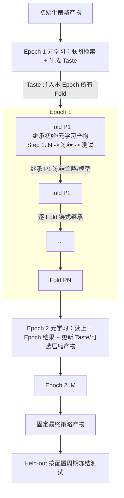

# Pipeline 设计

本文档记录训练、测试和 Held-out 的运行顺序。Pipeline 是 Step / Fold / Epoch 编排、策略产物冻结、测试执行和实验账本的权威文档。

相关边界：

- Agent 自身工作合同、可见数据、可写产物和输出格式见 `docs/agent_design.md`。
- PIT 窗口、Sandbox、Agent 工具和回测入口见 `docs/environment_design.md`。
- raw 数据下载和审计见 `docs/data_documentation.md`。
- QMT 实盘流程见 `docs/QMT_documentation.md`。

**术语说明**

| 术语 | 含义 |
|---|---|
| Pipeline | 调度 Data、Environment 和 Agent 的外层程序，不实现投资逻辑 |
| Step | 一个 Fold 内的一次策略修改和验证尝试 |
| Fold | 一个验证区间加后续测试区间 |
| Epoch | 从起始 Fold 到结束 Fold 跑完一遍 |
| Development | 用于滚动验证和测试的研究区间，不等于最终 held-out |
| Held-out | 所有训练完成后才运行的冻结测试区间 |
| `strategy_artifact` | Agent 写出的 `output/` 正式策略产物目录，根目录入口为 `main.py` |
| `model_artifact` | Agent 写出的 `models/` 可继承模型参数目录 |
| Taste | Epoch 开始前由元学习会话生成的探索偏好，作为 Prompt 注入本 Epoch 的 Fold Agent |
| `snapshot_manifest` | 记录本次可见数据窗口、hash、单位和时间覆盖的说明文件 |
| ledger | 记录 Fold、Epoch、Held-out 结果和审计信息的文件 |

**职责边界**

Pipeline 负责按时间顺序调度 Data、Environment 和 Agent，冻结每个阶段的输入输出，并写实验账本。Pipeline 不实现投资逻辑，也不改写 Agent 策略代码。

**导航**

- [1. 实验循环与时间排程](#1-实验循环与时间排程)
  - [1.1 循环层级与主路径](#11-循环层级与主路径)
  - [1.2 Fold 时间、泄漏边界与运行约束](#12-fold-时间泄漏边界与运行约束)
- [2. Step、Fold 验收与产物冻结](#2-stepfold-验收与产物冻结)
  - [2.1 Step 输入与执行](#21-step-输入与执行)
  - [2.2 冻结条件、完整验证与测试](#22-冻结条件完整验证与测试)
  - [2.3 策略产物、Manifest 与 Hash](#23-策略产物manifest-与-hash)
- [3. Epoch、元学习与最终评估](#3-epoch元学习与最终评估)
  - [3.1 元学习输入输出与边界](#31-元学习输入输出与边界)
  - [3.2 多 Epoch、Development 与 Held-out](#32-多-epochdevelopment-与-held-out)
- [4. 账本、路径、报告与失败处理](#4-账本路径报告与失败处理)
  - [4.1 实验目录、路径角色与主账本](#41-实验目录路径角色与主账本)
  - [4.2 报告、失败条件与验收清单](#42-报告失败条件与验收清单)

## 1. 实验循环与时间排程

### 1.1 循环层级与主路径

Pipeline 使用三层循环：

| 层级 | 含义 | 是否允许修改策略产物 |
|---|---|---|
| Step | 一个 Fold 内的一次尝试 | 允许，在修改约束内 |
| Fold | 一个滚动验证区间和下一测试区间 | 验证期允许；测试期禁止 |
| Epoch | 从起始周期到结束周期跑完所有 Fold | 每个 Epoch 开始前可运行元学习和可选正则化 |

**主路径：**



Pipeline 不实现投资逻辑，也不改写 Agent 代码；它只做调度、冻结、校验和记录。完整流程是：每个 Epoch 先运行一次元学习会话，基于 development 历史、父产物、可见数据和联网检索生成非空 Taste，并可选产出小幅正则化后的父产物；随后 Pipeline 按配置周期依次启动普通 Fold Agent，把同一份 Taste 注入本 Epoch 所有 Fold Prompt，让它作为策略实现、NL 使用、交易取舍和正则化偏好的关键指导；策略产物和模型参数则按 Fold 链式继承，第一个 Fold 继承初始模板或元学习正则化后的父产物，之后每个 Fold 继承上一个 Fold 在测试前冻结的策略和模型产物，若没有可接受更新则继承 fallback 父产物；所有 development Fold 完成后固定最终策略产物，再执行 held-out 冻结测试。Taste 在同一 Epoch 内保持一致，下一 Epoch 可基于 development 结果生成新的 Taste。完整实验运行不可原地续跑：`ExperimentPipeline.run()` 在目标 experiment 已存在冻结产物或 Fold 账本记录时直接 fail-fast，要求换用新的 experiment id，避免冻结写入落到已填充的实验目录。

### 1.2 Fold 时间、泄漏边界与运行约束

**可配置周期滚动。**

Pipeline 通过 `fold_period` 控制每个 Fold 的决策/测试周期，支持 `week`、`month`、`quarter`、`year`，默认 `quarter`（CLI `--fold-period` 同此四选一）。每个周期用“测试周期的前一个同频周期”作为验证区间，上一 Fold 的测试区间会成为下一 Fold 的验证区间。以默认季度 `fold_2022Q1` 为例：

| 项目 | 示例 |
|---|---|
| 输入窗口 | 2020-01 到 2021-09 |
| 验证区间 | 2021-10 到 2021-12 |
| 测试区间 | 2022-01 到 2022-03 |
| 验证决策时点 | 验证区间前最后一个交易日 23:59:59 北京时间（2021-10 首个交易日的前一交易日收盘） |
| 验证可见数据 | Environment 配置窗口内、截至验证决策时点已可见的数据 |
| 测试决策时点 | 测试区间前最后一个交易日 23:59:59 北京时间（2022Q1 首个交易日的前一交易日收盘） |
| 测试可见数据 | Environment 配置窗口内、截至测试决策时点已可见的数据 |

每个区间的研究/决策输入快照锚定在区间开始前最后一个交易日的 23:59:59（前一交易日收盘）。冻结的 `ctx.snapshot_dir` 因此只包含截至前一交易日收盘已发布的数据，不含区间首日的任何数据；区间自身的数据只在回放仿真时钟越过每行刷新节点时按逐 tick Timeview 滚动进入（见 `environment_design.md` §3.2）。该前一交易日收盘锚点统一适用于 valid、test 和 held-out 决策输入截止时点，确保区间首日盘前数据不进入冻结快照。下游快照构建不变：该锚点仍是传入 `build_decision_snapshot` 的决策输入截止时点。

下一个 Fold 向后移动一个配置周期：

| Fold | 输入窗口 | 验证区间 | 测试区间 |
|---|---|---|---|
| `fold_2022Q1` | 2020-01 到 2021-09 | 2021-10 到 2021-12 | 2022Q1 |
| `fold_2022Q2` | 2020-04 到 2021-12 | 2022Q1 | 2022Q2 |
| `fold_2022Q3` | 2020-07 到 2022-03 | 2022Q2 | 2022Q3 |

每个验证、测试和 held-out 区间至少要有 2 个交易日（`folds.MIN_REGION_TRADE_DAYS`）：回放区间的最后一个交易日保留给强制清仓，只含单个交易日的区间根本无法回测。`build_fold_schedule` 和 `heldout_periods` 在排程构建时即校验，交易日不足的区间直接报错，不会浪费 Sandbox 和 LLM 会话。

**泄漏边界。**

时间和泄漏边界：

- Agent 在验证决策时点（验证区间前一交易日收盘 23:59:59）只能看到该时点前已可见的数据；验证区间首日数据只在回放中按逐 tick Timeview 滚动进入。
- 验证期可以修改 `output/` 并重复 Step。
- 验证结束后冻结本 Fold 策略产物。
- 测试时使用冻结产物回放测试区间，不允许再改策略。
- 下一 Fold 只继承上一 Fold 在测试前已经冻结的策略和模型产物；如果上一 Fold 没有可接受更新，则继承 Pipeline 选择的 fallback 父产物。
- 本 Epoch 的 Taste 会直接注入每个 Fold Prompt，作为实现策略的高层指导；它可以影响普通 Fold 的探索方向、NL 使用方式、交易策略取舍和正则化偏好，但不能携带测试或 held-out 明细。
- 上一 Fold 的 Agent 对话历史、工具调用（含 shell）、LLM 调用日志、`results/test_*`、测试收益和测试 conversation log 不能进入下一 Fold prompt 或策略产物。
- 如果某个历史区间在后续 Fold 中成为验证区间，当前 Fold 必须重新调用 `backtest` 生成自己的 `results/valid_*`。
- 每个 Fold 必须创建新的 `conversation_id` 和 Agent session。

**运行约束。**

Environment 为每个决策时点准备实验配置冻结的数据窗口，默认 21 个月历史。Agent 可以少用窗口内数据，但不能请求超出窗口的数据。Pipeline 必须记录：

- `decision_time`
- `input_window`
- `validation_period`
- `test_period`
- `snapshot_config`
- `snapshot_id`
- `snapshot_manifest_hash`
- `strategy_artifact_id`

每个 Fold 默认 60 分钟，Step 共享同一个 Fold deadline。距离 deadline 进入收尾窗口时，Runner/Proxy 最多触发一次固定收尾提示。主对话 `max_llm_calls` 只限制 Agent 行动轮次；context compact 使用独立低成本模型、独立调用上限和独立 trace 事件，但仍受同一个 Fold deadline 约束。超过 `fold_deadline_at` 后，Pipeline 必须截断当前 Fold，停止新的 Shell、服务调用和 LLM 调用。`backtest` 独立计时：其墙钟耗时回补到推理 deadline，并受 `max_backtests_per_fold` 次数上限与按天/按决策的真实墙钟硬上限约束（细节见 `environment_design.md` §3.2）。

## 2. Step、Fold 验收与产物冻结

Step 是验证期的一次策略修改和验证。每个 Fold 的 Step 数有固定上限，实际执行仍受 Fold deadline 和 `finish_fold` 约束。

### 2.1 Step 输入与执行

Step 输入：

| 输入 | 说明 |
|---|---|
| `parent_strategy_artifact` | 本 Fold 起点产物：上一 Fold 冻结产物或初始模板，复制到只读 `parent_output`；Step 之间不替换该基准 |
| `output` | 当前可写策略工作副本，根目录固定 `main.py`，可含受控子目录 |
| `models` | 当前可写模型参数工作副本，可含受控子目录 |
| `train_snapshot` | Agent 可读的训练/探索数据槽 `/mnt/snapshots/train` |
| `validation_replay_snapshot` | Agent 可读的验证回放数据槽 `/mnt/snapshots/valid` |
| `test_replay_snapshot` | Agent 不可读的冻结测试回放槽 `/mnt/snapshots/test` |
| `valid_decision_input` | `backtest` 验证模式绑定到 `/mnt/snapshot` 的决策输入视图；`train_snapshot` 是它的 Agent-visible alias，manifest 记录相同 snapshot hash |
| `test_decision_input` | `frozen_eval` 绑定到 `/mnt/snapshot` 的测试决策输入视图 |
| `snapshot_config` | 实验启动前冻结的数据窗口配置，控制各数据域的 PIT 准备窗口 |
| `modification_constraints` | 当前 Step / Epoch 的文件数、diff 行数、代码 diff 行数、字节数和非法文件约束 |
| `AcceptanceRules` | 验证收益、Sharpe、回撤和完整验证要求 |
| `deadline` | Fold 运行时长约束和收尾窗口 |
| `execution_policy` | 允许调用的工具、主对话上限、compact 上限和超时 |
| `anti_overfit_prompt` | 防止记忆特定月份、题材或股票 |
| `convergence_prompt` | 收敛阶段优先保留更小、更稳定的策略 |
| `Taste` | Epoch 前元学习输出的探索偏好；同一 Epoch 内直接注入所有普通 Fold Prompt |
| `phase` | `exploration` 或 `convergence` |
| `step_tree` | 跨 Fold 的 Step 产物谱系树，供 Agent 只读参考 |

**执行流程：**

1. Fold 开始时，Pipeline 启动一个 Sandbox 和一个 Agent 会话。
2. Runner 挂载 `train`、`valid`、`test` 三类数据槽；`test` 对 Agent 用户不可读。
3. Pipeline 把父策略产物复制到 `/mnt/artifacts/parent_output/` 和 `/mnt/agent/output/`，把父模型参数复制到 `/mnt/artifacts/parent_models/` 和 `/mnt/agent/models/`。
4. Runner 把本 Epoch 的 Taste 注入 Fold Agent Prompt；该 Taste 不写入正式策略产物 hash，但会指导 Agent 如何实现和取舍策略。
5. Agent 在 `workspace/` 探索、读数据、复盘验证结果和调试。
6. Agent 把当前正式代码写入 `output/`，把需要继承的模型参数写入 `models/`。
7. Agent 主动调用 `modification_check`；`backtest` 在正式执行前也会复核最近检查结果和当前策略/model hash。
8. 修改检查通过后，Agent 调用 `backtest`；可选参数只有 `replay_window`，Runner 固定以 valid 模式执行。若检查缺失或过期，`backtest` 自动补跑。
9. `backtest` 执行 `output/main.py`，写入 `results/valid_<idx>/`。
10. Pipeline 把完成验证回测的 Step 轻量摘要追加到当前 Fold 记录的 `steps[]`。
11. Agent 根据结果继续下一 Step，或调用无参数 `finish_fold`。

**Step 摘要。**

`steps[]` 只记录完成验证回测的 Step；失败尝试、超时和无更新 fallback 由 run manifest、agent trace、Step tree 的 failed 节点和 Fold ledger 顶层状态记录。Step 摘要至少记录：

| 字段 | 内容 |
|---|---|
| `step_id` | Fold 内唯一 Step ID |
| `status` | `accepted`、`completed` 或 `rejected` |
| `strategy_artifact_ref` | 当前 `output` hash |
| `model_artifact_ref` | 当前 `models` hash |
| `combined_artifact_ref` | 策略 hash 与模型 hash 的组合身份 |
| `modification_check_ref` | 修改检查摘要位置或嵌入摘要 |
| `validation_result_ref` | `results/valid_<idx>/` 引用 |
| `modification_delta_summary` | 本次正式产物相对父产物的修改摘要 |
| `summary` | 收益、Sharpe、回撤、订单数量和 long/short 拆分摘要 |
| `timing` | 完成时间等轻量时间信息 |
| `decision_reason` | 记录该 Step 被接受、完成或拒绝的原因 |

Pipeline 不为 Step 单独维护账本文件。Shell、LLM、Broker、NL 和回测明细由 Environment 写入，并通过 result path 或 run manifest 引用。

### 2.2 冻结条件、完整验证与测试

**冻结条件。**

一个 Step 可被冻结必须同时满足：

- 最近一次 `modification_check` 通过。
- 当前 `output` hash 与 modification check hash 一致。
- 当前 `models` hash 与 modification check hash 一致。
- 最近一次完整 `backtest` 验证成功。
- 当前 `output` hash 与该 backtest 的 artifact hash 一致。
- 当前 `models` hash 与该 backtest 的 artifact hash 一致。
- 验证结果满足 `AcceptanceRules`。

默认 `AcceptanceRules`：

| 字段 | 默认 |
|---|---:|
| `min_return` | `0.0` |
| `min_sharpe` | `0.0` |
| `max_drawdown` | `0.25` |
| `require_complete_validation` | `true` |

实验 CLI 可用 `--min-return`、`--min-sharpe`、`--max-drawdown` 覆盖收益/风险阈值；`require_complete_validation` 恒为 `true`（冻结候选池只从完整验证回测中选取，不完整验证无法被冻结），流程烟测只放宽收益/风险阈值、不放宽完整验证要求。

**完整验证：**

- `output/main.py` 的 `main(ctx)` 在整个回放区间逐 tick 成功执行。
- `main` 发出的 Broker 原语通过 universe、方向、股数/权重和可交易性校验。
- Broker 完成日线或分钟线回放。
- `detailed_return.json`、`orders.parquet` 和必要 manifest 摘要写入。
- Broker 可执行性、拒单和费用摘要可追溯。

**收敛和早停：**

- 只看验证结果、修改量、策略复杂度和剩余 Fold 时间。
- 不看测试或 held-out 结果。
- 收敛阶段优先保护收益和风险指标，其次压缩 `output` 代码、helper、参数、prompt 和模型参数。
- 当验证效果接近或边际收益很小时，优先保留更小、更简单、更可解释的版本。

`finish_fold` 成功后，Runner 只读锁定 `output/` 和 `models/`、清理 Sandbox 内 Agent 后台进程，并停止本 Fold 的 Agent 调用。Pipeline 选择最近一次通过完整验证且当前策略/model hash 未变的 Step。Agent 在结束前应确保当前 `output`/`models` 就是自己认为最好的已验证版本；若历史 Step 更优，应先恢复该版本、重新完成 modification check 和完整 `backtest`，再调用 `finish_fold`。若没有可接受 Step：

1. 有父产物时沿用父产物，并按原因区分 `fold_status`：本 Fold 内从未产生成功的完整验证回测记 `no_valid_backtest`；已有完整验证但未被接受（未达 `AcceptanceRules`，或当前策略/model hash 与该验证不一致）记 `no_update`。两种情况都附带拒绝原因列表，供审计无需反推。
2. 首个 Fold 没有父产物且无法产生可接受基线时，实验失败。

**冻结测试：**

- Agent 停止，`shell` 不再可用。
- Runner/root 绑定测试决策输入视图到 `/mnt/snapshot`。
- 使用冻结产物自动执行 `frozen_eval`。
- 测试前后校验 `output` hash 和 `models` hash 不变。
- 测试结果只写宿主 development 账本、host manifest 和报告；不进入后续 Epoch 元学习输入，也不反馈给当前或下一 Fold Agent prompt。

### 2.3 策略产物、Manifest 与 Hash

**冻结目录：**

```text
experiments/<experiment_id>/strategy_artifacts/<epoch_id>/<strategy_artifact_id>/
  README.md
  main.py
  candidate.py
  trading.py
  nl_prompt.md
  ...
  manifest.json

experiments/<experiment_id>/strategy_artifacts/<epoch_id>/<strategy_artifact_id>.models/
  model.joblib
  scaler.json
  weights.pt
```

`manifest.json` 是冻结元数据，不参与策略 artifact hash，也不会复制回 `output`。下一 Fold 继承策略文件和对应模型参数；空 `models` 是合法状态并有稳定 hash。

**Manifest 字段。**

策略产物 `manifest.json` 只记录冻结产物自身的身份、血缘和来源运行。它不保存验证结果、修改检查详情或运行账本引用；这些属于 Fold ledger 的 Step 记录。

| 字段 | 内容 |
|---|---|
| `experiment_id` | 所属实验 ID |
| `epoch_id` | 所属 Epoch |
| `strategy_artifact_id` | 冻结产物 ID |
| `parent_strategy_artifact_id` | 父产物 ID，首个产物为空 |
| `strategy_artifact_hash` | 策略文件 hash，不含冻结 manifest |
| `model_artifact_hash` | 模型参数 hash，可为空目录 hash |
| `combined_artifact_hash` | 策略 hash 与模型 hash 的组合身份 |
| `source_run_id` | 产物来源 run |
| `source_fold_id` / `source_step_id` | 来源 Fold 和 Step |
| `created_at` | 冻结时间 |

触发冻结的验证结果、`run_manifest_ref`、`modification_check_ref` 和修改摘要写入 Fold ledger 的 Step 记录；文件清单和文件 hash 可由冻结目录重新计算，不作为最小 manifest 字段。

**Hash 边界：**

- 冻结策略产物。
- 冻结模型参数产物。
- snapshot manifest。
- 回测结果目录。
- run manifest。
- agent trace。
- prompt、seed、deadline 和 resource guard 配置。

## 3. Epoch、元学习与最终评估

每个 Epoch 覆盖从起始 Fold 到结束 Fold 的完整滚动序列。Epoch 开始前运行独立元学习会话，生成本 Epoch 的 Taste；随后每个普通 Fold 直接继承这份 Taste，同时在策略和模型文件层面依次继承上一个 Fold 的冻结产物。

### 3.1 元学习输入输出与边界

元学习输入（均写入 `workspace/`，由 Runner 注入）：

- compact `development_history.json`：紧凑的逐 Fold 验证摘要、接受/拒绝原因和验证回测明细。
- `experiment_ledger_full.jsonl`：Agent 可见 development 账本（逐条 `fold` / `meta_learning` 记录，排除 held-out、测试期调度和测试结果）。
- `meta_learning_memory.jsonl`：最近若干个 Epoch 元学习会话的完整对话/工具日志，按 Epoch 顺序从账本 `agent_trace_ref` 拼接。拼接的最近 Epoch 数由 `ExperimentConfig.meta_memory_max_epochs` 限制（默认 3，`0` 关闭拼接）；更早 Epoch 的原始记忆不再进入本文件，只通过 Taste 链和 compact 逐 Fold 历史保留。
- 上一次 Taste。
- 当前父策略产物和父模型参数产物。
- 实验级 `meta_learning_directive`：研究者在实验启动前可选注入的探索方向，写入 run manifest 和 meta-learning 账本。
- `run_manifest.json` 的 `experiment_parameters`：Fold 周期、数据窗口、验收规则、Broker profile、deadline、Step tree 和 Sandbox 资源等实验级参数；未来测试和 held-out 调度只保存在宿主审计账本。
- 元学习会话使用与第一个 Fold Agent 相同的可见数据：`/mnt/snapshot` 与 `/mnt/snapshots/{train,valid}`；test/held-out 不进入元学习可见输入（绑定与可见性规则见 `environment_design.md` §1.2）。
- `/mnt/artifacts/runtime_env.json`：Sandbox Python 包、CLI 工具、网络/安装策略和资源摘要。
- `/mnt/artifacts/data_summary.json`：第一个 Fold 可见数据的预生成轻量索引，含文件规模、行数、列数、关键列、日期覆盖和大表访问提示。
- meta-learning run manifest 中的 `web_search_engines`，默认暴露 Tavily 通用网页检索和 Semantic Scholar 论文检索。
- `meta_learning_sandbox_spec`：仅用于元学习 run 的 Docker 网络、资源和环境变量名透传配置；普通 Fold 仍使用基础 `sandbox_spec`。
- `workspace/sandbox_environment.example.json`：依赖声明模板，仅供 Agent 参考，不触发镜像构建。

元学习输出：

- 非空 `workspace/taste.md`。
- 可选的小幅正则化策略产物和模型参数产物。
- 可选 `workspace/sandbox_environment.json`：声明后续 Fold 需要的稳定依赖。正式请求只接受 `python_packages`、`apt_packages`、`npm_packages` 三个字符串列表，加可选 `reason` / `notes`，不接受 shell 命令、URL、token 或缓存路径；模板 `sandbox_environment.example.json` 仅供参考、不触发构建。Pipeline 以当前普通 Fold Sandbox 镜像为 base，生成派生 Dockerfile（末尾追加 `import` 烟测，构建成功即蕴含可 import）并执行 `docker build`；构建成功后，后续普通 Fold 和 held-out 使用新 image。构建失败时实验显式失败，不静默回退旧环境；模板文件 `sandbox_environment.example.json` 不会触发构建。派生 image tag 持久化在 ledger 的 `meta_learning` 记录（`sandbox_image_update`）；新进程（fold-only 或 resume 运行）启动时回读最近一次 `status="ok"` 的 tag，使后续 Fold 仍继承扩展镜像而非回退基础镜像。每次成功构建后按 `meta_sandbox_image_keep` 对本 Experiment 旧派生镜像做尽力 GC（不删活跃镜像，不动其他 Experiment）。
- meta-learning run manifest 和 canonical `artifacts/run_<id>/agent_trace.jsonl`。

`experiments/<id>/meta_learning/<epoch>/` 只保留便于人工查看的 `taste.md`。元学习 trace 不在该目录重复保存；账本记录 `agent_trace_ref` 指向 canonical run trace，避免 token/API 成本统计和审计时重复计数。元学习的最终化采用“先采集、总是写账本（含 `finalize_error`）、再 fail-fast”的顺序：即便派生镜像构建或 artifact 采集失败，也先写下完整的 `meta_learning` 账本记录再抛错，不丢失审计。Pipeline 会把 `taste.md` 内容作为 `taste_prompt` 注入本 Epoch 每个 Fold 的 run manifest 和 Agent Prompt；后续 Fold 不重新生成 Taste，只继承同一 Epoch 的 Taste。

**元学习边界。**

边界：

- 元学习使用独立 run/session，不复用普通 Fold Agent 会话。
- 实验级 `meta_learning_directive` 只进入元学习 Prompt，不直接进入普通 Fold Agent；元学习必须把它当作待检验假设，可采纳、细化、降级或拒绝，并在 Taste 中给出可执行方向。
- `web_search` 只在元学习会话开放；普通 Fold Agent 不联网。元学习 action 使用 `engine` 选择本次配置的搜索引擎；`perspective` 只记录研究视角。
- 元学习默认 Docker `bridge` 网络，经宿主 NAT 访问公网，并按配置透传环境变量名以支持 `git`/`pip`/`npm`/`hf`；只有实际注入容器的 active 凭据名进入当前实验事实。代理别名机制默认启用但不自动接管命令。若 `.env.xray.json` 或 `.env` 提供托管 XRay 配置，Pipeline 会为每个元学习 Sandbox 默认启动一次宿主 XRay、随机选择空闲端口、加入随机 inbound 认证并在结束后清理；只有实际注入容器的 active `AT_PROXY_*` 别名会进入当前实验事实。secret 值不写入 manifest、账本或 prompt。网络模式、host-proxy 与 `AT_PROXY_*` 代理别名的配置细节见 `environment_design.md` §2.1。
- 元学习 Prompt 要求 Agent 先读 `data_summary.json`，再用 shell 调 Python 对可见 snapshot 做只读详细检查和分析，至少理解本次数据 schema、日期覆盖、行数、关键空值和单位约束；大表优先用 DuckDB、Parquet metadata、按列读取或过滤读取。
- 启用联网搜索时，元学习必须在结束前分别完成金融/量化/经济、其他自然科学/工程、哲学/方法论三类视角的非空成功检索，并把结论收敛到一个创新但可执行的简洁 Taste。若某个引擎限流、失败或返回空结果，Agent 应换引擎或重试同一视角。
- Pipeline 只在真实 Runner summary 显示 `meta_learning_done` 且 `taste.md` 非空时采纳 Taste 或正则化改动；否则 fail-fast，不沿用旧 Taste 伪装本轮完成。
- Taste 是后续 Fold Agent 实现策略的重要指导输入。注入 Fold Prompt 前只保留方向性约束，不保存细粒度实现方案；它应提示 NL 证据的前视、召回和解析风险，以及是否把 NL 作为主信号、辅助过滤或风险降权。
- 元学习可以读取 development 摘要和当前父产物。
- 元学习不能读取 held-out。
- 元学习不能运行正式 backtest 来反复调参。
- Taste 注入本 Epoch 的 Fold Prompt，但不能包含测试或 held-out 明细。

正则化目标是压缩当前 `output` 正式策略产物目录、helper、参数、prompt 和 `models`，减少冗余，提高可读性和可迁移性。若元学习修改通过约束且存在父产物，Pipeline 可冻结为 `strategy_<epoch>_meta_learning`；否则仅保存 Taste 或沿用父产物。

### 3.2 多 Epoch、Development 与 Held-out

多 Epoch 之间：

- 每个 Epoch 都从首个 Fold 跑到末个 Fold。
- 后一 Epoch 可读取前一 Epoch 的 development 摘要和 Taste，并生成新的 Taste；新 Taste 只影响该 Epoch 后续 Fold，不改写上一 Epoch 已冻结产物。
- 同一 Epoch 内，普通 Fold 共享同一份 Taste；策略产物和模型参数则按 Fold 顺序从上一个冻结结果继承。
- Held-out 始终保留到全部 development 结束后。

**Development。**

Development 包含滚动 Fold 的验证和冻结测试。Development 结果可用于下一 Epoch 的元学习摘要，但不能直接泄漏到普通 Fold Agent 的测试数据、测试日志或测试对话。

**Held-out 配置：**

- 起止周期必须在实验开始前配置并冻结。
- 不能根据 development 结果选择 held-out 区间。
- 不能与 development 区间重叠。
- 使用最终冻结策略产物。
- 按配置周期生成 `heldout_<label>` run。
- 不启动 Agent。
- 不允许修改 `output`。
- 不允许修改 `models`。
- 测试前后校验策略和模型 artifact hash 不变。
- 只写 `record_type=heldout` 和报告。

Held-out 结果只用于最终评估，不反馈给任何训练、元学习或 Fold Prompt。

## 4. 账本、路径、报告与失败处理

### 4.1 实验目录、路径角色与主账本

实验目录树：

```text
experiments/<experiment_id>/
  ledgers/
    experiment_ledger.jsonl
  strategy_artifacts/
    <epoch_id>/<strategy_artifact_id>/
    <epoch_id>/<strategy_artifact_id>.models/
  meta_learning/
    <epoch_id>/
  artifacts/
    <run_id>/
  snapshot_cache/
  reports/
```

**路径角色：**

| 路径 | 写入方 | 用途 |
|---|---|---|
| `ledgers/experiment_ledger.jsonl` | Pipeline | Fold、meta-learning、held-out 主账本 |
| `strategy_artifacts/` | Pipeline | 冻结策略产物和对应模型参数产物 |
| `meta_learning/` | Pipeline | 元学习 Taste；trace 由账本 `agent_trace_ref` 指向 canonical run 目录 |
| `artifacts/<run_id>/` | Environment | Sandbox run manifest、trace、results、logs |
| `snapshot_cache/` | Pipeline | 实验内决策快照/回放槽构建缓存（见下） |
| `reports/` | reporting 脚本 | 实验图表和汇总 |

`CachingSnapshotProvider` 用 `snapshot_cache/` 复用同一实验内字节相同的快照构建：相邻 Fold 共享昂贵的决策快照（Fold N+1 的验证锚点就是 Fold N 的测试锚点），多 Epoch 重跑的全部视图与 Epoch 无关。缓存条目按内容键（锚点/区间 + label + provider 配置）构建一次，再硬链接进每个 run 的 Sandbox；回放槽的 label 写进视图 manifest，因此同区间的 valid/test 回放槽按 label 各构建一次、不跨 label 复用。快照 parquet 视图 write-once，共享 inode 安全（与 Step 树的 `link_copytree` 同一模式）。

**主账本：**

| record_type | 内容 |
|---|---|
| `fold` | Fold 时间、父产物、冻结产物、验证/测试摘要、Step 摘要、snapshot id |
| `meta_learning` | Taste、正则化状态、修改检查摘要、`agent_trace_ref` |
| `heldout` | held-out 区间和冻结测试结果 |

Fold 记录示例：

```json
{
  "record_type": "fold",
  "fold_id": "fold_2022Q1",
  "input_window": "20200101..20210930",
  "validation_period": "20211001..20211231",
  "test_period": "20220101..20220331",
  "parent_strategy_artifact_id": "strategy_epoch1_fold0",
  "finish_reason": "fold_finished",
  "fold_status": "frozen",
  "accept_reasons": [],
  "selected_step_id": "step_003",
  "steps": [],
  "frozen_strategy_artifact_id": "strategy_epoch1_fold_2022Q1",
  "frozen_strategy_artifact_hash": "sha256:...",
  "frozen_model_artifact_hash": "sha256:...",
  "frozen_combined_artifact_hash": "sha256:...",
  "frozen_strategy_artifact_path": "experiments/.../strategy_artifacts/...",
  "frozen_model_artifact_path": "experiments/.../strategy_artifacts/...models",
  "validation_result": {"total_return": 0.04, "sharpe": 0.8, "max_drawdown": 0.12},
  "test_result": {"total_return": 0.02, "sharpe": 0.4, "max_drawdown": 0.10},
  "run_manifest_ref": "artifacts/run_x/run_manifest.json",
  "snapshot_ids": {"train_snapshot": "...", "valid_decision_input": "...", "test_decision_input": "...", "valid_replay": "...", "test_replay": "..."},
  "state_changed_during_test": false
}
```

`fold_status` 取 `frozen`（本 Fold 冻结了新产物）、`no_update`（有完整验证但未接受，沿用父产物）或 `no_valid_backtest`（无成功完整验证，沿用父产物）；后两者的 `accept_reasons` 记录拒绝原因。

`SnapshotConfig` 由实验 CLI / ExperimentConfig 构造。run manifest 写入生效后的 `snapshot_config.decision_windows`，字段为 `daily_months`、`fundamentals_months`、`events_months`、`macro_months`、`text_months` 和 `intraday_trade_days`；snapshot manifest 另写 `window_config` 和各域 `domain_windows`。CLI 参数 `--daily-window-months` 等未传时，各域回退到 `--window-months`。Fold 记录里的 `input_window` 是按基础 `window_months` 推出的调度摘要；按域覆盖后，实际可见历史以 `snapshot_config` 和 snapshot manifest 为准。

普通 Fold run manifest 直接记录 Fold、snapshot、Broker、验收、修改约束和 deadline。其余约定：

- 初始模板只记录稳定 `template_ref` 和 `initial_template_hash`，不记录宿主 `configs/agent_output_template` 绝对路径；修改检查使用 sandbox 内只读 `parent_output` 作为基线。
- 元学习 run manifest 通过 `experiment_parameters` 汇总同一组实验级参数，并记录第一个 Fold 的可见决策输入和验证回放 snapshot id/hash；不记录 test 或 held-out。
- CLI 装配的真实 Agent 运行还会写入 `agent_session_config` 和 `llm_config_summary`，用于审计上下文压缩阈值、最大调用数和模型配置；这些字段不包含 API key。

实验级元学习方向由 `ExperimentConfig.meta_learning_directive` 提供，CLI 可用 `--meta-learning-directive` 直接传文本，或用 `--meta-learning-directive-file` 读取 UTF-8 文本文件。两者不能同时传。该字段写入 meta-learning run manifest 和 `meta_learning` 账本记录。

单会话审计入口是 `scripts/experiments/run_audit_session.py`。它只启动一次元学习会话或一个普通 Fold，用于人工检查 Prompt、Trace、Sandbox 和产物交接，不替代完整实验入口 `run_experiment.py`。`--mode meta-learning` 调用 `ExperimentPipeline.run_meta_learning()`，只生成 Taste 和可选正则化；`--mode fold` 调用 `ExperimentPipeline.run_fold()`，执行普通 Fold 的 Agent、validation 和冻结 test。脚本不会构建基础镜像 `autotrade-sandbox:latest`（正式 Docker 审计前须先确保它已存在）；但在 `--mode meta-learning` 下，若会话写出 `workspace/sandbox_environment.json`，仍会按 `meta_sandbox_rebuild` 配置构建派生镜像（默认开启，可用 `--disable-meta-sandbox-rebuild` 关闭）。

### 4.2 报告、失败条件与验收清单

报告：

- 默认命令：`scripts/experiments/report_experiment.py`。
- 默认 benchmark：`000300.SH`。
- 缺基准数据时，summary status 必须标记 warning。
- 输出 `reports/epoch_comparison_returns.png`。
- 输出 `reports/epoch_returns/<epoch_id>_returns.png`。
- 逐 Fold `active_return` 是该 Fold 策略收益减 benchmark 收益。
- 累计/复利 active return 统一用权益比口径 ∏(1+r)/∏(1+b)−1；汇总 `compound_active_return`、报告表 “Cum active” 列和 “Relative equity vs benchmark” 图三者口径一致。
- development 汇总另含样本标准差 `std_test_return`、`std_active_return`（样本数 < 2 时为 null），以及逐 Fold active return 对零的单样本 t 统计量 `active_return_tstat`（样本数 < 2 或离散度为 0 时为 null）。
- 相对权益曲线以策略权益除以 benchmark 权益表示，与上面的复利 active return 口径一致。

**失败条件。**

Pipeline 必须 fail fast：

- snapshot hash 与 run manifest 不一致。
- parent artifact hash 与 run manifest 不一致。
- parent model artifact hash 与 run manifest 不一致。
- frozen eval 前后策略或模型 artifact hash 变化。
- 首个 Fold 没有可接受基线。
- held-out 与 development 区间重叠。
- Sandbox 禁止路径被访问。
- Agent 读取未来数据、测试数据或 held-out 数据。
- Python 失败却返回成功状态。
- 工具调用、LLM 或 Broker 缺审计日志。
- 文本/NL 缺少可追溯 evidence。
- 回测输入 schema 非法。
- 测试或 held-out 期间策略或模型产物被修改。
- 修改次数、文件数、diff 行数或字节数超约束。
- 元学习读取 held-out 或反复正式回测调参。
- `backtest`、Broker 或 artifact 校验显式失败。
- 完整实验在已有冻结产物或 Fold 账本记录的 experiment 上重复运行（不支持原地续跑，须换新 experiment id）。

失败不能被静默吞掉。Pipeline 应记录明确状态、错误原因、run manifest 引用和可追溯日志路径。

**验收清单。**

实验配置：

- Fold 时间、输入窗口、验证区间、测试区间和 held-out 区间已冻结。
- Held-out 与 development 不重叠。
- 每个 Fold 有新的 `conversation_id`。
- 每个决策输入视图都有 snapshot manifest 和 hash。

数据和可见性：

- 所有正式输入满足 `available_at <= decision_time`。
- 测试/held-out 数据、结果和日志不反馈给 Agent。
- `universe.parquet` 使用决策日在市口径。

策略和工具：

- Agent 只在验证期修改 `output/` 和 `models/`。
- `workspace/` 不冻结、不复制到下一 Fold。
- `models/` 只保存需要继承的模型参数、权重和轻量元数据，不保存包目录、数据 dump、日志、notebook 或密钥。
- 每次正式回测前有通过的 modification check。
- `backtest` 结果目录完整。
- Broker 拒单、成交、费用、做空和强平事件可追溯。

冻结和账本：

- 冻结策略产物 manifest 完整。
- 测试和 held-out 前后策略/model artifact hash 不变。
- `experiment_ledger.jsonl` 写入 Fold、meta-learning 和 held-out 记录。
- run manifest、agent trace、LLM/compact conversation log 和结果目录可互相追溯。

报告：

- development 和 held-out 汇总生成。
- benchmark 缺失时显式 warning。
- active return 和相对权益口径一致。
