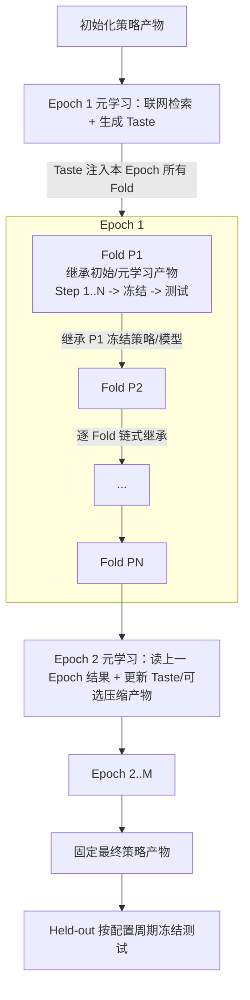

# Pipeline 设计

本文档记录策略探索、冻结测试和 Held-out 的运行顺序。Pipeline 是 Step / Fold / Epoch 编排、策略产物冻结、测试执行和实验账本的权威文档。

**相关边界**

- raw 数据下载、源口径和审计见 [数据文档](data_documentation.md)。
- PIT 窗口、Sandbox、工具和回测合同见 [Environment 设计](environment_design.md)。
- Agent 工作合同、可见输入和可写产物见 [Agent 设计](agent_design.md)。
- 控制台和 QMT 部署见 [部署文档](deployment_documentation.md)。
- 参数默认值速查见 [参数参考](parameters_reference.md)。

**职责边界**

Pipeline 负责消费已准备的数据，按时间顺序调度 Environment 和 Agent，冻结各阶段输入输出，并写实验账本。Pipeline 不负责下载或更新 raw 数据、实现投资逻辑、定义市场回放与 Broker 语义或改写 Agent 策略代码。

**术语说明**

| 中文名 | 代码/英文名 | 含义 |
|---|---|---|
| 实验管线 | `Pipeline` | 消费 Data 产物并调度 Environment 和 Agent 的外层程序，不实现投资逻辑 |
| 探索步骤 | `Step` | 策略探索阶段内的一次候选修改和验证回放 |
| 滚动单元 | `Fold` | 一个验证区间及其后续测试区间 |
| 实验轮次 | `Epoch` | 从起始 Fold 到结束 Fold 的一次完整运行 |
| 策略探索阶段 | `exploration` | 一个 Fold 内允许 Agent 修改候选策略，并在验证区间反复回放和选择最终产物的运行阶段 |
| 验证区间 | `validation period` | 策略探索阶段用于评价候选策略的市场数据时间范围，不是运行阶段 |
| 测试回放阶段 | `frozen_eval` | 策略产物冻结后，由宿主在测试区间执行样本外回放的运行阶段；Agent 不再修改产物 |
| 测试区间 | `test period` | 冻结产物接受样本外回放的市场数据时间范围，不是运行阶段 |
| 开发范围 | `Development` | 由滚动 Fold 构成的研究范围，不包含最终 Held-out |
| 最终留出评估 | `Held-out` | 全部 Development Fold 完成并冻结最终策略后运行的独立评估区间 |
| 策略产物 | `strategy_artifact` | Agent 写出的 `output/` 正式策略产物，根目录入口为 `main.py` |
| 模型参数产物 | `model_artifact` | Agent 写出的 `models/` 可继承模型参数产物 |
| 探索偏好 | `Taste` | Epoch 开始前由元学习会话生成，并作为 Prompt 注入本 Epoch Fold Agent 的高层探索偏好 |
| 快照清单 | `snapshot_manifest` | 记录本次可见数据窗口、hash、单位和时间覆盖的说明文件 |
| 实验账本 | `ledger` | 记录 Fold、Epoch、Held-out 结果和审计信息的文件 |

**导航**

- [1. 实验层级与时间排程](#1-实验层级与时间排程)
  - [1.1 循环层级与主路径](#11-循环层级与主路径)
  - [1.2 Fold 排程与时间边界](#12-fold-排程与时间边界)
- [2. 单 Fold 执行、验收与冻结](#2-单-fold-执行验收与冻结)
  - [2.1 Step 输入与执行](#21-step-输入与执行)
  - [2.2 冻结条件、完整验证与测试](#22-冻结条件完整验证与测试)
  - [2.3 策略产物、Manifest 与 Hash](#23-策略产物manifest-与-hash)
- [3. 跨 Fold 演进与最终评估](#3-跨-fold-演进与最终评估)
  - [3.1 产物继承与信息隔离](#31-产物继承与信息隔离)
  - [3.2 元学习输入输出与边界](#32-元学习输入输出与边界)
  - [3.3 多 Epoch、Development 与 Held-out](#33-多-epochdevelopment-与-held-out)
- [4. 产物持久化、报告与失败处理](#4-产物持久化报告与失败处理)
  - [4.1 实验目录、路径角色与主账本](#41-实验目录路径角色与主账本)
  - [4.2 报告与结果口径](#42-报告与结果口径)
  - [4.3 失败分类与记录语义](#43-失败分类与记录语义)
- [5. 运行入口、交互控制与恢复](#5-运行入口交互控制与恢复)
  - [5.1 运行入口与会话门控](#51-运行入口与会话门控)
  - [5.2 续跑与状态恢复](#52-续跑与状态恢复)
  - [5.3 Web 控制台与防泄漏](#53-web-控制台与防泄漏)

## 1. 实验层级与时间排程

本章定义 Step、Fold、Epoch 的层级、全局执行顺序和回放区间边界。

### 1.1 循环层级与主路径

**三层循环**

| 层级 | 含义 |
|---|---|
| Step | 一个 Fold 内的一次候选修改和验证回放 |
| Fold | 一个滚动验证区间和后续测试区间 |
| Epoch | 从起始周期到结束周期跑完所有 Fold |

**主路径**



### 1.2 Fold 排程与时间边界

**可配置周期滚动**

Fold 周期支持周、月、季度和年，默认季度。每个测试周期使用前一个同频周期作为验证区间；上一 Fold 的测试区间会成为下一 Fold 的验证区间。以下以季度为例：

| 项目 | 示例 |
|---|---|
| 输入窗口 | 2020-01 至 2021-09 |
| 验证区间 | 2021-10 至 2021-12 |
| 测试区间 | 2022-01 至 2022-03 |
| 验证决策时点 | 验证区间前最后一个交易日 23:59:59 北京时间（2021-10 首个交易日的前一交易日收盘） |
| 验证可见数据 | Environment 配置窗口内、截至验证决策时点已可见的数据 |
| 测试决策时点 | 测试区间前最后一个交易日 23:59:59 北京时间（2022-01 首个交易日的前一交易日收盘） |
| 测试可见数据 | Environment 配置窗口内、截至测试决策时点已可见的数据 |

验证、测试和 held-out 使用同一锚点合同：

- 决策输入截止在区间开始前最后一个交易日 23:59:59。
- 首日及后续回放数据只在回放时钟跨过行级可见时间和刷新节点后滚动进入 Timeview。

**Fold 滚动示例**

| Fold ID | 输入窗口 | 验证区间 | 测试区间 |
|---|---|---|---|
| `fold_2022Q1` | 2020-01 至 2021-09 | 2021-10 至 2021-12 | 2022-01 至 2022-03 |
| `fold_2022Q2` | 2020-04 至 2021-12 | 2022-01 至 2022-03 | 2022-04 至 2022-06 |
| `fold_2022Q3` | 2020-07 至 2022-03 | 2022-04 至 2022-06 | 2022-07 至 2022-09 |

每个验证、测试和 held-out 区间至少有 2 个交易日，因为最后一个交易日保留给期末清仓处理；清仓仍可能因市场约束失败。排程构建阶段直接拒绝不足区间，避免启动无效 Sandbox 和模型会话。

## 2. 单 Fold 执行、验收与冻结

本章定义普通 Fold 从父产物装载到冻结测试的过程，其中 Step 是策略探索阶段内的一次候选修改和验证回放，其数量受配置上限、Fold deadline 和 `finish_fold` 约束。

### 2.1 Step 输入与执行

**Fold 初始可见输入**

| 类别 | 内容 |
|---|---|
| 会话合同 | 默认系统 Prompt、初始任务指令和当前模式允许的原生工具 schema |
| 固定决策输入 | `valid_decision_input` 绑定到 `/mnt/snapshot`；`train_snapshot` 是其 Agent 可读的只读别名 |
| 验证回放数据 | `/mnt/snapshots/valid` 保存完整验证区间数据；Agent 工具可用于探查，正式策略不能直接读取，回放时由宿主作为动态数据源 |
| 父产物 | 上一 Fold 冻结产物或初始模板，以只读 `parent_output` 和 `parent_models` 提供 |
| 当前工作副本 | 可写 `workspace`、`output` 和 `models`；`output/main.py` 是正式策略入口 |
| 运行事实 | 当前身份、决策时间、可见窗口、Snapshot 配置与 hash、数据摘要、Broker/回放规则、运行环境和工具能力 |
| 验收与预算 | 验收规则、修改约束、Fold 截止时间、Step/回测/模型调用上限、上下文压缩和单次调用超时 |
| 探索指导 | 当前阶段、防过拟合与收敛提示、Taste，以及可选的研究者 Fold 指令 |
| 历史证据 | 可见 Step 树和父产物血缘；不包含历史测试结果 |

研究者设置完整系统 Prompt 覆盖时，覆盖文本替代自动装配的运行事实、阶段提示、Taste 和 Fold 指令；硬权限、工具和数据边界不变。

**Step 间滚动输入**

- 同一个 Fold 使用同一 Agent 会话；模型上下文保留近期消息和压缩摘要，旧消息及大型工具结果可能被裁剪，完整原始记录保留在可信 Trace 中。
- `workspace`、`output` 和 `models` 保留上一步修改；只读父产物不变。
- 每次验证产生新的 `results/valid_<idx>/`、Broker/NL 证据、修改检查结果和 Step 树节点。
- 剩余 Fold 推理时间、Step 数、回测次数、模型调用次数和上下文预算按各自规则更新；正式回测墙钟耗时回补，不消耗 Fold 推理时间。
- 每次回测重新初始化 Broker、`ctx.state_dir`、`ctx.asof_dir` 和该次回测的 NL 配额，不继承上一次回测的动态状态。

**宿主保留的冻结评估输入**

- 最终冻结的策略和模型产物及其 hash。
- 测试决策时点、`test_decision_input`、对应 Snapshot hash 和完整测试回放槽。
- Broker/回放配置、运行环境以及冻结评估的墙钟防挂死上限。
- `frozen_eval` 强制回放完整测试区间，不接受调试窗口；回放期间策略和模型只读，结束后重新校验 hash。
- Broker、策略状态、Timeview 和 NL 配额重新初始化，不继承验证回测状态。
- 测试排程、输入和结果不属于 Agent 的 Step 输入，也不反馈给当前或后续 Fold Agent。

**执行流程**

1. Fold 开始时，Pipeline 启动一个 Sandbox 和一个 Agent 会话。
2. Runner 挂载 `train`、`valid` 两类数据槽；test/held-out 数据仅由宿主持有，从不进入开发容器 mount namespace。
3. Pipeline 把父策略产物复制到 `/mnt/artifacts/parent_output/` 和 `/mnt/agent/output/`，把父模型参数复制到 `/mnt/artifacts/parent_models/` 和 `/mnt/agent/models/`。
4. Runner 把本 Epoch 的 Taste 注入 Fold Agent Prompt；该 Taste 不写入正式策略产物 hash，但会指导 Agent 如何实现和取舍策略。
5. Agent 在 `workspace/` 探索、读数据、复盘验证结果和调试。
6. Agent 把当前正式代码写入 `output/`，把需要继承的模型参数写入 `models/`。
7. Agent 主动调用 `modification_check`；`backtest` 在正式执行前也会复核最近检查结果和当前策略/model hash。
8. 修改检查通过后，Agent 调用 `backtest`；可选参数只有 `replay_window`，Runner 固定以 valid 模式执行。若检查缺失或过期，`backtest` 自动补跑。
9. `backtest` 执行 `output/main.py`，写入 `results/valid_<idx>/`。
10. Pipeline 把完成验证回测的 Step 轻量摘要追加到当前 Fold 记录的 `steps[]`。
11. Agent 根据结果继续下一 Step，或调用无参数 `finish_fold`。

**Fold 截止时间**

- Fold 内所有 Step 共享同一截止时间。
- 进入收尾窗口时，Runner 最多发送一次固定收尾提示。
- 主对话轮次和上下文压缩分别计数，但都受同一 Fold 截止时间约束。
- 截止时间到达后，不再启动 Shell、受控服务或模型调用。
- 正式回测独立计时并回补推理时间，但仍受回测次数和真实墙钟硬上限约束。

**Step 摘要**

`steps[]` 只记录完整验证回测。失败回测和超时始终写入 run manifest 与 Agent Trace；只有同时启用 Step Tree 和失败尝试记录时，才额外写入 failed 节点。整个 run 在成功记录前异常退出时，主账本另写 `attempt_failed`；无更新 fallback 则写入 Fold 顶层状态和原因。当前 Step 摘要记录：

| 字段 | 内容 |
|---|---|
| `step_id` | Fold 内唯一 Step ID |
| `status` | `accepted`、`completed` 或 `rejected`；`accepted` 表示最后一次完整验证被选作最终验收候选，不等于 Fold 最终采纳 |
| `decision_reason` | 成功完整验证当前记为 `validation_backtest`；Fold 最终采纳或拒绝原因记录在顶层状态与原因列表 |
| `strategy_artifact_ref` | 当前 `output` hash |
| `model_artifact_ref` | 当前 `models` hash |
| `combined_artifact_ref` | 策略 hash 与模型 hash 的组合身份 |
| `modification_delta_summary` | 本次正式产物相对父产物的修改摘要 |
| `summary` | 总收益、long/short 收益、Sharpe、最大回撤、融券资格拒单数、订单数和紧凑 benchmark 归因 |
| `validation_result_ref` | `results/valid_<idx>/` 引用 |
| `run_manifest_ref` | 当前 run manifest 引用 |
| `timing` | 当前只记录 `finished_at` |

Step 摘要属于实验主账本，但只作为 Fold 记录内的 `steps[]` 写入，不单独创建 Step 类型记录或账本文件。Shell、LLM 和工具调用明细写入 Trace 与日志；Broker、NL 和回测明细写入对应结果目录，并由 run manifest 和 Fold 记录引用。

### 2.2 冻结条件、完整验证与测试

**冻结必要条件**

- 最近一次 `modification_check` 通过。
- 当前 `output` hash 与 modification check hash 一致。
- 当前 `models` hash 与 modification check hash 一致。
- 最近一次完整 `backtest` 验证成功。
- 当前 `output` hash 与该 backtest 的 artifact hash 一致。
- 当前 `models` hash 与该 backtest 的 artifact hash 一致。
- 验证结果满足 `AcceptanceRules`。

收益和风险阈值可配置，但完整验证要求始终开启；当前默认值见 [参数参考](parameters_reference.md#2-实验编排与验收experimentconfig--acceptancerules--modificationconstraints)。数值边界如下：

- 非有限验收指标直接拒绝，不能利用 NaN 绕过阈值比较。
- 阈值必须是范围合法的有限数；预算和上限必须是正有限数。
- 验收指标与明确声明的严格 JSON 产物不得写入 NaN；其他审计文件不在此处作超出实现的统一保证。

**完整验证**

- `output/main.py` 的 `main(ctx)` 在整个回放区间逐 tick 成功执行。
- `main` 发出的 Broker 动作均由 Broker 处理；成交、拒单和撤单结果完整记录。合法拒单不影响回放完整性。
- Broker 完成日线或分钟线回放。
- 固定结果摘要和必要清单已写入；订单或日终持仓记录仅在存在对应记录时生成。
- Broker 可执行性、拒单和费用摘要可追溯。

**收敛和早停**

- 只看验证结果、修改量、策略复杂度和剩余 Fold 时间。
- 不看测试或 held-out 结果。
- 收敛阶段优先保护收益和风险指标，其次压缩 `output` 代码、helper、参数、prompt 和模型参数。
- 当验证效果接近或边际收益很小时，优先保留更小、更简单、更可解释的版本。

结束 Fold 时按以下顺序处理：

1. 只读锁定策略与模型，并清理 Agent 后台进程。
2. 选择最近一次完整验证成功且内容未变的候选。
3. 若历史候选更优，Agent 必须先恢复它并重新通过 hash 匹配的修改检查（过期时 backtest/finish_fold 会自动补跑检查）；策略+模型 hash 与已有成功完整验证一致的候选免重跑验证回测。
4. 没有可接受候选时进入下列 fallback。

Fallback 规则：

1. 有父产物时沿用父产物：从未有成功完整验证记 `no_valid_backtest`；已有完整验证但硬校验未过（回撤超限/指标非有限/内容已变）记 `no_update`。两种状态都附拒绝原因。收益/Sharpe 低于目标不再触发沿用——照常冻结并在账本记 `accept_warnings`（警告不重置 Fold）。
2. 首个 Fold 没有父产物且无法产生可接受基线时，实验失败。

**冻结测试**

- Agent 停止，`shell` 不再可用。
- Runner/root 绑定测试决策输入视图到 `/mnt/snapshot`。
- 使用冻结产物自动执行 `frozen_eval`。
- 测试前后校验 `output` hash 和 `models` hash 不变。
- 测试结果只写宿主审计面，包括运行结果、development 账本、host manifest 和报告；不进入后续 Epoch 元学习输入，也不反馈给当前或下一 Fold Agent Prompt。
- 冻结测试只作样本外诊断，不参与本 Fold 的策略接受。普通测试失败只记录原因，不撤销已冻结策略、不抹去 Fold 记录；测试前后策略/模型 hash 变化属于完整性失败：账本落盘（`state_changed_during_test=true`）后终止当前运行。

### 2.3 策略产物、Manifest 与 Hash

**冻结目录**

```text
experiments/<experiment_id>/strategy_artifacts/<epoch_id>/<strategy_artifact_id>/
  README.md
  main.py
  candidate.py
  trading.py
  nl_prompt.md
  ...
  manifest.json

experiments/<experiment_id>/strategy_artifacts/<epoch_id>/<strategy_artifact_id>.models/
  model.joblib
  scaler.json
  weights.pt
```

`manifest.json` 是冻结元数据，不参与策略 artifact hash，也不会复制回 `output`。下一 Fold 继承策略文件和对应模型参数；空 `models` 是合法状态并有稳定 hash。

**Manifest 字段**

策略产物 `manifest.json` 只记录冻结产物自身的身份、血缘和来源运行。它不保存验证结果、修改检查详情或运行账本引用；这些属于 Fold ledger 的 Step 记录。

| 字段 | 内容 |
|---|---|
| `experiment_id` | 所属实验 ID |
| `epoch_id` | 所属 Epoch |
| `strategy_artifact_id` | 冻结产物 ID |
| `parent_strategy_artifact_id` | 父产物 ID，首个产物为空 |
| `strategy_artifact_hash` | 策略文件 hash，不含冻结 manifest |
| `model_artifact_hash` | 模型参数 hash，可为空目录 hash |
| `combined_artifact_hash` | 策略 hash 与模型 hash 的组合身份 |
| `source_run_id` | 产物来源 run |
| `source_fold_id` / `source_step_id` | 来源 Fold 和 Step |
| `created_at` | 冻结时间 |

触发冻结的验证结果、`run_manifest_ref` 和修改摘要写入 Fold ledger 的 Step 记录；文件清单和文件 hash 可由冻结目录重新计算，不作为最小 manifest 字段。

**完整性边界**

- **内容身份**：策略代码、模型参数和数据快照使用稳定哈希；冻结、继承和评估前后据此校验内容未变。
- **审计证据**：运行配置、提示词、期限、资源限制、执行轨迹和结果目录持久保存，并通过运行身份互相引用。
- 除明确记录哈希的文件外，不宣称整个结果目录、运行清单或轨迹都经过内容寻址。

## 3. 跨 Fold 演进与最终评估

本章定义 Fold 之间的产物继承和信息隔离、Epoch 级元学习以及 development 结束后的 held-out。

### 3.1 产物继承与信息隔离

**产物继承**

- 每个 Fold 按第 2 章的验收和 fallback 规则确定最终冻结产物。
- 下一 Fold 继承上一 Fold 在测试前冻结的策略和模型产物；上一 Fold 没有可接受更新时，继承 Pipeline 选定的 fallback 父产物。
- 同一 Epoch 的 Fold 共享同一份 Taste。

**信息隔离**

- 每个 Fold 创建新的 `conversation_id` 和 Agent session。
- 上一 Fold 的 Agent 对话、工具调用、LLM 日志、测试结果和测试日志不能进入下一 Fold Prompt 或策略产物。
- 除第 3.2 节定义的 Taste 外，不跨普通 Fold 共享模型生成内容。
- 某个历史测试区间在后续 Fold 成为验证区间时，必须在当前 Fold 重新运行 `backtest`；不得复用它曾作为测试区间时产生的结果。

### 3.2 元学习输入输出与边界

**元学习输入**

以下输入均写入 `workspace/`，由 Runner 注入。

- compact `development_history.json`：紧凑的逐 Fold 验证摘要、接受/拒绝原因和验证回测明细。
- `experiment_ledger_full.jsonl`：Agent 可见 development 账本（逐条 `fold` / `meta_learning` 记录，排除 held-out、测试区间调度和测试回放结果）。
- 元学习记忆：按 Epoch 顺序拼接配置数量的最近会话完整对话和工具日志；设为 0 时关闭。更早的原始记忆不再注入，只通过 Taste 链和紧凑 Fold 历史保留。
- 上一次 Taste。
- 当前父策略产物和父模型参数产物。
- 实验级 `meta_learning_directive`：研究者在实验启动前可选注入的探索方向，写入 run manifest 和 meta-learning 账本。
- `run_manifest.json` 的 `experiment_parameters`：Fold 周期、数据窗口、验收规则、Broker profile、deadline、Step tree 和 Sandbox 资源等实验级参数；未来测试和 held-out 调度只保存在宿主审计账本。
- 元学习会话使用与第一个 Fold Agent 相同的可见数据：`/mnt/snapshot` 与 `/mnt/snapshots/{train,valid}`；test/held-out 不进入元学习可见输入（绑定与可见性规则见 `environment_design.md` §1.2）。
- `/mnt/artifacts/runtime_env.json`：Sandbox Python 包、CLI 工具、网络/安装策略和资源摘要。
- `/mnt/artifacts/data_summary.json`：第一个 Fold 可见数据的预生成轻量索引，含文件规模、行数、列数、关键列、日期覆盖和大表访问提示。
- meta-learning run manifest 中记录本次可用的 `web_search_engines`；当前默认引擎见 [参数参考](parameters_reference.md#9-hitl模型联网与控制台)。
- `meta_learning_sandbox_spec`：仅用于元学习 run 的 Docker 网络、资源和环境变量名透传配置；普通 Fold 仍使用基础 `sandbox_spec`。
- `workspace/sandbox_environment.example.json`：依赖声明模板，仅供 Agent 参考，不触发镜像构建。

**元学习输出**

- 非空 `workspace/taste.md`。
- 可选的小幅正则化策略产物和模型参数产物。
- 可选依赖声明只接受 Python、apt 和 npm 包列表，以及说明文本；不接受 Shell 命令、URL、Token 或缓存路径。
- 有效声明以当前 Fold 镜像为基础构建派生镜像，并在末尾执行 import 烟测。成功后，后续 Fold 与 held-out 使用派生镜像。
- 构建失败显式终止，不回退旧环境。生效镜像身份写入账本，恢复进程据此继续继承；旧派生镜像只做不影响活跃运行的尽力清理。
- meta-learning run manifest 和 canonical `artifacts/run_<id>/agent_trace.jsonl`。

元学习只额外保存便于人工查看的 Taste，执行轨迹仍由规范运行目录单点保存。最终化顺序为：

1. 采集可用产物。
2. 总是写元学习账本，包括最终化错误。
3. 再对构建或采集失败 fail-fast。

**边界**

- 元学习使用独立 run/session，不复用普通 Fold Agent 会话。
- 实验级 `meta_learning_directive` 只进入元学习 Prompt，不直接进入普通 Fold Agent；元学习必须把它当作待检验假设，可采纳、细化、降级或拒绝，并在 Taste 中给出可执行方向。
- 网页搜索和抓取只在元学习开放，普通 Fold 断网。抓取只读取公开网页，不替代三个规定研究视角的搜索完成要求；默认直连，显式请求才使用代理。
- 元学习 Sandbox 默认通过桥接网络访问公网，以支持源码、包和模型资源探索。
- 宿主中存在代码仓库或模型仓库凭据时，它们是默认透传候选；研究者还可显式追加允许的环境变量名。运行记录只保存实际注入的变量名，不保存值。
- 托管代理只在配置存在时按会话启动，默认不接管 Shell 命令；代理凭据和正文不得进入 Prompt、清单或账本。完整网络边界见 Environment。
- 元学习先读数据摘要，再只读检查可见快照的 schema、覆盖、行数、关键空值和单位。大表先查 metadata，之后按列和日期抽样或聚合。
- 启用联网搜索时，元学习结束前必须完成金融/量化/经济、自然科学/工程、哲学/方法论三类视角的非空检索，并收敛为可执行的简洁 Taste。引擎限流、失败或返回空结果时，应换引擎或重试同一视角。
- Pipeline 只在真实 Runner summary 显示 `meta_learning_done` 且 `taste.md` 非空时采纳 Taste 或正则化改动；否则 fail-fast，不沿用旧 Taste 伪装本轮完成。
- Taste 是后续 Fold Agent 实现策略的重要指导输入。注入 Fold Prompt 前只保留方向性约束，不保存细粒度实现方案；它应提示 NL 证据的前视、召回和解析风险，以及是否把 NL 作为主信号、辅助过滤或风险降权。
- 元学习可以读取 development 摘要和当前父产物。
- 元学习不能读取 held-out。
- 元学习不能运行正式 backtest 来反复调参。
- Taste 注入本 Epoch 的 Fold Prompt，但不能包含测试或 held-out 明细。

正则化只压缩正式策略、辅助模块、参数、Prompt 和模型产物，减少冗余。修改通过约束且存在父产物时可冻结为新的元学习产物；否则只保存 Taste 或沿用父产物。

### 3.3 多 Epoch、Development 与 Held-out

**多 Epoch 之间**

- 每个 Epoch 都从首个 Fold 跑到末个 Fold。
- 后一 Epoch 可读取前一 Epoch 的 development 摘要和 Taste，并生成新的 Taste；新 Taste 只影响该 Epoch 后续 Fold，不改写上一 Epoch 已冻结产物。
- Held-out 始终保留到全部 development 结束后。

**Development**

Development 保存滚动 Fold 的验证结果和冻结测试结果，但两者用途不同：

- 验证摘要、接受或拒绝原因及既往 Taste 可以进入下一 Epoch 的元学习。
- 冻结测试只供宿主事后诊断；测试区间、指标、日志、快照引用和对话在投影层移除。

**Held-out 配置**

- 起止周期必须在实验开始前配置并冻结。
- 不能根据 development 结果选择 held-out 区间。
- 不能与 development 区间重叠。
- 使用最终冻结策略和模型产物，不启动 Agent，也不允许修改产物。
- 按配置周期生成 `heldout_<label>` run。
- 测试前后校验策略和模型 artifact hash 不变。
- 账本只新增 held-out 类型记录；同时保存对应运行清单、Trace、回测结果和收集产物。

Held-out 结果只用于最终评估，不反馈给策略探索、元学习或 Fold Prompt。

## 4. 产物持久化、报告与失败处理

本章定义 Pipeline 产物的落盘位置、账本与运行清单的关系、报告口径以及失败和审计语义。

### 4.1 实验目录、路径角色与主账本

**实验目录树**

```text
experiments/<experiment_id>/
  ledgers/
    experiment_ledger.jsonl
  strategy_artifacts/
    <epoch_id>/<strategy_artifact_id>/
    <epoch_id>/<strategy_artifact_id>.models/
  meta_learning/
    <epoch_id>/
  artifacts/
    <run_id>/
  research_release/
    manifest.json
    quality/
  snapshot_cache/
  reports/
  hitl/
```

**路径角色**

| 路径 | 写入方 | 用途 |
|---|---|---|
| `ledgers/experiment_ledger.jsonl` | Pipeline | Fold、meta-learning、held-out 主账本 |
| `strategy_artifacts/` | Pipeline | 冻结策略产物和对应模型参数产物 |
| `meta_learning/` | Pipeline | 元学习 Taste；trace 由账本 `agent_trace_ref` 指向 canonical run 目录 |
| `artifacts/<run_id>/` | Environment | Sandbox run manifest、trace、results、logs |
| `research_release/` | Pipeline | 实验固定的数据 generation 与质量状态；恢复时原样复用 |
| `snapshot_cache/` | Pipeline | 实验内决策快照/回放槽构建缓存（见下） |
| `reports/` | reporting 脚本 | 实验图表和汇总 |
| `hitl/` | 交互式 worker / Web 后端 | HITL 控制面文件与 Fold 分析（见第 5 章） |

快照缓存按内容身份复用同一实验内字节相同的构建结果：

- 新实验先固定一个 research release：live 可读时按需发布当前 committed generation，更新期立即使用最近完整版本；部署后的首个版本须在 committed 空窗 bootstrap，已有账本但缺少 pin 时拒绝混用数据恢复。
- 相邻 Fold 可以共享相同决策锚点，多 Epoch 的同一视图也可复用。
- 同区间回放数据跨 valid/test 标签复用；label 不进入内容键，只原子写入本次运行目录的独立 manifest。
- 缓存键包含实验固定的 committed generation；live 更新不会令同一实验跨 Fold 换代，也不会读取部分更新。回放槽的键与内容另含 Fold 决策锚点（`available_from`）：锚点与期初日历日之间（周末/节假日）发布的事件、宏观和文本行以锚点为可见下界进入回放槽，首个盘前刷新节点即可放行。
- 缓存键另含显式格式版本；快照/PIT 磁盘合同变化时递增版本，无关代码提交不清空大缓存。
- 同一内容键由跨进程 `flock` 合并为一次构建，加锁后复查命中并原子发布；发布异常直接报错。
- 数据文件以硬链接挂入运行目录；本地 manifest 以新 inode 替换，不会改写缓存或其他运行的硬链接。
- 交互式 worker 只预取将进入的 Fold 的四个宿主数据缓存项：首 Fold（任意运行模式）自 Meta 门控起即提交预取，与研究者审批和 Meta 推理重叠；其他 Fold 与各自门控重叠；不创建 Sandbox 或容器，并在进入 Fold 前等待完成，所以不与正式回测并行。
- 每个 Fold/Meta/Held-out 的生产输入在启动 Agent 前校验 pinned generation 唯一；混代或部分缺失世代戳直接失败，本地合成输入可以全部无戳。

**主账本**

| record_type | 内容 |
|---|---|
| `fold` | Fold 时间、父产物、冻结产物、验证/测试摘要、Step 摘要、snapshot id |
| `meta_learning` | Taste、正则化状态、修改检查摘要、`agent_trace_ref` |
| `heldout` | held-out 区间和冻结测试结果 |

**Fold 记录示例**

```json
{
  "record_type": "fold",
  "fold_id": "fold_2022Q1",
  "input_window": "20200101..20210930",
  "validation_period": "20211001..20211231",
  "test_period": "20220101..20220331",
  "parent_strategy_artifact_id": "strategy_epoch1_fold0",
  "finish_reason": "fold_finished",
  "fold_status": "frozen",
  "accept_reasons": [],
  "selected_step_id": "step_003",
  "steps": [],
  "frozen_strategy_artifact_id": "strategy_epoch1_fold_2022Q1",
  "frozen_strategy_artifact_hash": "sha256:...",
  "frozen_model_artifact_hash": "sha256:...",
  "frozen_combined_artifact_hash": "sha256:...",
  "frozen_strategy_artifact_path": "experiments/.../strategy_artifacts/...",
  "frozen_model_artifact_path": "experiments/.../strategy_artifacts/...models",
  "validation_result": {"total_return": 0.04, "sharpe": 0.8, "max_drawdown": 0.12},
  "test_result": {"total_return": 0.02, "sharpe": 0.4, "max_drawdown": 0.10},
  "run_manifest_ref": "artifacts/run_x/run_manifest.json",
  "snapshot_ids": {"train_snapshot": "...", "valid_decision_input": "...", "test_decision_input": "...", "valid_replay": "...", "test_replay": "..."},
  "state_changed_during_test": false
}
```

`fold_status` 取 `frozen`（本 Fold 冻结了新产物；收益/Sharpe 低于目标时附 `accept_warnings`）、`no_update`（有完整验证但硬校验未过，沿用父产物）或 `no_valid_backtest`（无成功完整验证，沿用父产物）；后两者的 `accept_reasons` 记录拒绝原因。

实验启动时冻结各数据域的决策窗口：

- 日频、财务、事件、宏观和文本按月配置，分钟样本按交易日数配置。
- 未单独覆盖的域回退到基础窗口。
- Fold 的输入窗口只是调度摘要；实际可见历史以生效配置和快照清单记录的各域覆盖为准。

普通 Fold run manifest 直接记录 Fold、snapshot、Broker、验收、修改约束和 deadline。

**run manifest 约定**

- 初始模板只记录稳定 `template_ref` 和 `initial_template_hash`，不记录宿主 `configs/agent_output_template` 绝对路径；修改检查使用 sandbox 内只读 `parent_output` 作为基线。
- 元学习 run manifest 通过 `experiment_parameters` 汇总同一组实验级参数，并记录第一个 Fold 的可见决策输入和验证回放 snapshot id/hash；不记录 test 或 held-out。
- CLI 装配的真实 Agent 运行还会写入 `agent_session_config` 和 `llm_config_summary`，用于审计上下文压缩阈值、最大调用数和模型配置；这些字段不包含 API key。

### 4.2 报告与结果口径

**报告**

- 默认命令：`scripts/experiments/report_experiment.py`。
- benchmark（沪深300 `000300.SH`）取自账本各记录中回放时冻结的 `benchmark` 块（回放槽数据计算），报告不读可变 raw 数据湖，与 Agent/控制台所见完全一致。
- 有成绩的周期缺冻结 benchmark 块时，summary status 必须标记 warning。
- 输出 `reports/epoch_comparison_returns.png`。
- 输出 `reports/epoch_returns/<epoch_id>_returns.png`。
- 逐 Fold `active_return` 是该 Fold 策略收益减 benchmark 收益。
- 累计/复利 active return 统一用权益比口径 ∏(1+r)/∏(1+b)−1；汇总 `compound_active_return`、报告表 “Cum active” 列和 “Relative equity vs benchmark” 图三者口径一致。
- development 汇总另含样本标准差 `std_test_return`、`std_active_return`（样本数 < 2 时为 null），以及逐 Fold active return 对零的单样本 t 统计量 `active_return_tstat`（样本数 < 2 或离散度为 0 时为 null）。
- 相对权益曲线以策略权益除以 benchmark 权益表示，与上面的复利 active return 口径一致。

### 4.3 失败分类与记录语义

本节只定义失败如何影响当前运行、候选和恢复；各阶段的合法输入、冻结条件、信息隔离和报告要求由前文对应流程定义。

**终止当前运行**

- 输入、Snapshot、父产物或冻结产物的身份与运行清单不一致。
- 排程区间冲突、回测输入 schema 非法，或子进程退出状态与执行结果矛盾。
- 首个 Fold 无法产生可接受基线，或正式实验试图复用已有冻结产物和 Fold 记录的实验身份。
- 测试或 held-out 前后策略或模型 hash 发生变化。

这类错误会破坏运行身份、时间边界或结果可信度，Pipeline 不猜测、不降级，也不继续后续阶段。

**拒绝当前操作或候选**

- 工具访问越权、阶段不允许当前操作或修改约束超限时，只拒绝该次操作或当前产物。
- 单次回测、Broker 或产物校验失败时，当前结果不能用于冻结；预算和截止时间允许时可以修正后重试。
- 已有父产物但当前 Fold 没有可接受更新时，按冻结规则沿用父产物并记录 `no_update` 或 `no_valid_backtest`，不把候选失败升级为整个实验失败。

**记录与恢复**

- 所有失败和拒绝都写入对应 Trace、run manifest 或主账本，并保留明确状态和原因；不得静默吞掉。
- Fold、元学习或 held-out 在写入成功业务记录前异常退出时，主账本追加失败尝试记录。
- 同一次运行可能先写入成功业务记录，再在产物收集或最终化阶段失败，因此成功记录和失败尝试可以并存。
- 恢复逻辑以有效的成功业务记录重建已完成阶段；失败尝试提供审计证据，但不单独阻止重跑。

## 5. 运行入口、交互控制与恢复

本章定义批量实验、单会话审计和 HITL 入口，以及交互式控制、恢复和 Web 展示。

控制面不能放宽实验的数据、执行、冻结或审计边界。

### 5.1 运行入口与会话门控

**运行入口**

- 批量入口执行完整实验；目标 experiment 已存在冻结产物或 Fold 账本记录时直接终止，不支持原地续跑。
- 交互式入口用于需要研究者控制或会话级恢复的完整实验。
- 单会话审计入口只启动一次元学习会话或一个普通 Fold，用于检查 Prompt、Trace、Sandbox 和产物交接，不替代完整实验。

单会话审计分为两种模式：

- 元学习模式只生成 Taste 和可选正则化产物。
- Fold 模式执行 Agent、验证和冻结测试。
- 审计入口不构建基础 Sandbox 镜像；正式 Docker 审计前必须确保基础镜像存在。
- 元学习若提交有效依赖声明，仍按配置构建派生镜像；构建失败显式终止。

交互式入口沿用正式 Pipeline 的元学习、Fold 和 held-out 顺序，但在会话边界增加研究者控制。控制面采用单写者、原子替换的本地状态文件：

| 文件 | 写入方 | 内容 |
|---|---|---|
| `params.json` | 创建方 | 实验参数和交互式专有设置；每次启动据此确定性重建运行配置 |
| `control.json` | 控制方 | 模式、暂停或停止请求、会话批准、研究者输入、重跑、回滚、提前收官和资源分配 |
| `status.json` | worker（manager 仅在拉起瞬间写一次 `launching` 存根，进程创建前完成，无并发写者） | pid、心跳、当前会话、run_id 与实时 trace 路径、Agent 结束后的 Environment 阶段/粗粒度回放进度、错误；`launching` 桥接进程拉起到 worker 首次写状态的窗口（同时阻止该窗口内的重复拉起/删除），超时未接管降级为 `interrupted` |
| `schedule.json` | 仅 worker | 启动时写出的会话计划（元学习/Fold/held-out） |
| `analysis/` | worker / Web 后端 | Fold 完成后的 LLM 策略分析（markdown + provenance sidecar） |

**会话门控**

- 三档运行模式：`auto` 连续执行；`manual` 每个会话启动前需批准；`step` 在 `manual` 基础上，每次正式验证回测后再挂起等待批准并可注入 Step 级指令（逐 Fold 可用 `set_step_gate` 显式覆盖开/关，清空恢复模式默认；等待时间回补 Fold 推理预算，且不计入实时/完成 Fold 有效耗时）。
- `status.json` 的 `run_id`、trace 路径和 deadline 始终绑定同一个、且不早于 `session_started_at` 的 run；运行态和两种研究者等待态都会发现新 run。Web 在 state、session 或 run 变化时强制重取详情并重建 SSE。倒计时指 Agent 活跃会话预算，回测与研究者等待独立计时并回补。
- 实时 Trace 节点重挂后在“自动滚动”开启时回到底部；长回测在首个按日进度前也持续显示已用墙钟，避免把初始化/首日计算误判为停止。
- Agent `session_end` 后，控制台沿用同一状态轮询展示验收/冻结、冻结测试、结果落盘和 Fold 分析阶段及阶段墙钟；冻结测试与 held-out 只展示节流后的 `day_index/total_days`，不展示隐藏日期、订单、NL 活动、指标或结果。该宿主状态不进入 Agent Trace、Prompt、Sandbox 或预算核算，也不新增服务或轮询通道。
- 暂停和停止在会话边界生效，不中断正在运行的 Fold。
- 强制终止只用于中途停止进程；被中断的 Fold 需要整体重跑，并可能留下待人工处理的未记账运行目录。

**研究者输入**

- 每个会话可附加待检验的研究方向；它会进入运行清单和账本，但不参与策略内容哈希。
- 研究者输入不能放宽 PIT、写入、修改量、验证或冻结边界，也不得携带测试或 held-out 证据。
- Fold 允许整体覆盖系统 Prompt。覆盖会替代自动装配的 Prompt，并留下可审计标记；数据权限和工具硬边界不因此改变。

**交互控制操作**

- **重跑**：只允许在 worker 停止时重跑最新 Fold。旧记录保留，新产物使用独立身份；完成后重新执行 held-out。
- **回滚**：先备份账本并归档目标 Fold 之后的冻结产物，再从目标 Fold 恢复父产物链；同时修剪 Step 产物树——被丢弃 Fold 会话记录的节点（及其后代）连同快照移入同一归档目录（`tree.json` 一并备份），否则重跑的 Fold 会在树里看到未来区间上验证过的策略与指标。回滚后可继续运行或重跑该 Fold。
- **逐 Step 门控**：对单个 Fold 会话开启后，每次正式验证回测完成即挂起（status `waiting_step_user` + 该 Step 指标摘要），研究者放行时可注入 Step 级指令（作为待检验假设写入该次回测的工具观察，不放宽硬约束）；等待时间回补 Fold 推理预算；门控可随时开关，stop 请求在门控处立即生效。控制动作 `set_step_gate` / `approve_step`（后者由服务端从 status.json 解析当前挂起的 step 序号）。探针（`replay_window`）与失败回测不触发门控。`ask_user` 回复键含本次 worker attempt nonce，崩溃重试不会误消费旧问题的回复。
- **Agent 主动提问（`ask_user` 工具）**：Agent 在关键分叉点可暂停并提交一个方向性问题 + 现状总结（status `waiting_user_reply` + 问题原文），研究者在详情页答复（`reply_question`，空答复=放行由 Agent 自行决策），答复作为研究者方向指引注入工具观察（不放宽硬约束）；等待时间回补推理预算，stop 请求在等待处立即生效。auto 模式或 CLI 无人值守运行立即返回 unattended，由 Agent 自主决策。控制字段 `user_replies["<session>#q<n>"]`；重跑/回滚会清除对应会话的历史答复。
- **Step 级回滚（父产物覆盖）**：详情页 Step 产物树列出跨 Fold 的全部已验证节点（含各节点完整源代码与验证明细下载）；研究者可把任一已验证节点设为某个 Fold 会话的父产物起点（`parent_overrides`，替代默认冻结继承链）。未运行的 Fold 在下次启动时生效；已完成的 Fold 配合重跑使用。仅允许指向不晚于目标会话的节点（更晚 Fold 的节点携带未来区间验证结果，控制台直接拒绝）；节点快照按记录哈希校验后才会成为父产物，账本中该 Fold 的父产物 id 带 `stepnode_` 前缀可审计。设置持续有效，重设覆盖、留空清除；Fold 回滚会清除被丢弃会话的覆盖。
- **提前收官**：至少有一个冻结 Fold 后，可跳过剩余 development，以最新冻结产物进入 held-out；人工控制模式仍需批准 held-out。
- **资源分配**：批准 Fold 前可以查看资源状态并设置 GPU 数，自动选择仍按空闲显存分配具体设备。
- **继承创建**：新实验可以复制另一实验最新冻结产物作为起点。复制时校验内容身份，之后不依赖源实验继续存在。
- **过期代码提示**：worker 启动时把当时的仓库 HEAD 写入 status（`code_version`）；长驻进程在代码更新后仍运行旧实现，控制台在 worker 存活且与当前 HEAD 不一致时显示「代码过期」徽标（重启 worker 生效；提交粒度，不感知未提交改动）。

### 5.2 续跑与状态恢复

批量入口不支持在已有实验上原地续跑；交互式 worker 以账本为事实源进行会话级恢复：

- 已成功记录的元学习和 Fold 会话跳过，父产物链按账本重建并重新校验哈希。
- Taste 与最近生效的派生 Sandbox 环境从持久记录恢复。
- held-out 只补跑缺失周期。
- 冻结完成但账本尚未追加时被强制终止，会留下孤立产物；恢复流程拒绝猜测其归属，要求人工处理。
- 在受支持的单控制面运行方式下，进程身份和心跳用于拒绝重复启动；它们不是跨多个控制台进程或手工启动的全局互斥锁。

### 5.3 Web 控制台与防泄漏

Web 控制台是纯控制面，实验在独立 worker 进程中执行；控制台或隧道重启不影响正在运行的实验。生产网络、Unix socket、反向代理和访问控制由 Deployment 文档统一定义。

- 首页展示实验状态、Fold 进度和冻结结果摘要，并支持按统一参数定义创建、继承和删除实验；运行中的实验不得删除。
- 详情页提供会话导航、门控操作、指令和 Prompt 预览、资源分配、实时轨迹摘要、验证结果、Step 历史和整包冻结产物下载。
- 回放落盘权益曲线、基准日收益和风格归因。Web 后端只基于这些冻结产物派生展示曲线与跨 Fold 汇总，不读取 raw；浏览器只负责渲染。
- 风格暴露使用 Broker 按账户和方向记录的权威日终持仓，不从成交记录重建。短窗口回归只作诊断，不作为优化目标。
- 周期选择：创建表单的周期下拉由交易日历∩关键数据集分区覆盖（daily 与分钟线）共同约束，不提供无本地数据支撑、会在运行期报错的区间。
- Fold 完成后，worker 可用固定模板生成中文策略分析；分析只读验证证据，失败仅记录状态、不阻断实验，并可按需重新生成。
- Fold 分析只接收验证证据。测试与 Held-out 结果（首页汇总、逐 Fold 摘要、测试明细、测试权益曲线）默认全部隐藏，控制台只展示验证证据。
- 研究者可显式「揭示测试结果」：揭示不可撤销，实验随即封存——批准、重跑、回滚、逐 Step 放行、提问答复、指令与 Prompt 覆盖、父产物覆盖、提前收官全部拒绝（查看/停止/删除仍可用）。揭示前测试对人不可见，揭示后人的知识无法再影响学习，两种状态下 HITL 都不再依赖“自觉不看”的人为环节。
- 无控制面的 legacy 实验只读展示全部历史结果（不存在可被污染的后续学习）。

控制台的实际部署拓扑、服务保活和故障排查见 Deployment 文档。
